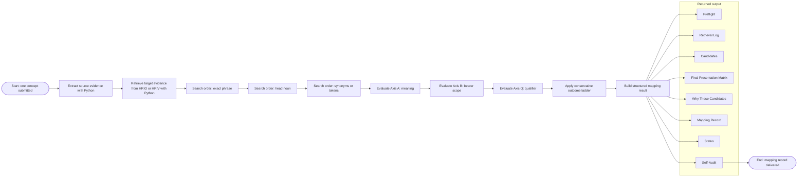
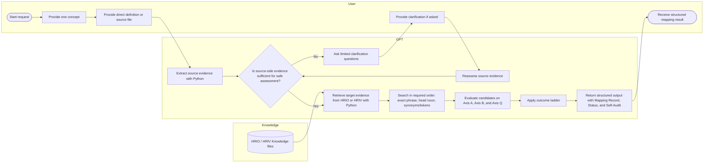
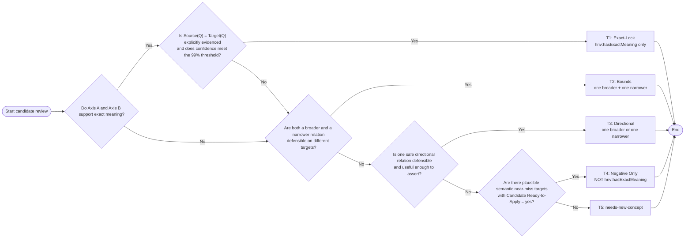

# User Guide: **HRIO Mapping Assistant**

!!! warning "Disclaimer"

    This page contains AI-assisted content that is currently under review and may include inaccuracies or omissions. Readers should use their judgment when interpreting or applying this information.

!!! info "Prompt version and traceability"

    This documentation reflects prompt version **[20260311-v1](https://raw.githubusercontent.com/Health-RI/semantic-interoperability/refs/heads/main/resources/prompts/gpt/mapping-assistant-20260311-v1.txt)** of the HRIO Mapping Assistant. The prompt files are available [in this folder](https://github.com/Health-RI/semantic-interoperability/tree/main/resources/prompts/gpt).

## What this GPT is

This GPT is a **specialized semantic mapping assistant** for mapping **one user domain concept per turn** to the **Health-RI Ontology (HRIO)** through a **strict, evidence-based, ontology-aware decision process**.

It is **not** a general ontology chatbot, a free-form search assistant, or a bulk mapping tool. Its role is narrower and more controlled: it takes one source concept, uses only the **user’s provided text** and the configured **Knowledge files**, uses **Python** to extract source evidence and retrieve target evidence from **HRIO/HRIV**, evaluates candidate targets deterministically, and returns a **structured mapping decision record**.

!!! note

    This GPT is designed for **careful, one-concept-at-a-time mapping decisions**, not for casual term matching or open-ended ontology browsing.

Its permitted mapping predicates are intentionally limited to:

- `hriv:hasExactMeaning`
- `hriv:hasBroaderMeaningThan`
- `hriv:hasNarrowerMeaningThan`
- `NOT hriv:hasExactMeaning`

If no defensible mapping can be asserted, it returns:

- `needs-new-concept`

If Python cannot read the source or the Knowledge resources, or if the source is unreadable, partial, or otherwise too unreliable for safe mapping, it returns:

- `knowledge-access-failed`

This GPT should therefore be understood as a **governed semantic decision tool**. Its purpose is to help users reach the **strongest defensible mapping outcome** while making retrieved evidence, missingness, risks, downgrade logic, and final status explicit.

Candidate evaluation is deterministic and follows three axes:

- **Axis A**: meaning
- **Axis B**: bearer scope
- **Axis Q**: qualifier

Qualifier handling is central to how this GPT works. Exact meaning is not allowed unless qualifier compatibility is **explicitly evidenced**. It recognizes only the following qualifier buckets:

- `self-reported`
- `clinician-assessed/diagnosed`
- `measured/observed`
- `administrative/recorded`
- `inferred/derived`

The GPT evaluates candidates through a conservative outcome ladder:

- **T1**: exact only
- **T2**: broader + narrower bounds
- **T3**: one directional mapping
- **T4**: negative-only near-miss mapping
- **T5**: `needs-new-concept`

It also distinguishes the final result status explicitly:

- `final`
- `provisional`
- `needs-new-concept`

`knowledge-access-failed` is a separate **access outcome**, not a mapping status.

At a high level, this is how the GPT moves from one user concept to a mapping result:

*Diagram 1. End-to-end workflow for mapping one user domain concept to HRIO under the prompt.*

## At a glance

| Item                              | Summary                                                                                                         |
| :-------------------------------- | :-------------------------------------------------------------------------------------------------------------- |
| **Input**                         | One concept only, provided as a direct definition or source file                                                |
| **Evidence base**                 | User text + configured Knowledge files only                                                                     |
| **Method**                        | Python-based source extraction, Python-based HRIO/HRIV retrieval, deterministic evaluation                      |
| **Evaluation axes**               | Meaning, bearer scope, qualifier                                                                                |
| **Possible mapping predicates**   | `hriv:hasExactMeaning`, `hriv:hasBroaderMeaningThan`, `hriv:hasNarrowerMeaningThan`, `NOT hriv:hasExactMeaning` |
| **Possible non-mapping outcomes** | `needs-new-concept`, `knowledge-access-failed`                                                                  |
| **Best use case**                 | Reviewable, one-concept semantic mapping to HRIO                                                                |
| **Not for**                       | Batch mapping, general browsing, web search, approximate lexical matching                                       |

## When to use this GPT

Use this GPT when you need a **careful, evidence-based semantic mapping** of **one user domain concept per turn** to **HRIO**.

Use it when the goal is to determine the **strongest defensible semantic relationship** under strict constraints on evidence, bearer scope, qualifiers, and final statement safety.

Typical good use cases include:

### A. Mapping one concept from a user domain model to HRIO

Use it when you have **one source concept** and want to determine whether it can be mapped safely to an HRIO target.

### B. Checking whether the best defensible relation is exact, broader, or narrower

Use it when the distinction matters and you want a defensible answer rather than a guess.

### C. Checking whether a candidate is a plausible near-miss but not exact

Use it when a target appears semantically close enough to compare, but not safe enough to assert as exact, broader, or narrower.

### D. Reviewing whether a new ontology concept may be needed

Use it when the nearest existing HRIO concepts appear close lexically but lose a defining feature, depend on unsupported assumptions, or fail on qualifier or bearer distinctions.

### E. Producing a traceable and reviewable mapping record

Use it when the output must be reviewable by ontology engineers, semantic modelers, or governance groups.

### F. Handling qualifier-sensitive concepts

Use it when the source concept depends on **how the concept is established**, and that distinction may affect exactness.

### G. Preferring safe outcomes over forced mappings

Use it when the evidence may be incomplete, the source may be partially readable, or qualifier and bearer distinctions may materially affect the mapping.

## When not to use this GPT

Do **not** use this GPT for tasks such as:

### A. General ontology browsing

Do not use it when the goal is simply to explore HRIO casually or inspect terms without needing a formal mapping decision.

### B. Multi-concept or batch mapping

Do not use it when you want to map many concepts at once.

!!! warning

    The prompt explicitly enforces **one concept per turn**. If more than one concept is provided, the GPT should ask which single concept to assess.

### C. Creative ontology design or unconstrained conceptual restructuring

Do not use it when the goal is to brainstorm new ontology structures freely or redesign large portions of a model without strict evidence constraints.

### D. Unconstrained search across external resources

Do not use it when the task depends on broad external search, web supplementation, or open-ended discovery beyond the configured evidence base.

### E. Situations where you only need a rough lexical suggestion

Do not use it when you only want a quick approximate match, a loose keyword suggestion, or a lightweight “closest label” answer.

### F. Cases where the source concept is too vague for safe mapping

Do not use it when the source concept is so underspecified that even a conservative mapping assessment cannot be made safely.

### G. Cases where missing ontology-side evidence must be guessed or compensated for

Do not use it if the task depends on inventing missing HRIO metadata, inferring unretrieved qualifier buckets, or compensating for missing ontology-side evidence through user questioning.

### H. Tasks that require relaxed or heuristic judgment

Do not use it when the task calls for flexible, intuitive, or deliberately approximate semantic judgment.

## How users should use this GPT

For best results, users should treat this GPT as a **single-concept semantic mapping workflow**.

This GPT works best when the user provides:

- **one concept only**
- either a **direct definition in chat** or a **source file**
- clarification only when the GPT asks for it and only when source-side missing information could materially change the result

Users should not treat it as a bulk-mapping tool, a casual ontology browser, or a free-form search assistant. It is designed for **careful, evidence-based mapping of one concept at a time** using only **user text** and **Knowledge files**.

Before reviewing the usage pattern in detail, it helps to see the interaction flow.

*Diagram 2. User–GPT interaction flow for submitting one concept and receiving a structured mapping result.*

### Recommended usage pattern

#### 1. Submit one concept only

The GPT is explicitly designed for **one concept per turn**.

#### 2. Provide the source concept in a usable form

The source concept should be provided as either:

- a direct definition in chat
- a source file

#### 3. Let the GPT retrieve target evidence from Knowledge files

Users should expect the GPT to rely on **configured Knowledge files**, not web knowledge.

#### 4. Clarify only when needed

The GPT may ask clarification questions, but only in a narrow set of cases:

- the missing information is about the **source concept**
- the missing information could materially change the outcome
- a safe assessment cannot yet be made from the available source-side evidence

#### 5. Expect a conservative structured result

The GPT is designed to return the **strongest defensible safe outcome**, not the most optimistic one.

Depending on the evidence, that may be:

- an exact mapping
- a broader or narrower mapping
- a negative-only near-miss result
- `needs-new-concept`
- `knowledge-access-failed`

### Mini worked example

A user provides the source concept:

> **Source label:** Family history of diabetes
> **Source definition:** Presence of diabetes in biological relatives, as reported by the participant.

A simplified decision path could look like this:

1. The GPT extracts the source evidence and identifies a likely qualifier of `self-reported` because that wording is **explicitly present**.
2. It retrieves candidate HRIO targets using the required order: exact phrase, then head noun, then synonyms/tokens.
3. Suppose it finds a candidate that captures **diabetes diagnosis in the patient**, not **family history**.
4. Axis A may look partially related at the lexical level, but Axis B fails because the bearer differs: the source is about **relatives**, while the target is about the **patient**.
5. Exactness is therefore blocked, even if the label looks close.
6. If no safe broader or narrower relation is useful, but a plausible semantic near-miss exists, the result may be **T4** with:
    - `NOT hriv:hasExactMeaning`

This example shows why label similarity alone is not enough: meaning, bearer scope, and qualifier evidence all matter.

### Good request template

A strong user request looks like this:

> Map this one concept to HRIO using the full structured result.
> Source label: [label]
> Source definition: [definition or verbatim excerpt]
> Source context: [optional bearer/scope/context]
> Source qualifier context: [only if explicit]
> Please use only the available user text and Knowledge files.
> Please assess `hriv:hasExactMeaning`, `hriv:hasBroaderMeaningThan`, `hriv:hasNarrowerMeaningThan`, or `NOT hriv:hasExactMeaning` only if supported by the retrieved evidence.

### File-based request template

Another good request pattern is:

> Use this file as the source evidence for one concept and map it to HRIO.
> Concept to assess: [label or identifier]
> Please return the full structured mapping result.
> Please do not infer missing metadata, qualifier values, bearer constraints, or ontology structure.

### What users should avoid

Users should avoid:

- submitting multiple concepts at once
- giving only a vague label with no definition or usable source evidence
- asking for a forced exact match
- expecting the GPT to compensate for missing HRIO-side metadata
- treating lexical similarity as sufficient evidence
- asking the GPT to guess qualifier values, identifiers, or ontology structure
- using the GPT as a bulk-mapping or general browsing tool

## What problem it solves

Without a system like this, semantic mapping often suffers from:

- overreliance on lexical similarity
- undocumented assumptions
- hidden interpretation of qualifiers
- inferred bearer constraints that were never retrieved
- inconsistent treatment of broader versus narrower relations
- contradictory statements on the same source-target pair
- forced exact matches when evidence is incomplete
- unclear downgrade logic
- lack of transparent justification
- failure to distinguish between “no safe mapping” and “knowledge could not be accessed safely”

This GPT addresses those problems by requiring that every mapping decision be tied to **retrieved evidence** and by making missing evidence visible instead of silently inventing it.

## What information this GPT relies on

This GPT relies on **two evidence streams only**:

- **source evidence** from the user’s provided concept
- **target evidence** from the configured **HRIO/HRIV Knowledge files**

It does **not** rely on web knowledge.

### 1. Source evidence

This is the user’s concept as provided in one of two forms:

- a direct definition in chat
- a source file

According to the prompt, the GPT must use **Python** to extract source evidence.

It reports:

- source label
- source definition
- normalization keys
- location
- verbatim source evidence

If evidence is unavailable, it must be recorded as `Missing`.

### 2. Target evidence

This is retrieved from the **HRIO/HRIV Knowledge files** using **Python**.

According to the prompt, the GPT must retrieve target-side evidence such as:

- HRIO labels
- HRIV labels
- CURIEs
- triples
- comments
- qualifier metadata

This target evidence is used to support candidate evaluation across:

- Axis A: meaning
- Axis B: bearer scope
- Axis Q: qualifier

The prompt also requires target retrieval to follow this order:

- exact phrase
- head noun
- synonyms/tokens

If Python cannot read the source or the Knowledge files, or if the source is unreadable, partial, or otherwise too unreliable for safe mapping, the GPT must return:

- `knowledge-access-failed`

## Core behavior rules of this GPT

This GPT is governed by several strict rule groups.

### 1. Core mapping rules

These rules define the allowed semantic outputs and how they may be combined.

#### Key constraints

- **one concept per turn**
- **one predicate per HRIO target**
- only the following mapping predicates are allowed:
    - `hriv:hasExactMeaning`
    - `hriv:hasBroaderMeaningThan`
    - `hriv:hasNarrowerMeaningThan`
    - `NOT hriv:hasExactMeaning`
- `NOT hriv:hasExactMeaning` is a valid mapping statement
- broader and narrower relations must never be negated
- HRIO labels and CURIEs must be quoted **verbatim**
- identifiers must never be invented
- for the same source-target pair, broader or narrower must not be combined with `NOT hriv:hasExactMeaning`
- if `hriv:hasExactMeaning` appears in the Mapping Record, it must be the **only** final statement
- under T1, non-exact candidates may still appear for comparison, but only the exact statement enters the Mapping Record

### 2. Evidence discipline

This is one of the most important parts of the GPT.

!!! important

    **Absence of evidence is not positive evidence.** If something is not retrieved, it must not be invented.

It must:

- use only **retrieved evidence**
- avoid paraphrasing as evidence
- avoid inferring unretrieved metadata, qualifier buckets, bearer constraints, or ontology structure
- record missing evidence as `Missing`
- avoid fabricating structure from partial or unreadable files
- label any small interpretive bridge as a **risk/assumption**, not as direct evidence

### 3. Clarification rule

The GPT may ask clarification questions, but only under tightly limited conditions.

It should ask only when:

- the missing information concerns the **source concept**
- the missing information could materially change the result
- clarification is genuinely needed for a safe assessment

It should not ask when:

- evidence already supports a safe decision
- the missing information is about HRIO metadata rather than the source
- a safe `provisional`, `no`, or `needs-new-concept` outcome already exists
- clarification would only compensate for missing ontology-side evidence

Additional constraints:

- ask at most **3 questions**
- do not ask for clarification merely because HRIO-side metadata is missing
- prefer a safe conservative outcome over extra questioning when that is already justified

### 4. Deterministic evaluation logic

Each candidate target is evaluated using three axes.

#### Axis A — meaning

Does the source concept mean the same thing as the target?

#### Axis B — bearer scope

Does the target apply to the same kind of bearer or subject as the source?

#### Axis Q — qualifier

Do source and target align on how the concept is established or qualified?

The GPT restricts qualifier handling to the following buckets only:

- `self-reported`
- `clinician-assessed/diagnosed`
- `measured/observed`
- `administrative/recorded`
- `inferred/derived`

Additional deterministic rules also apply:

- exact meaning requires **explicit evidence** that `Source(Q) = Target(Q)`
- `Source(Q)` may contain more than one explicit bucket
- if a target captures only part of a composite `Source(Q)`, it is **not exact**
- `Target(Q)` may be assigned only from:
    - explicit HRIO metadata, or
    - explicit HRIO subclassing to a target already assigned that bucket
- if `Target(Q)` is missing or mismatched, the result must be downgraded to T3, T4, or T5
- if Axis A and Axis B conflict, positive predicates should be avoided for that target and `NOT hriv:hasExactMeaning` should be preferred
- OntoUML structure and formal definition take priority over lexical similarity

## Qualifier handling

Qualifier logic is central to this GPT.

### Allowed qualifier buckets

Only the following qualifier buckets are allowed:

- `self-reported`
- `clinician-assessed/diagnosed`
- `measured/observed`
- `administrative/recorded`
- `inferred/derived`

### How qualifiers are determined

Qualifier values must be determined from **explicit evidence only**.

The GPT must report qualifier audit values in the form:

- `Source(Q): [bucket | bucket1 + bucket2 | None explicit | Missing]`
- `Target(Q): [bucket | Missing]`

The GPT may normalize **explicit wording** as follows:

- self-identified / self-identification / self-identifies as → `self-reported`
- diagnosed by / clinical diagnosis / clinician-assessed → `clinician-assessed/diagnosed`
- measured / observed / laboratory assessed → `measured/observed`
- administratively recorded / registered / officially recorded → `administrative/recorded`
- derived from / computed from / algorithmically inferred → `inferred/derived`
- otherwise → `Missing`

`Target(Q)` may be determined only from:

- explicit HRIO metadata, or
- explicit HRIO subclassing to a target already assigned that bucket

!!! note

    Qualifier mismatch does not automatically mean “no relationship at all.” It means **exactness is blocked**, and the GPT must consider safer downgraded outcomes.

### Important qualifier restrictions

- qualifiers must be **explicitly evidenced**
- if a target captures only part of a composite `Source(Q)`, the mapping is **not exact**
- if target qualifier evidence is absent, record `Target(Q): Missing`
- qualifier values must not be guessed from suggestive wording alone
- qualifier values must **not** be inferred from terms such as `karyotypic`, `chromosomal`, or `structural`

## Outcome selection ladder

The GPT uses a fixed ladder from the **strongest** to the **weakest** defensible mapping outcome.

This ladder governs **mapping outcome selection** (`T1` to `T5`). The separate **Status** result (`final`, `provisional`, or `needs-new-concept`) is assigned afterward based on the final statements and candidate readiness.

*Diagram 3. Decision ladder for selecting the safest defensible mapping outcome.*

### T1 — Exact-Lock

Use only when:

- Axis A and Axis B support exact meaning
- `Source(Q) = Target(Q)` is **explicitly evidenced**
- confidence meets the **99% threshold**
- the exact statement is safe as the **only** final statement

Output:

- one `hriv:hasExactMeaning` only

Under T1, non-exact candidates may still appear for comparison, but only the exact statement enters the Mapping Record.

### T2 — Bounds

Use when:

- one `hriv:hasBroaderMeaningThan` is defensible for one target, and
- one `hriv:hasNarrowerMeaningThan` is defensible for a different target

### T3 — Directional

Use when:

- exactly one broader or narrower relation is defensible for the best target
- exact meaning is not supported

Output:

- one `hriv:hasBroaderMeaningThan` **or**
- one `hriv:hasNarrowerMeaningThan`

Additional rule:

- `NOT hriv:hasExactMeaning` may optionally be added for **different** plausible near-miss targets

Do **not** prefer T3 when the only directional candidate is a **weak generic anchor** that loses the source’s core identity or qualifier specificity and a T4 outcome would be more useful.

### T4 — Negative Only

Use when:

- plausible **semantic near-miss** targets exist
- no safe **useful** broader or narrower relation should be asserted
- at least one negative candidate has `Candidate Ready-to-Apply: yes`

Output:

- `NOT hriv:hasExactMeaning` only

Additional rule:

- in T4, the Final Statements must include **all** candidates marked `Candidate Ready-to-Apply: yes` whose predicate is `NOT hriv:hasExactMeaning`

!!! note

    Do **not** use T4 when the negatives are only structurally adjacent, lexically incidental, or semantically remote. In those cases, the correct outcome is **T5**.

### T5 — Needs New Concept

Use when:

- no candidate is defensible as exact, broader, or narrower
- the best matches are only lexical near-matches
- missing qualifier or bearer distinctions are essential
- every candidate loses a core defining feature
- T4 cannot be supported because no negative candidate is `Candidate Ready-to-Apply: yes`

Output:

- `needs-new-concept`

## Decision priority

When the evidence is uncertain, the GPT should prefer:

- exact over directional
- directional over unsafe exact
- negative-only over unsafe positive mappings
- T4 over weak generic-anchor T3 when T4 is more useful to the user
- `Target(Q): Missing` over invented Q values
- `partial` over `yes` when conditions are not fully satisfied
- `provisional` over `final` when conditions are not fully satisfied
- `needs-new-concept` over forced mapping

## What the output looks like

The GPT is designed to return a **structured answer**.

In addition to the named output sections below, the response must also report the required **source evidence details**:

- source label
- source definition
- normalization keys
- location
- verbatim source evidence

### 1. Preflight

States whether knowledge access **succeeded** or **failed**.

### 2. Retrieval Log

Reports the required target retrieval progression:

- exact phrase
- head noun
- synonyms/tokens

It must also report the findings at each step.

### 3. Candidates

Lists up to **10 candidates**.

For each candidate, the GPT must provide:

1. HRIO Label: `[Label] ([CURIE])`
2. Predicate
3. Qualifier Audit: `Source(Q): ...` vs `Target(Q): ...`
4. Confidence: `0–100%` plus justification
5. Alignment: Axis A, Axis B, Axis Q
6. Risks
7. Evidence Pointers: verbatim source snippet vs verbatim target excerpt
8. Candidate Ready-to-Apply: `yes | partial | no`

The readiness values mean:

- `yes` = safe as a candidate mapping statement and eligible for Final Statements
- `partial` = defensible as a candidate mapping statement but dependent on directional approximation, missing metadata, qualifier mismatch, or loss/generalization of a defining source feature; eligible for Final Statements only when Overall Status is `provisional`
- `no` = not safe as a candidate mapping statement and not eligible for Final Statements

Additional candidate completeness rule:

- if a retrieved target is described as the **closest**, **best**, or **most semantically relevant** target, it **must** appear in **Candidates** and in the **Final Presentation Matrix**, even if exactness is blocked
- a target should **not** be elevated to full candidate status only because it is the nearest retrieved item; remote contrasts may instead be discussed in **Why These Candidates**

### 4. Final Presentation Matrix

This is a mandatory summary table.

It must always include:

| #   | Target HRIO Label (CURIE) | Predicate | Confidence | Candidate Ready-to-Apply |
| :-- | :------------------------ | :-------- | :--------: | :----------------------- |

### 5. Why These Candidates

Explains:

- why candidates were included
- why candidates were downgraded or rejected
- why T3, T4, or T5 was or was not triggered

### 6. Mapping Record

Provides:

- **Final Statements**
- **Overall Status**
- **Reason**

Final Statements must be reported in the form:

- `<User concept> → <predicate> → hrio:CURIE`
- or `none`

Additional rules:

- if `hriv:hasExactMeaning` appears in the Mapping Record, it must be the **only** final statement
- in T4, Final Statements must include **all** candidates marked `Candidate Ready-to-Apply: yes` whose predicate is `NOT hriv:hasExactMeaning`

### 7. Status

Reports one of:

- `final`
- `provisional`
- `needs-new-concept`

`knowledge-access-failed` remains a separate access outcome reported in Preflight.

The status rules are:

- `final` = all Final Statements are from candidates marked `yes`
- `provisional` = at least one Final Statement is from a candidate marked `partial`, and no Final Statement is from a candidate marked `no`
- `needs-new-concept` = no safe Final Statement can be asserted

### 8. Self-Audit

Confirms that the GPT respected the required guardrails:

- Exact-Lock rule respected
- Monotonicity preserved
- Structure prioritized over label similarity
- No redundant negation on the same source-target pair
- Q buckets were **not** inferred
- Missing evidence was recorded as `Missing`

## Why this GPT exists

This GPT exists to make concept mapping:

- **more consistent**
- **more auditable**
- **more evidence-based**
- **less dependent on ad hoc human judgment**
- **safer when exact equivalence is uncertain**
- **more explicit when evidence is missing**
- **more conservative when qualifier or bearer distinctions are not explicitly supported**
- **more reliable in distinguishing between no safe mapping and no safe knowledge access**

Its design reduces common failures such as:

- treating lexical similarity as semantic equivalence
- forcing exact mappings when only weaker relations are defensible
- inferring unretrieved metadata, qualifier values, bearer constraints, or ontology structure
- asking unnecessary clarification questions when a safe conservative outcome already exists
- collapsing distinct outcomes into one, instead of distinguishing `provisional`, `needs-new-concept`, and `knowledge-access-failed`

## Where this GPT can be found

This GPT is a **custom GPT in ChatGPT**. Users access it through the GPT itself in the ChatGPT interface, while its behavior is defined in the GPT editor.

From a setup perspective, three parts matter most.

### 1. Instructions

This is where the governing prompt is defined.

It specifies the GPT’s:

- core mapping rules
- evidence discipline
- clarification constraints
- source evidence requirements
- target evidence requirements
- deterministic evaluation logic
- qualifier handling rules
- outcome ladder
- response format
- self-audit requirements
- decision priority rules

### 2. Knowledge

This is where the GPT’s local mapping resources are attached.

Under the prompt, the GPT must rely on **Knowledge files** rather than web knowledge. These resources are expected to support retrieval of target-side evidence such as:

- HRIO labels
- HRIV labels
- CURIEs
- triples
- comments
- qualifier metadata

### 3. Capabilities

The prompt explicitly requires **Python** for both:

- source evidence extraction
- target evidence retrieval

Functionally, this capability is needed so the GPT can:

- extract source label, source definition, normalization keys, location, and verbatim source evidence
- retrieve HRIO/HRIV labels, CURIEs, triples, comments, and qualifier metadata
- follow the required search order:
    - exact phrase
    - head noun
    - synonyms/tokens
- detect when source or Knowledge access is unreadable, partial, or otherwise too unreliable for safe mapping

## Why this configuration matters

The configuration directly supports the GPT’s design and constraints.

### 1. Closed evidence base

The prompt explicitly requires the GPT to:

- use **no web knowledge**
- use only **user text** and **Knowledge files**

### 2. Python is required for evidence handling

The prompt explicitly requires Python for both source extraction and target retrieval.

### 3. Restricted configuration supports safe decisions

Because the GPT relies on local Knowledge resources plus Python-based retrieval, it operates in a **restricted evidence environment**. That supports rules such as:

- use only retrieved evidence
- do not treat paraphrase as evidence
- do not invent identifiers, metadata, qualifier values, bearer constraints, or structure
- record unavailable evidence as `Missing`

### 4. The configuration must support safe failure

If Python cannot read the source or the Knowledge resources, or if the source is unreadable, partial, or otherwise too unreliable for safe mapping, the correct result is:

- `knowledge-access-failed`

## Known limitations

This GPT is strong in precision, but its design also introduces limits.

### 1. It is intentionally conservative

It may reject mappings that a human expert might still discuss informally.

### 2. It depends on readable evidence

If Python cannot read the source or the Knowledge files, or if the source is unreadable, partial, or otherwise too unreliable for safe mapping, it may return `knowledge-access-failed`.

### 3. It handles one concept per turn

This improves quality and control, but reduces throughput.

### 4. It does not use the web

It cannot supplement missing local knowledge with external resources.

### 5. It does not invent ontology structure, identifiers, or qualifier values

This increases trustworthiness, but may feel strict to users expecting more inferential flexibility.

### 6. It is not a bulk-mapping tool

It is designed for controlled concept-by-concept assessment, not large batch workflows.

## Practical interpretation of the configuration

Based on the prompt, this GPT should be understood as:

- a **single-concept HRIO mapping assistant**
- grounded in **user text** and **Knowledge files**
- dependent on **Python-based source extraction and target retrieval**
- optimized for **structured, auditable semantic decisions**
- intentionally restricted to **safe and reviewable outputs**

## Suggested user-facing description

> This GPT maps one user domain concept at a time to HRIO using only user text, configured Knowledge files, and Python-based evidence handling. It returns a structured, auditable mapping result using strict semantic rules, qualifier checks, and conservative outcome selection.

## Suggested user instructions

1. Provide exactly **one concept** per request.
2. Include a definition or source evidence whenever possible.
3. Mention qualifier context only when it is **explicitly supported** by the source.
4. Do not force exactness; expect conservative outcomes when evidence is incomplete.
5. Do not expect the GPT to invent missing HRIO-side metadata.
6. Use the result as a reviewable mapping record or decision artifact.

## In one sentence

This GPT is a **controlled semantic mapping tool for assigning one source concept at a time to HRIO using retrieved evidence, explicit qualifier handling, and conservative ontology-aware decision logic**.
