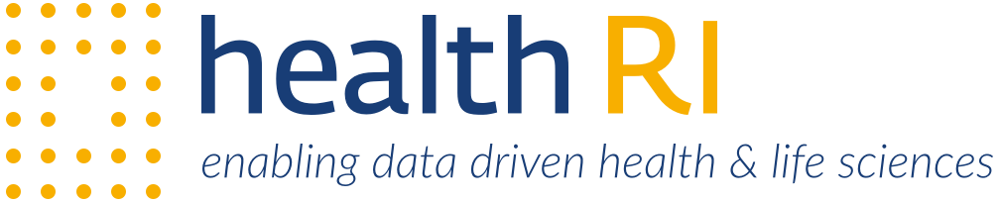

# Health-RI Semantic Interoperability Initiative

This site documents how Health-RI achieves semantic interoperability across health and life-sciences data: our concepts, modeling foundations (OntoUML & gUFO), the method and mapping vocabulary we use, and the published ontology deliverables (specs, docs, changelog).

## About Health-RI

[Health-RI](https://www.health-ri.nl) is a national initiative in the Netherlands dedicated to building an integrated infrastructure for health and life sciences data. By improving data sharing, reuse, and accessibility, Health-RI aims to empower researchers, clinicians, and policymakers to accelerate data-driven healthcare innovation.

Semantic interoperability plays a foundational role in this mission by ensuring that data from diverse sources can be aligned and understood consistently — not just technically, but conceptually.

## What’s on this site

- **Semantic Interoperability**: [Overview](semantic-interoperability/index.md)
- **OntoUML & gUFO**: [Overview](ontouml-gufo/index.md) · [OntoUML](ontouml-gufo/ontouml.md) · [OntoUML Stereotypes](ontouml-gufo/ontouml-stereotypes.md) · [OntoUML/UFO Catalog](ontouml-gufo/ontouml-ufo-catalog.md) · [Creating OntoUML Models](ontouml-gufo/creating-ontouml-models.md) · [gUFO](ontouml-gufo/gufo.md)
- **Method**: [Overview](method/index.md) · [Introduction](method/introduction.md) · [Mapping Strategy](method/mapping-strategy.md) · [Mapping Vocabulary Specification](method/specification.html) · [SSSOM Mapping Set](method/mapping-set.md) · [Publications](method/publications.md) · [Persistent Identifiers](method/persistent-ids.md)
- **Deliverables**: [Overview](ontology/index.md) · [Ontology Documentation](ontology/documentation.md) · [Ontology Specification](ontology/specification.html) · [Ontology Changelog](ontology/changelog.md)
- **Help & Contributions**: [FAQ](faq.md) · [Contributing](contributing.md)

## Who this is for
Data stewards, modelers, and engineers who need stable, shared meaning across systems—using a common reference model (OntoUML → gUFO) and mappings that align external ontologies to it.

> Looking for stable links and how to cite or reference our artifacts? See [Persistent Identifiers](method/persistent-ids.md) and [Publications](method/publications.md).
