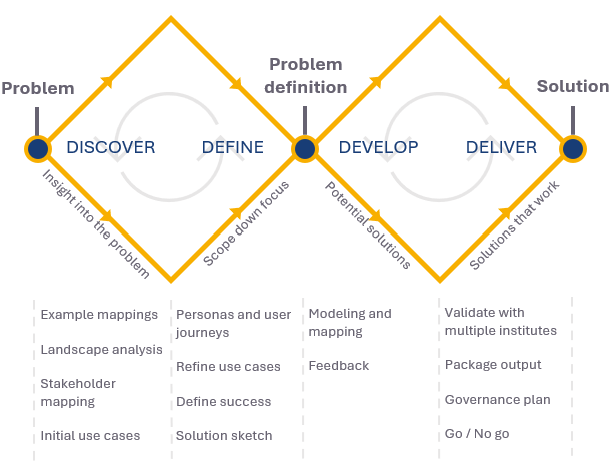
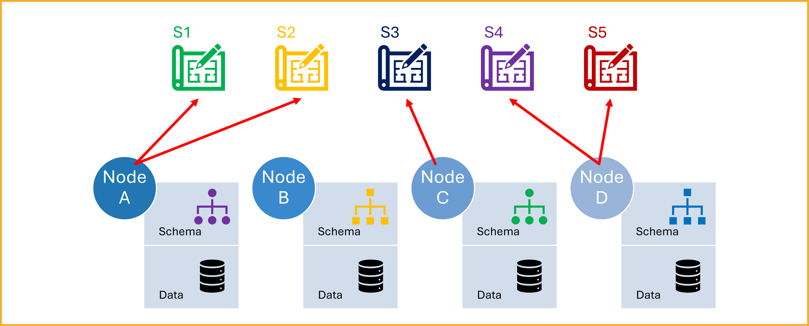
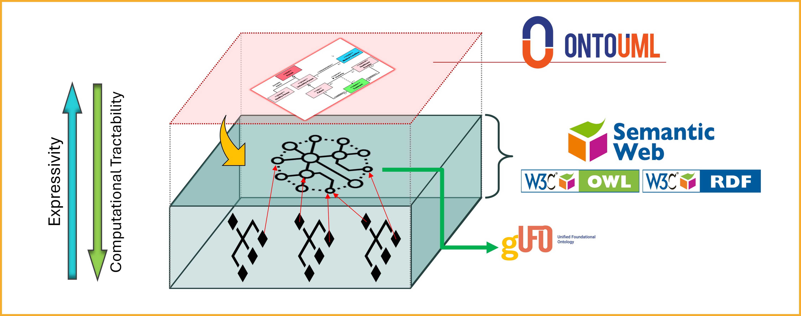
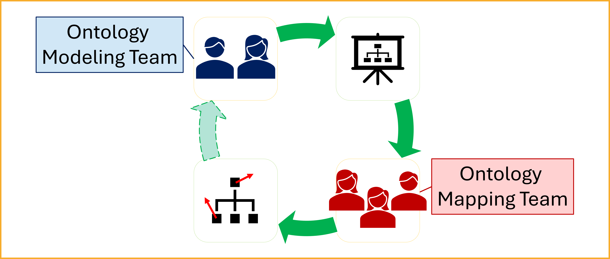

# Method Overview

## Generic process

## Current Situation

Health-RI serves as an intermediary that enables the nodes in its network to publish and consume data across institutions and systems. However, for this data exchange to be meaningful and analytically reliable, the data must be interpreted consistently and correctly by all parties involved.

Addressing this challenge requires moving beyond structural or syntactic alignment. What is needed is semantic interoperability—a shared understanding of the meaning behind the data being exchanged.

As illustrated in the figure above, each node maintains its own data schema and data repository. These schemas often vary significantly in structure, terminology, and the standards or assumptions they follow. In practice, several challenges arise:

* Some schemas adhere to formal standards, while others are informally defined by the data authors themselves.
* A single schema might be influenced by multiple standards, each introducing different terminologies or modeling assumptions.
* Documentation is often incomplete or ambiguous, which leads to misunderstandings and misinterpretation when data is exchanged between nodes.

This lack of clear, shared semantics introduces significant barriers to data integration and analysis. It increases the risk of misinterpretation, reduces confidence in the data, and ultimately limits reuse and impact.

To address these challenges and ensure semantic alignment across Health-RI’s network, we propose a new approach centered around a shared reference model.

## Toward a Solution: Introducing a Common Reference Model

Rather than relying on isolated and potentially ambiguous schemas, we propose the creation of a Common Reference Model to serve as a shared semantic foundation across all nodes.

This model is not intended to replace local schemas. Instead, it will serve as a semantic anchor: each schema will be expected to explicitly declare how its elements correspond to the concepts in the reference model, clarifying their intended meaning and enabling consistent interpretation.

!!! note
    In practice, schemas do not need to be restructured or rewritten. Rather, they must be mapped to the reference model—declaring, for each concept, its corresponding concept (or the nature of its relation) in the shared ontology.

To be effective, the reference model must be expressed in a highly expressive modeling language—one capable of making ontological commitments explicit and capturing rich semantic distinctions.

These requirements call for the use of ontologically well-founded modeling languages, which are grounded in formal ontology and support the precise representation of complex domains. Among them, [OntoUML](../ontouml-gufo/ontouml.md) stands out as a leading and widely adopted approach, offering both theoretical rigor and practical tooling.

The image below illustrates the roles and technologies involved in our approach to enabling semantic interoperability. At the top, the conceptual common reference model is represented using OntoUML, providing a clear and ontologically well-founded view of the meaning of concepts. While this model supports human understanding, it is not directly usable in computational artifacts.

To enable computational use, the OntoUML model is transformed into a corresponding ontology implemented in [gUFO](../ontouml-gufo/gufo.md), a lightweight ontology in OWL aligned with the Unified Foundational Ontology (UFO).

Once the computational ontology is available, computational artifacts—such as schemas, web ontologies, or others used for information exchange—can be mapped to the gUFO-based OWL ontology. These mappings may be created by Health-RI (see [mappings](../ontology/mappings.md)) or by the owners of the aligned artifacts.

<!-- TODO: add advantages of OntoUML and link to its page -->

## Division of Responsibilities: Modeling and Mapping Teams

To operationalize the approach based on a shared reference model, Health-RI will structure the effort around two complementary teams:

* The Ontology Modeling Team
* The Ontology Mapping Team

These teams will work in parallel to accelerate delivery while maintaining a clear division of responsibilities.

### Ontology Modeling Team

The Modeling Team is responsible for developing the reference model using OntoUML. Team members are expected to:

* Model domain knowledge using OntoUML with a high degree of accuracy and precision.
* Analyze and interpret technical materials, such as standards, protocols, and domain documentation.
* Engage with domain specialists to gather the necessary insights for accurate modeling.

The team’s objective is to produce a semantically rich and ontologically well-founded model that captures the essential structure and meaning of the domain.

### Ontology Mapping Team

The Mapping Team is responsible for linking existing data schemas from participating nodes to the reference model. This involves:

* Interpreting and understanding OntoUML models.
* Analyzing data schemas in various formats, with an emphasis on Semantic Web technologies.
* Applying best practices in concept mapping using appropriate tools and techniques.
* Utilizing the [Simple Standard for Sharing Ontological Mappings (SSSOM)](https://mapping-commons.github.io/sssom/) to document mappings in a consistent and reusable way.
* Collaborating closely with data holders, managers, and owners at each node to capture the intended meaning of schema elements.

This team plays a critical role in ensuring that local schemas are semantically aligned with the reference model, enabling shared understanding across the network.

### Domain Guidance and Coordination

While domain knowledge is essential, it does not need to reside within the modeling or mapping teams. Instead, a third coordinating group will provide:

* Access to domain experts and technical documentation.
* Guidance throughout the modeling and mapping processes.
* Logistical and institutional support to ensure smooth collaboration between stakeholders.

This group ensures that the teams are supported with the necessary context and resources to perform their tasks effectively.

### Collaborative Iteration and Feedback

As shown in the diagram, the Modeling and Mapping Teams operate in a collaborative feedback loop.

* The Ontology Modeling Team develops the conceptual model.
* The Ontology Mapping Team uses this model to map the local schemas.
* Insights gained during the mapping process are fed back to the modeling team.

This feedback may include:

* Missing concepts that need to be added to the reference model.
* Redundant or unused elements that can be removed or revised.
* Ambiguities or inconsistencies that require clarification.

This iterative cycle improves both the quality of the reference model and the precision of the mappings. Over time, it leads to a stronger, more coherent semantic framework for Health-RI and its partners.

## Translating OntoUML to OWL via gUFO

While OntoUML provides the expressiveness and ontological rigor needed to build the reference model, it is designed primarily for conceptual modeling. Its focus is on producing models that support human understanding, learning, communication, and informed decision-making. As such, OntoUML models are not directly suited for computational use in Semantic Web applications or automated reasoning tasks.

To bridge this gap, the OntoUML model must be transformed into a computational representation. This is achieved by converting the OntoUML reference model into [gUFO (gentle UFO)](../ontouml-gufo/gufo.md)—a lightweight, computationally accessible ontology derived from UFO, the foundational ontology on which OntoUML is based.

gUFO is implemented in the Web Ontology Language (OWL), a widely used standard for representing ontologies on the Semantic Web. This makes it compatible with existing RDF-based technologies and allows:

* The OntoUML-based reference model to be used computationally within semantic infrastructures.
* Semantic mappings from node-level RDF-based schemas to be aligned directly with the OWL representation of the model.

By converting OntoUML models into gUFO-compliant OWL ontologies, we ensure that the semantics captured during conceptual modeling are retained, while also enabling their technical integration into semantic web systems and interoperability workflows.

## Mapping Schemas to the gUFO Ontology

Once the reference model has been converted into its computational form—namely, the gUFO ontology in OWL format—schema-level mappings can be established to connect the original data schemas to the reference ontology.

The figure above outlines the decision process for performing these mappings, depending on the characteristics and technical constraints of each source schema.

The first consideration is whether the original schema is expressed using Semantic Web technologies, such as RDF, RDFS, or OWL. If it is not, the schema cannot be programmatically linked to gUFO concepts. In these cases, the recommended approach is to create comprehensive external documentation that clearly registers the mappings between the schema and the gUFO ontology in a structured and traceable manner.

If the schema is already implemented using Semantic Web technologies, the next step is to determine whether it is possible to extend or modify the schema:

* If the schema is writable and under the control of the team, the mappings should be directly embedded into the schema using standard RDF mechanisms (e.g., `rdfs:seeAlso`, `owl:equivalentClass`, or custom annotation properties) that link schema terms to the corresponding concepts in gUFO.

* If the schema is non-writable (e.g., maintained by an external authority, published as read-only, or subject to strict governance constraints), the mappings must be maintained externally. In such cases, the use of the [Simple Standard for Sharing Ontological Mappings (SSSOM)](https://mapping-commons.github.io/sssom/) is recommended. SSSOM provides a machine-readable, semantically robust format for documenting mappings between source terms and reference ontology concepts.

* Finally, even if the schema is expressed in a Semantic Web format but lacks the structural flexibility to support such mappings natively (e.g., due to rigid serialization patterns or minimal annotation support), the mapping must still be registered in a formal and sound manner. This should be done in accordance with the capabilities and limitations of the target technology, ensuring both semantic precision and technical feasibility.

By tailoring the mapping strategy to the technical nature of each schema, we ensure that all semantic alignments—whether embedded or external—remain traceable, reusable, and aligned with the reference ontology. This step is critical for enabling robust semantic interoperability across the Health-RI ecosystem.
