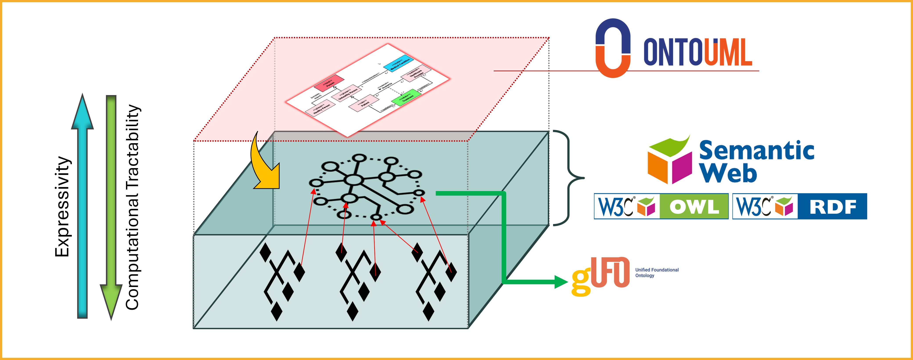
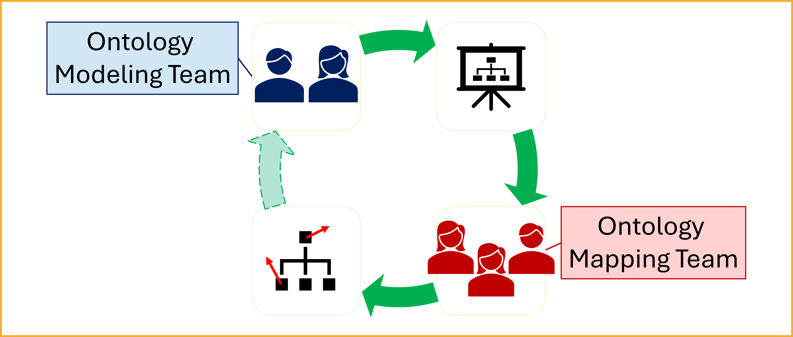

# Method Overview

## Current Situation

<!-- TODO: Update this image, removing the "nodes" concept. -->

!!! note
    This figure may contain legacy terminology (e.g., "nodes"). Interpret it as referring to data sources/schemas and their mappings.

Across the health and life sciences, data producers and consumers often need to publish and consume data across institutions and systems. However, for this data exchange to be meaningful and analytically reliable, the data must be interpreted consistently and correctly by all parties involved.[^1][^2] In practice, achieving this often relies on manual, case-by-case mappings across heterogeneous standards and local schemas, which is technically complex, time-consuming, and error-prone.[^3][^4]

!!! note
    In this page, "schema" is used broadly to include local database schemas as well as standard-level models (e.g., FHIR, OMOP, openEHR) and RDF/OWL artifacts used for exchange.

Addressing this challenge requires moving beyond structural or syntactic alignment. What is needed is semantic interoperability—a shared understanding of the meaning behind the data being exchanged.[^3][^4][^32] Otherwise, systems may appear to agree because they use the same terms or data structures, while still committing to different conceptualizations. Such a situation can lead to [*false agreement*](../semantic-interoperability/index.md).[^19][^22]

As illustrated in the figure above, each institution maintains its own data schema and data repository, often resulting in fragmented data silos. These schemas often vary significantly in structure, terminology, and the standards or assumptions they follow.[^3][^4][^5][^17][^24] In practice, several challenges arise:

* Some schemas adhere to formal standards, while others are informally defined by the data authors themselves.[^4][^24]
* A single schema might be influenced by multiple standards, each introducing different terminologies or modeling assumptions.[^4][^5]
* Documentation is often incomplete or ambiguous, which leads to misunderstandings and misinterpretation when data is exchanged between institutions.[^4][^5]
* Mappings and transformations are often specified at the level of implementation artifacts (schemas and their structures), leaving underlying conceptualizations and meaning-level relations implicit.[^21][^22]
* Similar labels, codes, textual definitions, or even OWL axioms are not sufficient to guarantee shared meaning when ontological commitments remain implicit.[^19][^22]

This lack of clear, shared semantics introduces significant barriers to data integration and analysis. It increases the risk of misinterpretation, reduces confidence in the data, and ultimately limits reuse and impact.[^1][^3][^17]

!!! warning
    Shared labels, codes, or even similar OWL patterns do not guarantee shared meaning. Apparent agreement can hide genuine semantic misalignment ("false agreement"), so mappings must make their intended ontological commitments explicit and reviewable.[^18][^22]

To address these challenges and ensure semantic alignment across institutions and systems, we propose a new approach centered around a common semantic reference model: the Health-RI Ontology (HRIO).[^21][^18]

## Toward a Solution: Introducing a Common Semantic Reference Model

Rather than relying on isolated and potentially ambiguous schemas, we propose the creation of a common semantic reference model—the Health-RI Ontology, or simply HRIO—to serve as a shared semantic foundation across institutions and systems.[^21][^18]

HRIO is not intended to replace local schemas. Instead, it will serve as a semantic anchor: each schema will be expected to explicitly declare how its elements correspond to the concepts in HRIO, clarifying their intended meaning and enabling consistent interpretation.[^18][^21]

!!! note
    In practice, schemas do not need to be restructured or rewritten. Rather, they must be mapped to HRIO—declaring, for each concept, its corresponding concept (or the nature of its relation) in the shared ontology, using the Health-RI Mapping Vocabulary (HRIV) (cf. SKOS mapping relations for general vocabulary alignment).[^36]

!!! info
    The Common Reference Model is a semantic hub, not a replacement for local schemas. It supports reuse by letting multiple standards and local schemas align to one shared conceptualization rather than maintaining many pairwise mappings.

To be effective, HRIO must be expressed in a highly expressive modeling language—one capable of making ontological commitments explicit and capturing rich semantic distinctions.[^20][^23]

These requirements call for the use of ontologically well-founded modeling languages, which are grounded in formal ontology and support the precise representation of complex domains. Among them, [OntoUML](../ontouml-gufo/ontouml.md) stands out as a leading and widely adopted approach, offering both theoretical rigor and practical tooling.[^20][^23]

The image below illustrates the roles and technologies involved in our approach to enabling semantic interoperability. At the top, the conceptual HRIO reference model is represented using OntoUML (HRIO OntoUML), providing a clear and ontologically well-founded view of the meaning of concepts. While this model supports human understanding, it is not directly usable in computational artifacts.

To enable computational use, the HRIO OntoUML model is transformed into a corresponding gUFO-based OWL implementation (HRIO gUFO/OWL), based on [gUFO](../ontouml-gufo/gufo.md), a lightweight ontology in OWL aligned with the Unified Foundational Ontology (UFO).[^23][^25]

The next figure summarizes *semantic traceability* in the approach, connecting (i) the semiotic view (referent, conceptualization, representation) with (ii) the Model-Driven Architecture (MDA) view. It highlights the relationship between the conceptual model (HRIO OntoUML, CIM) and its computational ontology implementation (HRIO gUFO/OWL, PIM), helping preserve meaning across layers.[^33][^34][^35] For the initiative-level conceptual rationale and worked example, see the academic paper.[^37]

<!-- TODO: Add this new image. -->

Once the computational ontology is available, computational artifacts—such as schemas, web ontologies, or others used for information exchange—can be mapped to HRIO gUFO/OWL using the Health-RI Mapping Vocabulary (HRIV). These mappings may be created by Health-RI (see [mappings](../deliverables/mappings.md)) or by the owners of the aligned artifacts.[^21][^29]

!!! info "Why OntoUML?"
    OntoUML is used for HRIO OntoUML because it is grounded in the Unified Foundational Ontology (UFO) and supports explicit ontological commitments. This helps:

    - make modeling commitments discussable, reviewable, and comparable across artifacts;
    - support conceptual clarification and meaning negotiation with domain experts (when terminology alone is not reliable);
    - preserve intended semantics when transforming the conceptual model into HRIO gUFO/OWL.

    For more information, access: [OntoUML](../ontouml-gufo/ontouml.md).

## Division of Responsibilities: Modeling and Mapping Teams

To operationalize the approach based on a common semantic reference model (HRIO), Health-RI will structure the effort around two complementary teams:

* The Ontology Modeling Team
* The Ontology Mapping Team

These teams will work in parallel to accelerate delivery while maintaining a clear division of responsibilities.

!!! tip
    Treat mappings as versioned artifacts: they must be reviewed when either the source schema/standard or the reference model evolves. Capturing rationale for each mapping decision reduces rework and reviewer disagreement.

### Ontology Modeling Team

The Modeling Team is responsible for developing the HRIO reference model (HRIO OntoUML) using OntoUML. Team members are expected to:

* Model domain knowledge using OntoUML with a high degree of accuracy and precision.
* Analyze and interpret technical materials, such as standards, protocols, and domain documentation.
* Engage with domain specialists to gather the necessary insights for accurate modeling.

The team's objective is to produce a semantically rich and ontologically well-founded model that captures the essential structure and meaning of the domain.

### Ontology Mapping Team

The Mapping Team is responsible for aligning concepts from external standards and local schemas (and related implementation artifacts such as RDF/OWL ontologies, codes, and schema elements) to HRIO. In the approach, these external artifacts contribute the *source expressions* being mapped, while HRIO concepts play the role of the target meanings. This involves:

* Interpreting and understanding OntoUML models.
* Analyzing data schemas in various formats, with an emphasis on Semantic Web technologies.
* Applying best practices in concept mapping using appropriate tools and techniques.
* Utilizing the [Simple Standard for Sharing Ontological Mappings (SSSOM)](https://mapping-commons.github.io/sssom/) to document mappings in a consistent and reusable way.[^29]
* Collaborating closely with artifact owners and maintainers (e.g., standard communities, ontology/schema maintainers, and domain experts) to capture the intended meaning of concepts and schema elements.

!!! tip "Drafting mappings with the HRIO Mapping Assistant (GPT)"
    When you need help selecting a candidate HRIO target and choosing exactly one HRIV predicate, you can use the [HRIO Mapping Assistant](https://chatgpt.com/g/g-6990a7e348c4819190ef2de88503ff5e-hrio-mapping-assistant)** as a drafting aid.

    *Always capture evidence in the mapping record and follow the review rules described in Mapping Governance before publishing or contributing mappings.*

Depending on editorial control, mappings may be maintained non-invasively in a separate mapping set (e.g., SSSOM) or embedded directly in the source artifact when governance permits.

This team plays a critical role in ensuring that concepts from standards, schemas, and related artifacts are semantically aligned with the reference model, enabling shared understanding and more reliable reuse across systems and integration settings.

### Domain Guidance and Coordination

While domain knowledge is essential, it does not need to reside within the modeling or mapping teams. Instead, a third coordinating group will provide:

* Access to domain experts and technical documentation.
* Guidance throughout the modeling and mapping processes.
* Logistical and institutional support to ensure smooth collaboration between stakeholders.

This group ensures that the teams are supported with the necessary context and resources to perform their tasks effectively.

### Collaborative Iteration and Feedback

As shown in the diagram, the Modeling and Mapping Teams operate in a collaborative feedback loop.

* The Ontology Modeling Team develops the conceptual model.
* The Ontology Mapping Team uses this model to map concepts from external artifacts (standards, local schemas, and ontologies) and local schemas (and related implementation artifacts) to HRIO.
* Insights gained during the mapping process are fed back to the modeling team.

This feedback may include:

* Missing concepts that need to be added to the reference model.
* Redundant or unused elements that can be removed or revised.
* Ambiguities or inconsistencies that require clarification.

This iterative cycle improves both the quality of the reference model and the precision of the mappings. Over time, it leads to a stronger, more coherent semantic framework for Health-RI and others facing similar interoperability challenges.

## Translating OntoUML to OWL via gUFO

While OntoUML provides the expressiveness and ontological rigor needed to build HRIO OntoUML, it is designed primarily for conceptual modeling. Its focus is on producing models that support human understanding, learning, communication, and informed decision-making. As such, OntoUML models are not directly suited for computational use in Semantic Web applications or automated reasoning tasks.[^20][^23]

To bridge this gap, the OntoUML model must be transformed into a computational representation. This is achieved by converting the OntoUML reference model (HRIO OntoUML) into a gUFO-based OWL implementation (HRIO gUFO/OWL) using [gUFO (gentle UFO)](../ontouml-gufo/gufo.md)—a lightweight, computationally accessible ontology derived from UFO, the foundational ontology on which OntoUML is based.[^23][^25]

gUFO is implemented in the Web Ontology Language (OWL), a widely used standard for representing ontologies on the Semantic Web. This makes it compatible with existing RDF-based technologies and allows:[^25]

!!! note
    OntoUML is optimized for making ontological distinctions explicit for human understanding and review, while gUFO/OWL enables computational use. Keeping both layers preserves meaning while remaining technically tractable.

* The OntoUML-based reference model to be used computationally within semantic infrastructures.
* Semantic mappings from local RDF-based schemas to be aligned directly with the OWL representation of the model.

By converting HRIO OntoUML into HRIO gUFO/OWL, we ensure that the semantics captured during conceptual modeling are retained, while also enabling their technical integration into semantic web systems and interoperability workflows.[^25]

[^1]: Wilkinson, M. D., et al. (2016). The FAIR Guiding Principles for scientific data management and stewardship. *Scientific Data, 3*(1), 160018. https://doi.org/10.1038/sdata.2016.18
[^2]: Piera-Jiménez, J., Leslie, H., Dunscombe, R., & Pontes, C. (2024). Interoperability in the context of integrated care. In V. Amelung, V. Stein, E. Suter, N. Goodwin, R. Balicer, & A.-S. Beese (Eds.), *Handbook of Integrated Care* (pp. 1–22). Springer Nature Switzerland. https://doi.org/10.1007/978-3-031-25376-8_101-1
[^3]: Yadav, R., Murria, S., & Sharma, A. (2021). A research review on semantic interoperability issues in electronic health record systems in medical healthcare. In *IoT-Based Data Analytics for the Healthcare Industry* (pp. 123–138). Elsevier. https://doi.org/10.1016/B978-0-12-821472-5.00009-0
[^4]: De Mello, B. H., et al. (2022). Semantic interoperability in health records standards: A systematic literature review. *Health Technol, 12*(2), 255–272. https://doi.org/10.1007/s12553-022-00639-w
[^5]: Capuano, N., Foggia, P., Greco, L., & Ritrovato, P. (2022). A Linked Data application for harmonizing heterogeneous biomedical information. *Applied Sciences, 12*(18), 9317. https://doi.org/10.3390/app12189317
[^17]: Mithiri, R. K. (2025). A semantic interoperability framework for cross-institutional integration of heterogeneous electronic health records. *International Journal of Engineering Technology Research & Development, 6*(3), 25–31.
[^18]: Guizzardi, G. (2020). Ontology, ontologies and the "I" of FAIR. *Data Intelligence, 2*(1–2), 181–191. https://doi.org/10.1162/dint_a_00040
[^19]: Guarino, N. (Ed.). (1998). *Formal Ontology in Information Systems: Proceedings of the 1st International Conference (Trento, Italy, June 6–8, 1998)*. IOS Press.
[^20]: Guizzardi, G. (2005). *Ontological foundations for structural conceptual models* (Doctoral dissertation, University of Twente).
[^21]: Ekaputra, F. J., Sabou, M., Serral, E., Kiesling, E., & Biffl, S. (2017). Ontology-based data integration in multi-disciplinary engineering environments: A review. *Open Journal of Information Systems (OJIS), 4*(1), 1–26.
[^22]: Guizzardi, G., & Guarino, N. (2024). Explanation, semantics, and ontology. *Data & Knowledge Engineering, 153*, 102325. https://doi.org/10.1016/j.datak.2024.102325
[^23]: Guizzardi, G., Botti Benevides, A., Fonseca, C. M., Porello, D., Almeida, J. P. A., & Prince Sales, T. (2022). UFO: Unified Foundational Ontology. *Applied Ontology, 17*(1), 167–210. https://doi.org/10.3233/AO-210256
[^24]: Saberi, M. A., Mcheick, H., & Adda, M. (2025). From data silos to health records without borders: A systematic survey on patient-centered data interoperability. *Information, 16*(2), 106. https://doi.org/10.3390/info16020106
[^25]: Almeida, J. P. A., Guizzardi, G., Sales, T. P., & Falbo, R. A. (2019). *gUFO: A lightweight implementation of the Unified Foundational Ontology (UFO)*. http://purl.org/nemo/doc/gufo
[^29]: Zhang, S., Cornet, R., & Benis, N. (2024). Cross-Standard Health Data Harmonization using Semantics of Data Elements. *Scientific Data, 11*(1), 1407. https://doi.org/10.1038/s41597-024-04168-1
[^32]: Palojoki, S., & Vuokko, R. (2023, April 26). Semantic interoperability of EHRs: Review of approaches for enhancing the goals of European Health Data Space. *Preprint*. https://doi.org/10.20944/preprints202304.0957.v1
[^33]: Ogden, C. K., & Richards, I. A. (1923). *The meaning of meaning: A study of the influence of language upon thought and of the science of symbolism*. Kegan Paul, Trench, Trubner & Co.
[^34]: Gangemi, A. (2007). *Semiotics Ontology Design Pattern*. http://www.ontologydesignpatterns.org/cp/owl/semiotics.owl
[^35]: Miller, J., & Mukerji, J. (2003). *MDA Guide Version 1.0.1* (OMG/03-06-01). Object Management Group. http://www.omg.org/cgi-bin/doc?omg/03-06-01.pdf
[^36]: Miles, A., & Bechhofer, S. (2009, August 18). *SKOS Simple Knowledge Organization System Reference* (W3C Recommendation REC-skos-reference-20090818). World Wide Web Consortium. https://www.w3.org/TR/skos-reference/
[^37]: Barcelos, P. P. F., van Ulzen, N., Groeneveld, R., Konrad, A., Khalid, Q., Zhang, S., Trompert, A., & Vos, J. (n.d.). *Enabling Semantic Traceability in Health Data: The Health-RI Semantic Interoperability Initiative* (manuscript approved at SWAT4HCLS 2026, v1.1.1). [Download link.](https://raw.githubusercontent.com/Health-RI/semantic-interoperability/main/documents/preprints/enabling-semantic-traceability-in-health-data-v1.1.0.pdf)
