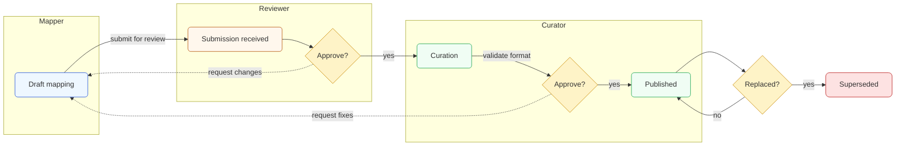

# Governance, Lifecycle, and Validation of the Health-RI SSSOM Mapping Set

This page sets the governance, lifecycle, validation, and release policy for the Health-RI SSSOM Mapping Set. It complements the [Mapping Set](./mapping-schema.md) page (schema, field semantics, URIs) and the [Semantic Mapping Strategy](./mapping-strategy.md) page (methodology and scope).

## Purpose and Scope

This policy defines how the Health-RI SSSOM Mapping Set is governed, validated, versioned, and released so that mappings are trustworthy, reproducible, and easy to discover.

### Objectives

- Enforce clear roles with separation of duties (Mapper, Reviewer, Curator) and independent human approvals (two-person rule).
- Run a stateful lifecycle with explicit promotion gates and an append-only supersession model.
- Guarantee provenance, reproducibility, and transparent release management.
- Align with external standard communities where applicable (e.g., OMOP) and record outcomes.

### Applicability

- Applies to all mapping records proposed for or included in Health-RI mapping artifacts (TSV/TTL) and their metadata as defined on the [Mapping Set](./mapping-schema.md) page.
- Covers all submission routes referenced on the [Mapping Set](./mapping-schema.md) page (e.g., issue form or XLSX) and the end-to-end path to publication.

### In Scope

- Role definitions and two-person rule.
- [Lifecycle states and promotion gates](#lifecycle-states-and-promotion-gates) (Draft → Review → Curation → Published → Superseded).
- Validation criteria: schema and completeness, predicate policy (Health-RI Mapping Vocabulary, HRIV), CURIE/URI hygiene, supersession integrity, and temporal/provenance checks.
- [Versioning and change control](#versioning-and-change-control) (daily-dated releases `YYYY-MM-DD`, at most one per calendar day; append-only `replaces` chains; immutable history).
- [Publication and discovery](#publication-and-discovery) (stable w3id endpoints; artifacts listed on the [Mapping Set](./mapping-schema.md) page).
- [External standard community alignment](#external-standard-community-alignment) and traceability of submissions.

### Out of Scope

- Per-row schema, allowed values, justification vocabulary, and field semantics (see the [Mapping Set](./mapping-schema.md) page).
- Mapping methodology and domain-specific modeling guidance (see the [Semantic Mapping Strategy](./mapping-strategy.md) page).
- Tool-specific implementation details beyond what is needed to satisfy the policy.

### Expected Outcomes (Conformance)

- Every published record:
    - Has independent approvals by Reviewer and Curator.
      - The Reviewer approval is recorded per row in SSSOM via reviewer_id.
      - The Curator approval is recorded in the repository publication workflow (in git logs); SSSOM does not define a per-row curator slot.
    - Appears in a dated release (`YYYY-MM-DD`), with release notes summarizing additions, changes, and supersessions.
    - Is reachable via stable w3id URIs and traceable via `record_id` and the `replaces` chain (as defined and linked on the [Mapping Set](./mapping-schema.md) page).
- Historical states are discoverable within the single canonical, append-only artifact via dated entries (see [Versioning and Change Control](#versioning-and-change-control)).

## Roles and Responsibilities

- **Mapper**
    - Acts as the primary owner and creator of the mapping record.
    - Analyzes the source standard concept and the target Health-RI Ontology (HRIO) concept in context (definitions, scope notes, relations, etc.), evaluates semantic fit, and selects the appropriate HRIV predicate and, where applicable, a modifier.
    - Drafts mapping records with clear comments/rationale for non-obvious choices so mappings are understandable to users.
    - Ensures that all mandatory fields defined on the [Mapping Set](./mapping-schema.md) page are present and both semantically and syntactically valid before submission.
    - Implements modifications requested by the Reviewer and Curator and resubmits until approval.

- **Reviewer**
    - A domain expert or mapper, independent from the author.
    - Acknowledges submission, evaluates semantic and syntactical correctness, and either approves for curation or requests changes back to the Mapper.
    - Records rationale when non-obvious or when using any negation (`predicate_modifier = Not`).

- **Curator**
    - Performs curation (including format/schema checks, CURIE/URI hygiene, and supersession integrity); may perform minor syntactic fixes when appropriate.
    - Optionally serves as a secondary semantic reviewer when needed.
    - Decides on approval for publication or requests fixes back to the Mapper.
    - Publishes approved mappings.

- **Separation of duties**
    - The author and reviewer must be different people (two-person rule).
    - Publication requires independent human approvals by the Reviewer and Curator.

!!! warning "Two-person rule is mandatory"
    The author of a mapping cannot also act as Reviewer or Curator for that same record.
    If staffing is limited, reschedule publication rather than collapsing roles.

!!! note "Curator Approval: Workflow, Not Per-Row"
    Curator approval is captured as workflow evidence (in git logs), not as a per-row SSSOM field. Per-row approval in SSSOM is recorded via `reviewer_id`.

## Lifecycle States and Promotion Gates

The lifecycle follows the flow below.

!!! info "Promotion gates at a glance"
    - Draft → Review: All mandatory fields present; rationale captured for non-obvious choices.
    - Review → Curation: Independent Reviewer confirms semantic fit and predicate choice.
    - Curation → Published: Curator confirms schema, CURIE/URI hygiene, and supersession integrity.
    - Published → Superseded: New record must reference the prior via `replaces` (append-only).

!!! important "Timeboxes (SLA) summary"
    - **Reviewer:** Concludes within **one sprint** from receipt; extendable to **two sprints** with documented justification.
    - **Curator:** Provides an outcome (**return to Mapper** or **publish**) within **one sprint** from receipt.
    - **External submission:** Initiate community submission within **one sprint** of publication.

### Lifecycle states

1. Draft mapping (Mapper)

    - Mapper prepares the record with mandatory fields; CURIEs/URIs well-formed; rationale captured for non-obvious choices.

2. Submission received (Reviewer)

    - Reviewer acknowledges intake, evaluates meaning and scope.
    - **Timeline:** Within **one sprint** from receipt of the mapping from the Mapper, the Reviewer concludes the review; this may be extended to **two sprints** with documented justification.
    - Decision (Approve?)
      - Yes → Curation
      - Request changes → back to Draft

    !!! note "Extensions"
        Extensions to two sprints are possible when justified.

   !!! success "Reviewer quick-check"
    - [ ] Predicate choice justified on the concepts' semantics, not label similarity
    - [ ] Rationale present for contentious cases or any `predicate_modifier = Not`
    - [ ] Mandatory fields complete per the [Mapping Set](./mapping-schema.md) page

3. Curation (Curator)

    - Curator checks field completeness per the [Mapping Set](./mapping-schema.md) page, CURIE/URI hygiene, and supersession integrity; applies minor syntactic fixes if safe.
    - **Timeline:** Within **one sprint** from receipt, the Curator analyzes the mapping and provides an outcome (**return to Mapper** or **publish**).
    - Decision (Approve?)
      - Yes → Published
      - Request fixes → back to Draft

    !!! success "Curator quick-check"
        - [ ] Required columns
        - [ ] Allowed HRIV predicates and valid (optional) `predicate_modifier`
        - [ ] CURIE/URI hygiene (resolves with 2xx/3xx where applicable)
        - [ ] `replaces` points to an existing record
        - [ ] `mapping_date ≤ publication_date`
        - [ ] Uniqueness (Exact Meaning): For each `subject_id`, ensure no more than one current row has `predicate_id = hriv:hasExactMeaning` and no `predicate_modifier = Not` (use the `replaces` chain to determine which row is current).
        - [ ] Per-record identifiers: `record_id` and any `replaces` URIs use the `hrim` prefix[^hrim].

4. Published (Curator)

    - Merged to main, included in a dated release, and exposed via stable w3id endpoints listed on the [Mapping Set](./mapping-schema.md) page.

5. Superseded

    - When Replaced? is Yes, a newer record references the prior via `replaces`. Append-only: older records remain in the canonical artifact; consumers should follow the latest in the `replaces` chain.

!!! tip "How to resolve to the current mapping"
    When multiple rows exist for the same source-target pair, follow the latest entry in the `replaces` chain. Do not assume the highest `record_id` is the current mapping.

## Versioning and Change Control

- Release cadence: At most one release per calendar day, versioned as `YYYY-MM-DD`.
- Append-only records: No in-place edits to published rows. Corrections create a new record that references the prior via `replaces`.
- Reproducibility: The canonical artifact is a single append-only TSV/TTL; prior states are recoverable via dated rows. Current validity can be assessed using `replaces` chains.

!!! tip "Why append-only?"
    An append-only approach (immutable log) preserves a complete audit trail, makes releases reproducible, and avoids ambiguity about which version of a mapping was used.

!!! warning "No in-place edits to published rows"
    Fixes must be new records that point to the prior one via `replaces`. Editing a published row is not possible, as it would break reproducibility and the audit trail.

## Semantic Requirements

Normative, per-row schema constraints (e.g., allowed predicates, label language tags, justification vocabulary) are defined on the [Mapping Set](./mapping-schema.md) page. This section provides usage guidance only.

### Justification and Evidence

- Set `mapping_justification` to the appropriate method indicator. By default (and currently the only generally acceptable value) it is `semapv:ManualMappingCuration` (a curator-approved alternative may be used when explicitly evaluated). This field records the method/rationale category for how the mapping was produced, not the semantic relation itself.
- Capture the concrete reasoning for your choice of HRIV `predicate_id` (e.g., `hriv:hasExactMeaning`, `hriv:hasBroaderMeaningThan`, `hriv:hasNarrowerMeaningThan`) in the `comment` field. When justifying, use definitional/semantic arguments (notes, formal definitions) over label similarity.
- When using a negation, set `predicate_modifier` to `Not` (its only valid value) and add a brief rationale in `comment`.
- For borderline hierarchical mappings, add a brief rationale in `comment` explaining why you selected broader or narrower.

## Validation

- **Reviewer (independent from author):**
    - Apply the predicate selection policy in [Semantic Requirements](#semantic-requirements); base decisions on definitions, scope notes, and modeled relations (not label similarity).
    - Ensure rationale is recorded for contentious cases or any `Not`.
    - Approve or request changes (back to Draft).

- **Curator:**
    - **Schema & completeness:** required columns present; datatypes valid; unique `record_id`; valid prefixes (per the [Mapping Set](./mapping-schema.md) page).
    - **Predicate policy:** conformance to allowed HRIV predicates and modifier rules (per the [Mapping Set](./mapping-schema.md) page).
    - **URI hygiene:** HTTP URIs well-formed and (where applicable) dereference with a 2xx/3xx response.
    - **Supersession integrity:** `replaces` points to an existing record.
    - **Temporal/provenance consistency:** `mapping_date ≤ publication_date`.
    - Approve for Published or request fixes (back to Draft).
    - **Identity distinctness:** verify that the set of `author_id` values is disjoint from the set of `reviewer_id` values within each row (enforcing two-person rule).

## Publication and Discovery

- Only mappings that have passed Reviewer and Curator approvals are published.
- Published artifacts and stable URIs are exactly those listed on the [Mapping Set](./mapping-schema.md) page.

For submission methods (issue form/XLSX) and the contributor checklist, see the [Mapping Set](./mapping-schema.md) page ("How to Contribute").

### External standard community alignment

When a source or target standard maintains an official mapping registry or acceptance process (e.g., OHDSI/OMOP), Health-RI shall:

1. Submit after publication: Within **one sprint** of publication, notify/submit the mapping(s) to the standard's community channel or registry.
2. Provide traceable facts: Include the Health-RI release date (`publication_date`), affected `record_id`(s), chosen HRIV predicate (`predicate_id`), and `mapping_justification`.
3. Record the submission: Add the submission URL or ticket ID in release notes; optionally place a per-row link in the `comment` field.
4. Handle outcomes via supersession: If the external review requests changes, publish a new record that supersedes the previous one using `replaces` (append-only), with a short rationale.

!!! important "Submission SLA"
    Submissions to external registries (e.g., OHDSI/OMOP) must be initiated within **one sprint** of publication.

<!-- footnotes -->
[^hrim]: `hrim` is the prefix for <https://w3id.org/health-ri/semantic-interoperability/mappings#>
