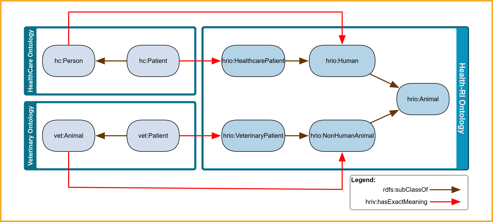
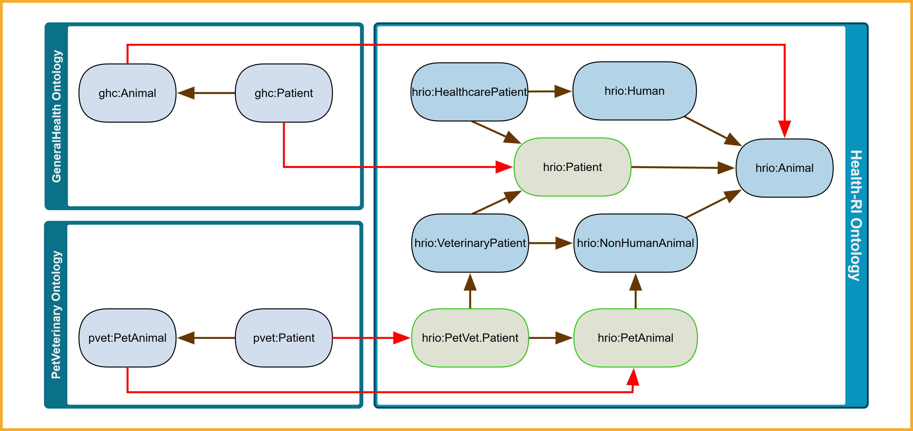

# Semantic Mapping Strategy

!!! warning "Disclaimer"
    While efforts have been made to ensure accuracy, the material in this page is still under review and may contain inaccuracies or omissions. Users are advised to interpret and apply the content with caution.

## Model-Driven Techniques: MDA, MDD, and MDE

The **[Model-Driven Architecture (MDA)](http://www.omg.org/mda/)**, defined by the Object Management Group (OMG), is an architectural framework that structures system modeling into abstract layers—promoting interoperability, portability, and reuse by separating domain concerns from technical implementation <a href="#ref1">[1</a>, <a href="#ref2">2]</a>.

- **Model-Driven Development (MDD)** denotes development processes guided by high-level models; MDA is one such OMG-conforming realization <a href="#ref2">[2]</a>.
- **Model-Driven Engineering (MDE)** is an overarching paradigm including model creation, transformation, code generation, reverse-engineering, and lifecycle evolution <a href="#ref2">[2]</a>.

OMG defines three main abstraction layers <a href="#ref1">[1</a>, <a href="#ref2">2]</a>:

- **Computation-Independent Model (CIM)**: captures domain context and system requirements in business terms, without specifying implementation structure.
- **Platform-Independent Model (PIM)**: defines structural and behavioral aspects—such as classes and relationships—in a technology-agnostic way, without committing to any particular implementation platform.
- **Platform-Specific Model (PSM)**: refines the PIM with technology-specific information (e.g. database schemas, APIs, frameworks) to enable implementation.

## CIM and PIM in Our Ontology Artifacts

Within our semantic interoperability framework:

- The **OntoUML ontology** sits at the CIM layer: it defines conceptual domain entities and relationships grounded in the Unified Foundational Ontology (UFO) <a href="#ref3">[3]</a>.
- The **gUFO representation** (OWL-based lightweight implementation of UFO) resides at the PIM layer: it expresses those same concepts as an executable OWL 2 DL ontology, suitable for reasoning and integration with Semantic Web tools <a href="#ref3">[3]</a>.

*Figure 1: OntoUML at the CIM layer defines the semantics that are implemented in gUFO/OWL at the PIM layer.*

This visual clarifies that OntoUML provides the conceptual meaning, which the gUFO artifact operationalizes—while preserving semantic integrity across layers.

### Roles of the Artifacts

| Artifact       | Layer | Purpose                                                                                                                                                       | Practical Role                                                                                        |
| -------------- | ----- | ------------------------------------------------------------------------------------------------------------------------------------------------------------- | ----------------------------------------------------------------------------------------------------- |
| **OntoUML**    | CIM   | Provides clarity about domain-specific concepts by offering clear and precise definitions, supporting conceptual validation and enabling expert communication | Serves as a semantic map and meaning contract to align domain terms for interoperability              |
| **gUFO** (OWL) | PIM   | Provides machine-readable semantics, supporting automated reasoning and tool interoperability                                                                 | Enables integration and alignment of RDF-based artifacts within semantic web and linked data contexts |

Maintaining both artifacts ensures clear traceability from domain concepts (OntoUML/CIM) to executable ontology structures (gUFO/PIM) <a href="#ref3">[3]</a>.

## Semantic Reference: Defining CIM-to-PIM Semantics

In the Health-RI architecture, every class in the gUFO ontology (PIM) is implicitly semantically defined by its counterpart in OntoUML (CIM). For example, the class `hrio:Person` in gUFO borrows its semantics from the `Person` class in the OntoUML model. Because the CIM is not computational, this semantic linkage remains implicit and is *not formally encoded* <a href="#ref3">[3]</a>.

!!! tip "Why the CIM-PIM link matters"
    Even though the OntoUML model is not executable, it defines the core meaning that gUFO classes implement. This semantic grounding improves trust, clarity, and alignment in data integration.

## Aligning Third-Party Ontologies

Our common reference model provides authoritative semantics to external concept definitions. When another ontology defines `onto:Person`, it may be semantically aligned with our `hrio:Person`. To make this relationship explicit, a **`hriv:hasSemantics`** link can be asserted—either by the Health-RI mapping team (e.g., in SSSOM format), or by the owners of the external ontology within their artifact—signifying that the external concept carries the same meaning.

There are two possible approaches for creating and maintaining such mappings:

- **Mappings performed by the Health-RI team:** In this case, mappings are created by Health-RI's semantic modeling team and provided in [SSSOM](https://w3id.org/sssom/) format. This is the default strategy when the external ontology or resource is publicly available or beyond Health-RI’s editorial control (e.g., national standards, web-accessible vocabularies). These mappings are *non-invasive*, meaning they do not alter the original artifacts but describe their alignment externally. For details on how these mappings are published, versioned, and curated, see the [SSSOM Mapping Set](./mapping-set.md).

- **Mappings authored by external partners:** If the external artifact is under the editorial responsibility of a partner or collaborating organization, that party may directly include the mappings within their ontology. In this case, the mappings are *embedded* into the source artifact itself (e.g., adding `hriv:hasSemantics` to their RDF model pointing to Health-RI concepts), offering tighter integration and long-term maintainability by the artifact owner.

These complementary approaches enable semantic alignment in both centrally controlled and federated interoperability scenarios.

!!! info "View Current Mappings"
    For a list of the mappings created by the Health-RI team, see the [Mappings page](../ontology/mappings.md).

!!! info
    For details about the schema and contribution process, see the [SSSOM Mapping Set](./mapping-set.md).

!!! warning "Only one `hriv:hasSemantics` allowed"
    Each concept may have **exactly one** `hriv:hasSemantics` to a Health-RI concept—**and only when a perfect semantic equivalence exists**. Using more than one `hriv:hasSemantics` for the same concept is not allowed, as it introduces ambiguity.

*Figure 2: If an external ontology defines `External:Patient` which we map via `hriv:hasSemantics` to `hrio:Patient`—and `hrio:Patient` derives its semantics from the OntoUML `Patient` concept—then we can interpret `External:Patient` as conveying the same semantics as the `OntoUML Patient` concept.*

## Mapping Properties for Cross-Scheme Alignment

The Health-RI Mapping Vocabulary was created to provide a set of mapping properties designed for expressing alignments between concepts in different concept schemes (e.g. external vocabularies and our Health-RI ontology). The principal properties are: `hriv:hasSemantics`, `hriv:hasSemanticsBroad`, and `hriv:hasSemanticsNarrow`.

### Our Strategy: Choosing the Right Mapping Property

- **`hriv:hasSemantics`** is used when the external concept is fully equivalent in meaning to our reference concept.
  - Each external concept may have **only one** `hriv:hasSemantics`.
- **`hriv:hasSemanticsBroad`** is used when the external concept is **broader** than our reference concept (i.e., it includes our concept and possibly more).
- **`hriv:hasSemanticsNarrow`** is used when the external concept is **narrower** than our reference concept (i.e., it captures a more specific notion).

!!! note "Clarifying hriv:hasSemantics semantics"
    Although `hriv:hasSemantics` can be treated like a strong semantic alignment **in meaning**, it does **not imply logical equivalence** (such as `owl:equivalentClass`). It is intended to capture a strong semantic alignment **in meaning**, not in logical entailment. This allows semantic interoperability without risking unintended reasoning consequences in OWL-based systems.

In contrast to `hriv:hasSemantics`, both `hriv:hasSemanticsNarrow` and `hriv:hasSemanticsBroad` allow **multiple mappings per concept** to express partial or hierarchical semantic overlaps.

These mappings are only to be used when **no perfect equivalence exists** and a semantic approximation must be made to the **closest reference concept** in the Health-RI ontology.

### Visual Example: Exact Semantic Alignment

*Figure 3: External ontologies (e.g., HealthCare and Veterinary) map their local concepts to reference concepts in the Health-RI Ontology via `hriv:hasSemantics` (red). These reference concepts are also semantically structured via `rdfs:subClassOf` (brown), enabling consistent classification across domains.*

This figure illustrates how concepts such as `hc:Patient` and `vet:Patient` are mapped to `hrio:HealthcarePatient` and `hrio:VeterinaryPatient` respectively. These are in turn subsumed by higher-level concepts like `hrio:Human` or `hrio:NonHumanAnimal`, ultimately aligning under `hrio:Animal`. This modeling strategy ensures that semantic alignments preserve domain distinctions while enabling unified interpretation under a shared reference ontology.

!!! tip "How to assert an exact match in your OWL file"
    To assign that a concept in your ontology has its semantics defined by a concept in the **latest version** of the Health-RI Ontology, use `hriv:hasSemantics` as shown below:

    - `hc:Patient hriv:hasSemantics <https://w3id.org/health-ri/ontology#HealthcarePatient> .`

    Or, if you've defined the prefix `hrio: <https://w3id.org/health-ri/ontology#>`, you can simply write:

    - `hc:Patient hriv:hasSemantics hrio:HealthcarePatient .`

    To align with a **specific version** of a Health-RI Ontology's concept (e.g., `v2.0.0`), use:

    - `hc:Patient hriv:hasSemantics <https://w3id.org/health-ri/ontology/v2.0.0#HealthcarePatient> .`

### Visual Example: Broader and Narrower Semantic Alignments

*Figure 4: Mapping external concepts from GeneralHealth and PetVeterinary ontologies to the Health-RI ontology. This example evolves from Figure 3 by incorporating `hriv:hasSemanticsNarrow` (magenta) and `hriv:hasSemanticsBroad` (blue) mappings in addition to `hriv:hasSemantics` (red).*

- `ghc:Patient` and `pvet:Patient` are both linked via `hriv:hasSemanticsNarrow` to `hrio:VeterinaryPatient`, indicating that each of these patients represents a specialized kind of patient in the Health-RI ontology.
- `pvet:PetAnimal` is linked via `hriv:hasSemanticsBroad` to `hrio:NonHumanAnimal`, signaling that the external concept is broader in scope.
- The figure also maintains `hriv:hasSemantics` mappings for concepts that are fully equivalent (e.g., `ghc:Animal` and `hrio:Animal`).
- Internal hierarchical structure is preserved via `rdfs:subClassOf` to allow consistent classification across ontologies.

This more flexible mapping strategy supports gradual alignment of external ontologies to our reference model even in cases where semantic overlap is partial rather than complete.

!!! tip "How to assert broader or narrower mappings in your OWL file"
    After having defined the `hri` prefix, to express an approximate mapping using `hriv:hasSemanticsNarrow` or `hriv:hasSemanticsBroad`, use:

      - `ghc:Patient hriv:hasSemanticsNarrow hrio:VeterinaryPatient .`
      - `pvet:PetAnimal hriv:hasSemanticsBroad hrio:NonHumanAnimal .`

    You may also reference a specific version using the full ontology's URI (e.g., for v2.0.0):

      - `ghc:Patient hriv:hasSemanticsNarrow <https://w3id.org/health-ri/ontology/v2.0.0#VeterinaryPatient> .`

#### Visual Example: Completing the Ontology via Semantic Gaps

*Figure 5: Following the scenario from Figure 4, new intermediate concepts (in green) were added to the Health-RI ontology to bridge semantic gaps and enable the replacement of approximate mappings (`hriv:hasSemanticsNarrow`, `hriv:hasSemanticsBroad`) with exact ones.*

In cases where an external ontology cannot be mapped via `hriv:hasSemantics` due to a lack of equivalent concepts, we encourage internal teams and external partners to **contact the Health-RI modeling team**. By collaboratively extending the reference ontology with **missing intermediate concepts**, we support:

- The replacement of `hriv:hasSemanticsNarrow` and `hriv:hasSemanticsBroad` with `hriv:hasSemantics`,
- A more **complete and semantically precise reference model**,
- And clearer, more actionable mappings for downstream reasoning and integration.

In the figure above, concepts like `hrio:PetVet.Patient` and `hrio:PetAnimal` were introduced to bridge the gap between `pvet:Patient`/`pvet:PetAnimal` and broader Health-RI categories. These new concepts enable the creation of precise `hriv:hasSemantics` relationships, improving the coherence and utility of both the reference ontology and the external ontology being mapped.

## References

  
**[1]** Object Management Group. *MDA Guide rev. 2.0*. OMG Document ormsc/14-06-01, 2014. [**Access**](https://www.omg.org/cgi-bin/doc?ormsc/14-06-01)
  
**[2]** Brambilla, M., Cabot, J., Wimmer, M. *Model-Driven Software Engineering in Practice*. Morgan & Claypool, 2017.
  
**[3]** Guizzardi, G. *On Ontology, Ontologies, Conceptualizations and the Reality of Categories*. Applied Ontology, 16(2), 2021.
