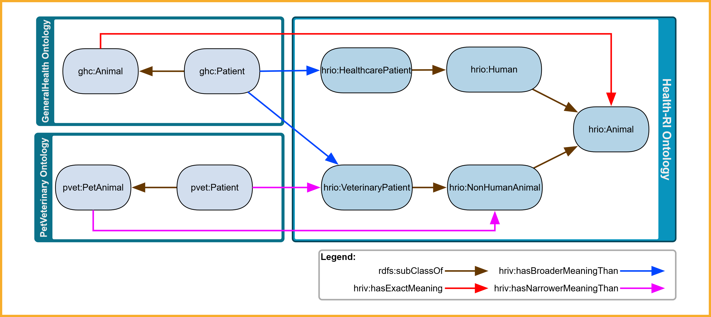

# Semantic Mapping Strategy

!!! warning "Disclaimer"
    While efforts have been made to ensure accuracy, the material in this page is still under review and may contain inaccuracies or omissions. Users are advised to interpret and apply the content with caution.

## Model‑Driven Techniques: MDA, MDD, and MDE

The **[Model‑Driven Architecture (MDA)](http://www.omg.org/mda/)**, defined by the Object Management Group (OMG), is an architectural framework that structures system modeling into abstract layers—promoting interoperability, portability, and reuse by separating domain concerns from technical implementation [1,2].  

- **Model‑Driven Development (MDD)** denotes development processes guided by high‑level models; MDA is one such OMG‑conforming realization [2].  
- **Model‑Driven Engineering (MDE)** is an overarching paradigm including model creation, transformation, code generation, reverse-engineering, and lifecycle evolution [2].

OMG defines three main abstraction layers [1,2]:

- **Computation‑Independent Model (CIM)**: captures domain context and system requirements in business terms, without specifying implementation structure.  
- **Platform‑Independent Model (PIM)**: defines structural and behavioral aspects—such as classes and relationships—in a technology-agnostic way, without committing to any particular implementation platform.  
- **Platform‑Specific Model (PSM)**: refines the PIM with technology‑specific information (e.g. database schemas, APIs, frameworks) to enable implementation.

## CIM and PIM in Our Ontology Artifacts

Within our semantic interoperability framework:

- The **OntoUML ontology** sits at the CIM layer: it defines conceptual domain entities and relationships grounded in the Unified Foundational Ontology (UFO) [3].  
- The **gUFO representation** (OWL‑based lightweight implementation of UFO) resides at the PIM layer: it expresses those same concepts as an executable OWL 2 DL ontology, suitable for reasoning and integration with Semantic Web tools [3].

  
*Figure 1: OntoUML at the CIM layer defines the semantics that are implemented in gUFO/OWL at the PIM layer.*

This visual clarifies that OntoUML provides the conceptual meaning, which the gUFO artifact operationalizes—while preserving semantic integrity across layers.

### Roles of the Artifacts

| Artifact   | Layer | Purpose                                                                  |
| ---------- | ----- | ------------------------------------------------------------------------ |
| OntoUML    | CIM   | Domain-level clarity, conceptual validation, communication among experts |
| gUFO (OWL) | PIM   | Machine-readable semantics, reasoning support, tool interoperability     |

Maintaining both artifacts ensures clear traceability from domain concepts (OntoUML / CIM) to executable ontology structures (gUFO / PIM) [3].

## Semantic Reference: Defining CIM-to-PIM Semantics

In the Health‑RI architecture, every class in the gUFO ontology (PIM) is implicitly semantically defined by its counterpart in OntoUML (CIM). For example, the class `health‑ri:Person` in gUFO borrows its semantics from the `Person` class in the OntoUML model. Because the CIM is not computational, this semantic linkage remains implicit and is **not formally encoded** [3].

## Aligning Third‑Party Ontologies via SKOS Mapping

Our common reference model provides authoritative semantics to external concept definitions. When another ontology defines `onto:Person`, we interpret it as intended to match our `health‑ri:Person`. To make this relationship explicit, we assert a **[`skos:exactMatch`](https://www.w3.org/TR/skos-reference/#mapping)** link from the third‑party concept to ours—signifying that the external concept carries the same meaning.

!!! warning "Only One skos:exactMatch Allowed"
    Each concept may have **exactly one** `skos:exactMatch` to a Health‑RI concept—**and only when a perfect semantic equivalence exists**. Using more than one `skos:exactMatch` for the same concept is not allowed, as it introduces ambiguity.

  
*Figure 2: If an external ontology defines `External:Patient` which we map via `skos:exactMatch` to `health‑ri:Patient`—and `health‑ri:Patient` implements OntoUML `Patient`—then we can interpret `External:Patient` as conveying the same semantics as the `OntoUML Patient` concept, by transitivity of the mapping.*

### SKOS Mapping Properties for Cross‑Scheme Alignment

The [SKOS](https://www.w3.org/TR/skos-reference/) standard provides a set of mapping properties designed for expressing alignments between concepts in different concept schemes (e.g. external vocabularies and our Health‑RI ontology). The principal properties are: `skos:exactMatch`, `skos:closeMatch`, `skos:broadMatch`, `skos:narrowMatch`, and `skos:relatedMatch`.

#### Our Strategy: Choosing the Right Mapping Property

- **`skos:exactMatch`** is used when the external concept is fully equivalent in meaning to our reference concept.  
  - Each external concept may have **only one** `skos:exactMatch`.
- **`skos:broadMatch`** is used when the external concept is **broader** than our reference concept (i.e., it includes our concept and possibly more).
- **`skos:narrowMatch`** is used when the external concept is **narrower** than our reference concept (i.e., it captures a more specific notion).

In contrast to `exactMatch`, both `narrowMatch` and `broadMatch` allow **multiple mappings per concept** to express partial or hierarchical semantic overlaps.

These mappings are only to be used when **no perfect equivalence exists** and a semantic approximation must be made to the **closest reference concept** in the Health‑RI ontology.

#### Visual Example: Broader and Narrower Semantic Alignments

  
*Figure 3: Mapping external concepts from GeneralHealth and PetVeterinary ontologies to the Health-RI ontology. This example evolves from Figure 2 by incorporating `skos:narrowMatch` (magenta) and `skos:broadMatch` (blue) mappings in addition to `skos:exactMatch` (red).*

- `ghc:Patient` and `pvet:Patient` are both linked via `skos:narrowMatch` to `hri:VeterinaryPatient`, indicating that each of these patients represents a **specialized kind** of patient in the Health‑RI ontology.
- `pvet:PetAnimal` is linked via `skos:broadMatch` to `hri:NonHumanAnimal`, signaling that the external concept is broader in scope.
- The figure also maintains `skos:exactMatch` mappings for concepts that are fully equivalent (e.g., `ghc:Animal` and `hri:Animal`).
- Internal hierarchical structure is preserved via `rdfs:subClassOf` to allow consistent classification across ontologies.

This more flexible mapping strategy supports gradual alignment of external ontologies to our reference model even in cases where semantic overlap is partial rather than complete.

## Summary of Semantic Alignment Strategy

- **OntoUML (CIM)** defines the authoritative semantics for PIM artifacts.  
- **gUFO (PIM)** encodes those semantics in an executable OWL ontology.  
- **External concepts** are mapped to our reference via:
  - `skos:exactMatch` for perfect semantic equivalence (one per concept),
  - `skos:narrowMatch` or `skos:broadMatch` when approximate alignment is necessary (multiple allowed).
- This enables reasoning from external definitions back to OntoUML semantics—even when external artifacts don't know about OntoUML directly.

## References

[1] Object Management Group. *[MDA Guide rev. 2.0](https://www.omg.org/cgi-bin/doc?ormsc/14-06-01)*. OMG Document ormsc/14-06-01, 2014.  

[2] Brambilla, M., Cabot, J., Wimmer, M. *Model-Driven Software Engineering in Practice*. Morgan & Claypool, 2017.  

[3] Guizzardi, G. *On Ontology, Ontologies, Conceptualizations and the Reality of Categories*. Applied Ontology, 16(2), 2021.  
