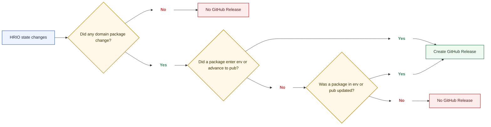
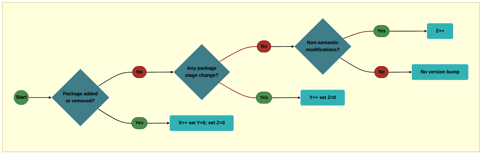

# Versioning Strategy for the Health-RI Ontology

This document specifies the version number semantics (`X.Y.Z`), priority rules, increment/reset logic, and triggers for `X`/`Y`/`Z`. It also includes the semantic vs. non-semantic decision tests, worked examples, and decision diagrams for ontology version assignment and GitHub Release creation. Stage concepts are referenced only insofar as they drive `Y`-level changes.

This versioning strategy applies to all ontology artifacts versioned as part of the Health-RI Ontology (HRIO). For any given ontology version, all artifacts share the same version identifier (`X.Y.Z`) and correspond to the same underlying HRIO OntoUML model.

## Purpose & Scope

Defines how versions are assigned and incremented for the ontology/model artifacts, including precedence (`X > Y > Z`), single-step increments, and resets. Stage mechanics (`int`/`irv`/`erv`/`pub`) are covered in the [Validation Strategy](./ontology-validation.md); they are referenced here only where they directly affect `Y`. This strategy is effective for versions starting at `v1.0.0`; earlier versions (`< v1.0.0`) followed an [earlier versioning policy](./ontology-versioning-old.md).

!!! note "Ontology versioning vs. GitHub Releases"

    This page defines how the ontology version identifier (`X.Y.Z`) is assigned. A GitHub Release is a separate repository publication event. GitHub Releases use an already assigned ontology version, but they do not determine whether `X`, `Y`, or `Z` changes.

!!! note "Artifacts covered and alignment"

    The `X.Y.Z` version identifier applies uniformly to the ontology artifacts versioned and maintained by this initiative:

    - HRIO OntoUML model in Visual Paradigm (`.vpp` project).
    - HRIO OntoUML model exported as JSON (`.json`).
    - HRIO gUFO/OWL ontology (`.ttl`, in Turtle).
    - SHACL shapes file (`.shacl`, in Turtle).
    - Ontology documentation and specification.

    Model changes are authored in the OntoUML `.vpp` project first. For each ontology version, the derived artifacts above are regenerated or updated from that source so they remain synchronized under the same version identifier.

## Definitions & Glossary

- Version format: `X.Y.Z`
    - `X` — Package index (`1, 2, 3, …`): increases when a new package (new domain scope) is introduced.
    - `Y` — Stage increment (`0, 1, 2, …`): increases for every domain package stage change.
    - `Z` — Minor fixes (`0, 1, 2, …`): minor modifications that should not significantly impact the domain representation (layout, labeling, diagramming, minor corrections, etc.).
    - Examples: `3.0.0`, `3.7.15`, `4.0.1`.

> Note on stages. Stages are tracked per domain packages (see [Validation Strategy](./ontology-validation.md)). A stage transition causes `Y++` and resets `Z → 0`, per rules below.

!!! note "GitHub Release versions are rarely 'round'"

    GitHub Release creation is operationally separate from ontology version assignment, but the version shown in a GitHub Release always reflects the ontology version already assigned under the `X`/`Y`/`Z` rules in this document.

    Because domain package stage transitions increase `Y`, and non-semantic corrections may increase `Z`, versions that are made available through GitHub Releases are unlikely to be exactly `X.0.0` (e.g., `2.0.0`). In practice, expect versions such as `2.1.0` or `2.3.4` to appear frequently.

    A GitHub Release is created when a package enters `erv`, when a package already in `erv` or `pub` is updated, or when a package advances from `erv` to `pub`. Changes limited to packages that remain only in `int` or `irv` do not require a GitHub Release.

    "Round" versions may still occur, but they are expected to be uncommon because the ontology is versioned as a whole, while package-level stage transitions and corrections continue to influence the overall ontology version.

## Version Numbering & Semantics — Increment & Reset Rules

- Single-step per ontology update. Exactly one component increments by `+1` per ontology update — the highest-priority applicable one (`X > Y > Z`). Lower components never increment concurrently; they only reset (`Y → 0` on `X++`; `Z → 0` on `X++` or `Y++`).
    - Not allowed: `1.5.3 → 1.6.4` or `1.5.3 → 1.7.0` in a single ontology update.
    - Allowed: `1.5.3 → 1.6.0` (`Y++`) or `1.5.3 → 2.0.0` (`X++`).
- Priority. If multiple qualifying changes occur together, apply only the highest-priority bump (`X > Y > Z`). Lower components reset accordingly.
- No skipping within a component. Always increment by exactly `+1` within `X`, `Y`, or `Z`.
- Mixed `X` with `Y/Z`. If any `X` trigger occurs in the same ontology update, apply `X++` (once). Record `Y`/`Z`-qualifying changes in the changelog; do not increment `Y` or `Z` in that same ontology update (`Y = 0`, `Z = 0` after `X++`).
- Mixed `Y` with `Z`. If any `Y` trigger occurs in the same ontology update, apply `Y++` (once). Record `Z`-qualifying changes in the changelog; do not increment `Z` in that same ontology update (`Z → 0` on `Y++`).
- Semantic changes mandate a stage transition. Any semantic change (meaning of classes/relations/constraints/definitions) must be recorded as a package stage reversion to `int` (see [Validation Strategy](./ontology-validation.md)). This causes `Y++` and `Z → 0`.
- Resets.
    - When `Y` increases, `Z` resets to `0`.
    - When `X` increases, `Y` and `Z` reset to `0`.

## Triggers & Decision Rules

### Conditions for increasing `X`

- Triggers:

    - Starting a new package (new domain scope) in the repository.
    - Removing an existing package from the official package set (any removal from scope is `X`).

- Non-triggers:

    - Advancing a package through stages (`int`, `irv`, `erv`, `pub`): that is `Y`, not `X`.
    - Renaming/regrouping classes within an existing package without adding a new package.

### Conditions for increasing `Y`

- Triggers:

    - Any domain package stage transition: `int → irv`, `irv → erv`, `erv → pub`, or a recorded reversion (e.g., `irv → int`) via the package's stage tagged value.
    - Any semantic change that alters model meaning within a package (e.g., adding/removing/retaxonomizing classes, retyping relations, changing multiplicities or constraints, revising authoritative definitions, introducing/removing key axioms).
        - Action: record `<current> → int` for the package (see [Validation Strategy](./ontology-validation.md)).
        - Result: `Y++` for that ontology update; `Z → 0`.
    - When multiple packages transition in the same ontology update, perform a single `Y++` (`Z` resets to `0`).

- Non-triggers:

    - Being in a stage without a transition since the previous ontology update.
    - Diagram/class edits that do not change the package stage.
    - Tagged-value corrections that leave stage history unchanged.
    - Removing a package (this is `X`, not `Y`).

### Conditions for increasing `Z`

- Triggers:

    - Minor, non-semantic corrections that do not materially change domain representation: label/name normalization, spelling/typos, diagram layout, link/URI fix, file reorganization, export settings, docstring wording, small diagram tweaks.

- Non-triggers:

    - Any package stage transition (`int/irv/erv/pub`) → that is `Y` (and resets `Z` to `0`).
    - Starting/adding a new package → that is `X` (and resets `Y` and `Z` to `0`).
    - Semantic modeling changes are never `Z`; they require a stage reset to `int` and thus `Y++`.

### Conditions for creating a GitHub Release

GitHub Release creation is independent from ontology versioning. A GitHub Release must be created when at least one domain package satisfies one of the following conditions:

- the package enters external review (`irv → erv`);
- the package is updated while already in `erv`;
- the package is updated while already in `pub`;
- the package advances from `erv` to `pub`.

A GitHub Release is not required when all affected packages remain only in `int` or `irv` (for example, `int → irv` by itself).

When a GitHub Release is created, use the ontology version already assigned under the `X`/`Y`/`Z` rules above. The GitHub Release does not create or alter the ontology version number.

#### GitHub Release examples

The examples below illustrate the difference between ontology version assignment and GitHub Release creation.

Assume the current ontology version is `v1.2.3` and the ontology currently includes the following domain packages:

- Patient package — stage `int`
    Covers core patient identification and demographic concepts such as `Patient`, `Patient Identifier`, `Date of Birth`, and `Sex at Birth`.

- Laboratory Observation package — stage `erv`
    Covers laboratory-result concepts such as `Laboratory Observation`, `Observation Result`, `Specimen`, `Observation Method`, and the link to the observed analyte/test.

- Care Plan package — stage `pub`
    Covers care-planning concepts such as `Care Plan`, `Care Plan Activity`, `Goal`, `Performer`, and care-planning status information.

The cases below are independent examples. In each case, assume the starting ontology version is `v1.2.3`.

1. Internal-only progression in a package that is not yet externally visible

    The Patient package completes internal modeling and is promoted from `int` to `irv`. No package currently in `erv` or `pub` is changed in this ontology update.

    - Change made in package: `Patient package`
    - Package transition: `int → irv`
    - Versioning effect: `Y++`, so the ontology version becomes `v1.3.0`
    - GitHub Release?: No

    **Why?** The ontology version changes because any recorded domain-package stage transition contributes to `Y`. However, no GitHub Release is required for this event alone because the affected package has not yet entered external review or publication.

2. Non-semantic update in a package currently under external review

    The Laboratory Observation package is already in `erv`. During external review, the team corrects the textual definition of `Observation Result` for clarity, fixes a typo in the package documentation, and improves the layout of the diagram showing `Laboratory Observation` and `Specimen`. The model meaning does not change.

    - Change made in package: `Laboratory Observation package`
    - Package stage during change: remains `erv`
    - Type of modification: non-semantic documentation/diagram correction
    - Versioning effect: `Z++`, so the ontology version becomes `v1.2.4`
    - GitHub Release?: Yes

    **Why?** The version change is only `Z` because the modification is non-semantic. Even so, a GitHub Release is created because the updated package is already in `erv`, meaning that the package is in an externally visible review stage.

3. Promotion from external review to publication

    The Laboratory Observation package completes external review successfully and advances from `erv` to `pub`.

    - Change made in package: `Laboratory Observation package`
    - Package transition: `erv → pub`
    - Versioning effect: `Y++`, so the ontology version becomes `v1.3.0`
    - GitHub Release?: Yes

    **Why?** The package stage transition contributes to `Y`, and the package is becoming formally published. This is therefore both a versioned ontology update and a GitHub Release event.

4. Non-semantic correction in a package that is already published

    The Care Plan package is already in `pub`. The team fixes a spelling mistake in the definition of `Care Plan Activity`, updates one outdated figure title, and adjusts diagram alignment to improve readability. No classes, relations, constraints, or definitions are changed in a way that affects meaning.

    - Change made in package: `Care Plan package`
    - Package stage during change: remains `pub`
    - Type of modification: non-semantic correction
    - Versioning effect: `Z++`, so the ontology version becomes `v1.2.4`
    - GitHub Release?: Yes

    **Why?** The change is non-semantic, so it increases `Z` only. A GitHub Release is still required because the updated package is already in `pub`.

5. Mixed release affecting more than one package

    In the same ontology update, the Patient package advances from `int` to `irv`, while the Laboratory Observation package advances from `erv` to `pub`.

    - Changes made in packages: `Patient package` and `Laboratory Observation package`
    - Package transitions: `int → irv` and `erv → pub`
    - Versioning effect: only one `Y++` is applied, so the ontology version becomes `v1.3.0`
    - GitHub Release?: Yes

    **Why?** Multiple package events may occur in the same ontology update, but the version still changes only once according to the priority rules. A GitHub Release is required here because at least one affected package is entering or already belongs to the externally visible stages governed by this policy.

The following diagram summarizes the GitHub Release decision logic illustrated by the examples above.

*Figure 1. GitHub Release decision logic. A GitHub Release is created when a domain package enters `erv`, advances to `pub`, or is updated while already in `erv` or `pub`.*

These examples show that ontology versioning and GitHub Release creation are related but not identical:

- the ontology version is assigned according to the `X`/`Y`/`Z` rules;
- a GitHub Release is created only when the release conditions for externally visible packages are met.

As a result, versions shown in GitHub Releases will often be non-round values such as `v1.3.0` or `v1.2.4`, because they reflect the ontology version already assigned to that repository state.

## Semantic vs. Non-Semantic — Decision Tests

Treat the change as **semantic** (counts for `Y`) if any of the following is **yes**; otherwise it is `Z`:

1. Entailment / constraints test. Does the change alter logical consequences, constraints, or permitted structures (e.g., subsumption, typing, multiplicities, keys, disjointness)? → yes ⇒ semantic (`Y`).
2. Extension / instances test. Would at least one previously valid instance become invalid (or vice versa) solely due to this change? → yes ⇒ semantic (`Y`).
3. Identity / reference stability test. Does the change alter IRIs/identifiers or definitions in a way that affects element identity/meaning? → yes ⇒ semantic (`Y`).
    - Label-only edits (e.g., `rdfs:label`, typos, capitalization) with unchanged IRI/definition are `Z`.
4. Diagram-only test. Is the change confined to visuals (positions, routing, styling) with no change to model elements or constraints? → yes ⇒ non-semantic (`Z`).

### Edge-case examples

| Change                                                                            | Y or Z? | Rationale                                                      |
| --------------------------------------------------------------------------------- | ------- | -------------------------------------------------------------- |
| Rename class label "Person" → "Individual" (label only; IRI/definition unchanged) | Z       | Terminology-only; no entailment or instance impact.            |
| Rename class IRI or revise textual definition to narrow/broaden scope             | Y       | Identity/meaning changed; instance/entailment impact possible. |
| Add an association previously only *visually implied* by layout                   | Y       | New relation; changes entailments/instances.                   |
| Move boxes/arrows, improve diagram readability                                    | Z       | Diagram-only; model unchanged.                                 |
| Change multiplicity `0..* → 1..*`                                                 | Y       | Constraint tightened; prior instances may become invalid.      |
| Retype association end or change superclass                                       | Y       | Taxonomic/typing change; affects entailments/instances.        |
| Fix spelling/capitalization in labels                                             | Z       | Surface-only.                                                  |

## Examples / Decision Table (Worked Examples)

*(Assume current version is `v1.5.8` unless noted.)*

1. A: `int → irv` → `Y++` → `v1.6.0` (`Z → 0`).
2. A: `irv → erv`, B: `int → irv` (same ontology update) → `Y++` once → `v1.6.0` (`Z → 0`).
3. Start new package C and A: `erv → pub` (same ontology update) → `X++` → `v2.0.0` (`Y, Z → 0`).
4. Typos/layout only → `Z++` → `v1.5.9`.
5. B: `irv → int` (recorded) → `Y++` → `v1.6.0` (`Z → 0`).
6. Later A: `erv → pub` (subsequent ontology update) → `Y++` → `v1.7.0` (`Z → 0`).
7. Semantic change at `erv` (retype relation): record `erv → int` → `Y++` → `v1.6.0` (`Z → 0`).
8. Remove a package (scope contraction) from `v1.5.8` → `X++` → `v2.0.0` (`Y = 0`, `Z = 0`).
9. `X` present with multiple `Y` events → `X++` once → `v2.0.0` (no `Y++`).
10. `Y` present with several `Z` events → `Y++` once → `v1.6.0` (no `Z++`).
11. Label rename only ("Person" → "Individual") → `Z++` → `v1.5.9`.
12. Definition/IRI change ("Person" narrowed/broadened): record `<current> → int` → `Y++` → `v1.6.0` (`Z → 0`).

## Figures

### Versioning Flow

*Figure 2. Ontology versioning decision flow. The highest-priority applicable trigger determines the ontology version increment (`X > Y > Z`).*

## Edge Cases & Notes

- Reverting a stage. Any recorded stage transition (forward or backward) increments `Y` and resets `Z` to `0`.
- Simultaneous edits across many packages. Combine into one ontology update → at most one increment; apply `X > Y > Z` priority and resets.
- Semantic change at any stage (including `pub`). Reset stage to `int` (`<current> → int`) and issue `Y++` (`Z → 0`). If missed earlier, correct the stage and bump `Y` in the ontology update that fixes the record.
- Definition of semantic change. A change is semantic iff it alters at least one of: (i) logical consequences; (ii) admissible instance space; or (iii) intentional content (identity) via IRI/definition changes. All other changes are non-semantic.
- Moving classes between existing packages. If entailments/constraints/definitions change → treat as semantic (`Y`); otherwise `Z`.
