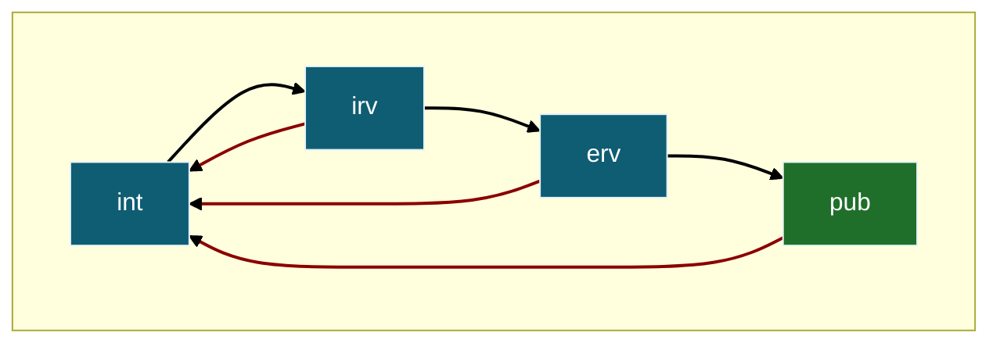

# Ontology Lifecycle and Validation Policy

This document defines the per-package stages (`int`, `irv`, `erv`, `pub`), how transitions and reversions are recorded in Visual Paradigm, when/why reversions happen, and the mandatory policy for semantic modifications. It also specifies who validates at each stage, how reviews are initiated, and the expected review timelines. Version effects (Y++) are included where relevant.

## Purpose & Scope

Specifies stage governance for ontology packages: how stage states are tracked, transitioned, and reverted, and how those transitions are recorded. It also defines who performs validation and reviews, when they occur, and how version increments (Y++) are applied. Version impacts are acknowledged where stages drive them; see [Versioning Strategy](./versioning-ontology.md) for the full versioning logic. This policy applies to all modelers and reviewers involved in ontology development and maintenance.

## Definitions & Glossary (Stages)

Stages are tracked per package inside the Visual Paradigm project as tagged values on packages and displayed in documentation.

- `int` – internal work (draft modeling, layout, labels, notes).
- `irv` – submitted for internal review.
- `erv` – submitted for external review.
- `pub` – external review window closed and package is published.

Rule. Stage changes happen at package level (not diagram/class). Packages can move through stages independently, and multiple stage transitions may be combined into one release; the version still changes at most once per release following the priority X > Y > Z.
Version note. A stage transition triggers Y++ and Z → 0 (see [Versioning Strategy](./versioning-ontology.md)).

**Checklists: gate vs operations.** Stage gate checklists list **exit criteria** to leave stage X and enter stage Y (they are pass/fail gates). The [Publication Stage Operations Checklist](#publication-stage-operations-checklist) is **not** a gate; it lists actions to perform **after** entering `pub` and while remaining there.

## Validation Procedures by Stage

Stages `int` and `irv` have exit gate checklists that control advancement (see [Stage-specific Checklists](#stage-specific-checklists)). Entry into `irv` requires passing the [Internal Stage Gate Checklist](#internal-stage-gate-checklist); advancement from `irv` to `erv` requires passing the [Internal Review Stage Gate Checklist](#internal-review-stage-gate-checklist). The only in-stage checklist is the [Publication Stage Operations Checklist](#publication-stage-operations-checklist), executed upon entering `pub` and maintained while in `pub`.

### Internal Review (`irv`)

**Who validates.** Members of the modeling and mappings teams who were not directly involved in modeling the package.

**Objective.** Perform an internal completeness and quality sanity check from a non-domain-specialist perspective. Reviewers verify:

- Documentation hygiene (descriptions, definitions, provenance, IDs, stage tagged value).
- Clear and consistent naming (including class and relation names).
- Presence of mandatory items and required metadata.
- Basic modeling soundness (typing, obvious constraint issues).
- Diagram readability (labels, legends, layout) and terminology consistency.
- Cross-package references are resolvable and unambiguous.

Reviewers must execute the IRV checklist in section [Internal Review Stage Gate Checklist](#internal-review-stage-gate-checklist) and record evidence in the review issue.

**Start condition.** The package has passed the [Internal Stage Gate Checklist](#internal-stage-gate-checklist); the modeler sets the stage tagged value to `irv` and notifies internal reviewers.

**Planning & timeline.** A review activity is created and scheduled into a sprint. Internal reviewers have one sprint to complete the review. Depending on model complexity, team availability, and other factors, this may be extended to two sprints.

**Outcome.** If the review passes (no semantic changes required), the modeler updates the stage tagged value to `erv` and records the transition `<irv → erv>`. Per the [Versioning Strategy](./versioning-ontology.md), this contributes Y++ and resets Z → 0 for the release (subject to X > Y > Z precedence). Advancement to `erv` is permitted only after a passed [Internal Review Stage Gate Checklist](#internal-review-stage-gate-checklist).

### External Review (`erv`)

**Who validates.** An expanded reviewer pool of domain specialists, modeling specialists, and informed non-specialists.

**Objective.** Conduct an independent, deeper assessment of domain correctness and conceptual rigor. Reviewers check for inconsistencies, incorrectness, incompleteness, ambiguities, hidden assumptions, and coverage gaps, and validate definitions, constraints/multiplicities, and example use-cases/queries, including implications for interoperability and mappings.

**Community call.** The internal team publishes a LinkedIn post entitled "Call for Community Review: [Model Name]". Members of the (future) D12 task group are encouraged to repost this call on their LinkedIn profiles to broaden reach.

**Start condition.** Begins only after a passed [Internal Review Stage Gate Checklist](#internal-review-stage-gate-checklist).

**Planning & timeline.** A review activity is created and scheduled into a sprint. External reviewers have one sprint to provide feedback; this may be extended to two sprints based on package complexity, community availability, and other factors.

**Outcome.** If the review passes (no semantic changes required), the modeler updates the stage tagged value to `pub` and records the transition `<erv → pub>`. Per the [Versioning Strategy](./versioning-ontology.md), this contributes Y++ and resets Z → 0 for the release (subject to X > Y > Z precedence). Upon entering `pub`, immediately execute the [Publication Stage Operations Checklist](#publication-stage-operations-checklist).

## Stage-specific Checklists

These checklists function strictly as exit gates: the [Internal Stage Gate Checklist](#internal-stage-gate-checklist) controls exit from `int` to `irv`, and the [Internal Review Stage Gate Checklist](#internal-review-stage-gate-checklist) controls exit from `irv` to `erv`. Reviewers must execute the relevant checklist and record evidence (links, notes) in the associated review issue. The [Publication Stage Operations Checklist](#publication-stage-operations-checklist) is intentionally non-gate and applies **after** `<erv → pub>`; use it to run publication and ongoing `pub` tasks.

### Internal Stage Gate Checklist

**Exit criteria for `int → irv`.** All items below must be satisfied to leave `int` and enter `irv`.

- [ ] **Stage & package setup**
    - [ ] Package stage is set to `int`.
    - [ ] Title and Description filled using Visual Paradigm's default fields (not tags).
    - [ ] Package metadata initialized with `introducedInVersion` and possibly `lastChangedInVersion`.

- [ ] **Modeling prepared (OntoUML → gUFO)**
    - [ ] Classes and relations carry appropriate OntoUML stereotypes (no obvious anti-patterns).
    - [ ] Multiplicities and constraints are specified and justified.
    - [ ] All generalization sets show `isDisjoint` and `isCovering` in every diagram occurrence.
    - [ ] Relation naming applied per (or aligned with the draft) naming strategy; directionality is explicit.

- [ ] **Terminology & labels**
    - [ ] Names/labels follow the nomenclature strategy (capitalization, spelling, prefixes).
    - [ ] For classes: `prefLabel` = class Name; synonyms added to the `synonyms` tagged value to generate `altLabel`s.

- [ ] **Definitions & examples**
    - [ ] Each package, diagram, and class has a definition that is concise, non-circular, and free of hidden assumptions.
    - [ ] If examples are included, they are domain-correct and consistent with the formal model.

- [ ] **Diagram quality & traceability**
    - [ ] External element origin shown: any external/reused class displays its origin (source package) using the standard notation.
    - [ ] Empty attribute compartment hidden: classes with no attributes hide the attribute compartment per the diagram style guide.
    - [ ] Diagrams are readable (clear layout, legible labels, no overlapping edges/nodes).
    - [ ] Figure titles match package names.
    - [ ] Notes and constraints follow the standard style and placement.

- [ ] **OWL/TTL export & header**
    - [ ] Model transforms/exports to gUFO/OWL without errors (local build).
    - [ ] Ontology header metadata template is populated.

- [ ] **Basic domain consistency (author self-check)**
    - [ ] Complete enough: key concepts/relations for the package scope are present.
    - [ ] Scope fit: no out-of-scope elements introduced.
    - [ ] No contradictions: definitions, diagrams, and OWL/TTL tell the same story.
    - [ ] Reasonable cardinalities for the domain.

- [ ] **Docs & handover**
    - [ ] Export diagrams: export the latest package diagrams to the Figures folder (no missing/old images).
    - [ ] Changelog/change summary drafted for this package.

### Internal Review Stage Gate Checklist

**Exit criteria for `irv → erv`.** All items below must be satisfied to leave `irv` and enter `erv`.

- [ ] **Stage tagging & metadata present**
    - [ ] Package has the correct stage tag (e.g., `irv`).
    - [ ] Required package-level metadata (post-v1.0.0) is present: `introducedInVersion`, `lastChangedInVersion`, `lastPublishedInVersion`, `reviewedBy`.
    - [ ] Title and Description are filled using Visual Paradigm's default fields (not tags).

- [ ] **Public docs build (Semantic Interoperability site)**
    - [ ] The package's page on the Semantic Interoperability site builds without errors.
    - [ ] All links resolve: documentation, specification (OWL/TTL), IRIs, and release notes (no 404s).
    - [ ] Package diagrams/images render correctly (no missing assets; labels are readable).
    - [ ] In-page anchors/table of contents navigate to the correct sections.
    - [ ] The OWL/TTL file includes the expected ontology header metadata according to the project standard (pass/fail only; no per-field audit).
    - [ ] Figures folder up to date: the latest package diagrams are exported to the Figures folder (no missing/old images).

- [ ] **Terminology consistency**
    - [ ] Names/labels follow the adopted nomenclature strategy (capitalization, spelling, prefixes).
    - [ ] Terminology is consistent across diagrams, package docs, and OWL/TTL (no mismatches or redefinitions).
    - [ ] Relation naming follows the defined naming strategy (directionality, verb/preposition pattern, capitalization) and is consistent across diagrams and OWL/TTL.
- [ ] Labels: `prefLabel` is the most appropriate primary label (no `altLabel` would be a better choice); missing `altLabel`s (synonyms, common variants, abbreviations) are identified and proposed.

- [ ] **Definitions & examples (scope: packages, diagrams, classes)**
    - [ ] Every package, diagram, and class has a definition.
    - [ ] Definitions are concise, non-circular, and free of hidden assumptions.
    - [ ] If examples are provided, they are domain-correct, consistent with the formal model (stereotypes, constraints, relations), and never contradict the model.
    - [ ] Documentation is supplementary only: it explains what is modeled and must not introduce new semantics; any new information must be added via modeling, not prose.

- [ ] **Conceptual modeling soundness (OntoUML → gUFO)**
    - [ ] Classes and relations use appropriate OntoUML stereotypes; no obvious anti-patterns.
    - [ ] Multiplicities and constraint choices are justified and non-contradictory.
    - [ ] Every generalization set explicitly indicates `isDisjoint` and `isCovering`, and these settings are consistently displayed in all diagram occurrences of the set.

- [ ] **Diagram quality & traceability**
    - [ ] External element origin shown: any external/reused class displays its origin (source package/namespace) using the standard notation.
    - [ ] Empty attribute compartment hidden: classes with no attributes hide the attribute compartment per the diagram style guide.
    - [ ] Clear layouts, legible labels, no overlapping edges/nodes.
    - [ ] Figure titles match package names (consistent with the package being reviewed).
    - [ ] All notes follow the defined standard color scheme and placement.
    - [ ] All constraints follow the defined standard notation and placement (and are visible where applicable).

- [ ] **Basic domain consistency (quick sanity check)**
    - [ ] Complete enough: the key concepts/relations expected by the package scope are present (no obvious gaps).
    - [ ] Scope fit (no extras): no out-of-scope elements are introduced; concepts that belong elsewhere are not modeled in this package.
    - [ ] Clear wording: names and definitions are unambiguous; avoid near-synonyms/homonyms.
    - [ ] Right categories: no obvious category errors (e.g., role vs kind; quality/event modeled as a substance).
    - [ ] No contradictions: docs, diagrams, and OWL/TTL tell the same story; examples (if any) don't violate constraints.
    - [ ] Reasonable cardinalities: multiplicities and disjoint/covering choices look realistic for the domain.
    - [ ] No orphans: no unused/orphan classes or relations; no dangling cross-package references.

### Publication Stage Operations Checklist

**In-stage operational checklist (non-gate).** Use this list to run and monitor activities while the package remains in `pub`. Failure on any item does **not** automatically change stage; substantive issues should trigger a reversion per [Stage Reversions — Why and When](#stage-reversions--why-and-when).

- [ ] **Release & preservation (one-time at publication)**
    - [ ] Generate the Technical Report (PDF) for the domain ontology represented in the package. The report must summarize what was modeled, key design decisions, challenges/limitations, and relevant context (e.g., related ontologies, mappings/alignments, reuse).
    - [ ] Create a new GitHub Release for this package version (tag, title, release notes) that includes the Technical Report PDF and the exported figures as release assets.
    - [ ] Trigger Zenodo archiving via the release and verify the DOI is minted; record the DOI in the release notes and on the package page.

- [ ] **Catalog & discoverability (one-time at publication)**
    - [ ] Submit/update the package in the OntoUML/UFO Catalog with the correct version and metadata (including the GitHub Release and Zenodo DOI).
    - [ ] Upload the Technical Report PDF to ResearchGate (project item/preprint as appropriate) to improve visibility and indexing in Google Scholar and similar services; ensure the record links back to the GitHub Release and Zenodo DOI.
    - [ ] Announce on LinkedIn that the package is published and available (link to GitHub Release and Zenodo DOI).
    - [ ] Post follow-ups on LinkedIn when (a) the OntoUML/UFO Catalog entry is published/updated, and (b) the ResearchGate upload is live, each time linking the respective record.

- [ ] **Academic publication** (optional, but recommended)
    - [ ] Identify a suitable open-access venue (scope fit, audience, licensing).
    - [ ] Prepare a submission derived from the Technical Report (methods, results, contribution), following venue author guidelines.
    - [ ] Submit and track peer review; if accepted, add the formal citation and publisher DOI to the GitHub Release notes, package docs, and the OntoUML/UFO Catalog entry.
    - [ ] If allowed, post a preprint (or author accepted manuscript) and link it from the package page and release notes.

## Post-Publication Validation & Ongoing Feedback (`pub`)

Mark the package as `pub` (in its stage tagged value) once internal and external reviews conclude. Publication does not end the package lifecycle. As described in [Stage Reversions and Semantic Modifications](#stage-reversions-and-semantic-modifications) and in the [Versioning Strategy](./versioning-ontology.md), packages may receive new feedback, undergo stage reversions, and re-enter previous stages. If feedback triggers a reversion to `int`, the package must re-pass the [Internal Stage Gate Checklist](#internal-stage-gate-checklist) before moving back to `irv`. For publication-time and ongoing `pub` tasks, execute and maintain the [Publication Stage Operations Checklist](#publication-stage-operations-checklist).

**Active actions at `pub`.** Execute the [Publication Stage Operations Checklist](#publication-stage-operations-checklist). The items below explain *what* each checklist group is about:

- **Release & preservation.**
    - Create a GitHub Release for the package version (tag, title, and release notes) to make the package citable and discoverable in the repo history.
    - Attach the PDF package report and exported figures so the exact published artifacts are preserved with the release.
    - Verify that Zenodo archiving is triggered and that a DOI is minted; record that DOI in the release notes to provide a permanent scholarly reference.

- **Catalog & discoverability.**
    - Submit to the OntoUML/UFO Catalog entry with correct versioning and references (GitHub Release, Zenodo DOI) so users can locate and reuse the model.
    - Upload the Technical Report to ResearchGate (with links to the Zenodo DOI and Release) to increase scholarly discoverability (e.g., Google Scholar).
    - Communicate on LinkedIn at publication time (linking Release/DOI) and post short follow-ups when the Catalog entry and ResearchGate record go live.

- **Academic publication (optional).**
    - Consider a peer-reviewed venue to add external validation and community contribution.
    - If proceeding, submit and track the process; once accepted, record the publisher DOI/citation in the Release notes, package docs, and Catalog entry; keep the LinkedIn audience updated as appropriate.

**Passive/standing channels (indefinite window; respond when triggered):**

- **GitHub Issues (standing channel).** A public, always-open channel for internal and external collaborators to request inclusion/exclusion/modification of concepts and related changes via templates. Submissions are evaluated continuously; once a package is in `pub`, substantive issues may trigger a stage reversion per this policy.

**Feedback handling.** Feedback received through any channel (Catalog, GitHub, publications) is evaluated and may trigger stage reversions per the policies in this document. Once a package is in `pub`, any substantive issue may lead to a reversion to a previous stage; significant feedback requiring semantic changes will reset the package to `int` and contribute Y++ per the [Versioning Strategy](./versioning-ontology.md).

## Stage Reversions — Why and When

Reversions (e.g., `irv → int`, `erv → int`, or `pub → int`) happen when the package cannot advance or remain at its current stage due to new information. Typical triggers include:

- Critical modeling defects discovered (e.g., wrong typing, invalid constraints).
- Review failure (internal or external) with required changes.
- Substantial requirement or scope changes affecting meaning.
- Upstream dependency changes that invalidate assumptions.

Process. Record the explicit transition as `<current> → int` in the Visual Paradigm tagged value, open a rework window, and issue Y++ (Z → 0) per the versioning rules. After any reversion to `int`, the package must re-pass the [Internal Stage Gate Checklist](#internal-stage-gate-checklist) before re-entering `irv`.

## Policy for Semantic Modifications

When a package undergoes a semantic modification (e.g., adding/removing/retaxonomizing classes, retyping relations, changing multiplicities or constraints, revising authoritative definitions, introducing/removing key axioms), record an explicit stage reversion `<current> → int` in the Visual Paradigm tagged value.
This mandatory reversion triggers Y++ for that release and resets Z → 0. Before resubmitting to `irv`, the package must re-pass the [Internal Stage Gate Checklist](#internal-stage-gate-checklist).

> See [Versioning Strategy](./versioning-ontology.md) for the semantic vs. non-semantic decision tests and the full trigger matrix for X/Y/Z.

## Figures

### Stage Changes

## Edge Cases & Notes

- Any recorded transition (forward or backward) increments Y and resets Z to 0 (version note).
- Simultaneous stage changes across many packages in one release produce at most one version increment (priority X > Y > Z).
- Semantic change at any stage (including `pub`): reset the stage to `int` (`<current> → int`) and issue Y++ (Z→0). If a semantic change was committed without this reset, correct the stage and bump Y in the release that fixes the record.
