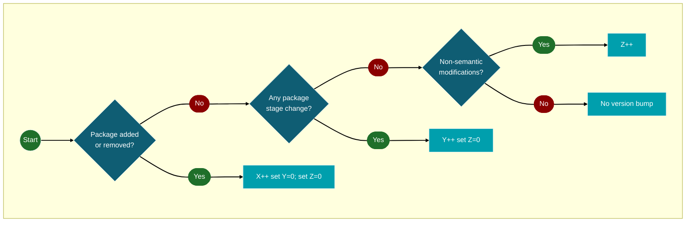

# Versioning Strategy for Ontology Releases

This document specifies the version number semantics (`X.Y.Z`), priority rules, increment/reset logic, and triggers for `X`/`Y`/`Z`. It also includes the semantic vs. non-semantic decision tests, worked examples, and the versioning flowchart. Stage concepts are referenced only insofar as they drive `Y`-level changes.

## Purpose & Scope

Defines how versions are assigned and incremented for the ontology/model releases, including precedence (`X > Y > Z`), single-step increments, and resets. Stage mechanics (`int`/`irv`/`erv`/`pub`) are covered in *Validation Strategy*; they are referenced here only where they directly affect `Y`. This strategy is effective for releases starting at `v1.0.0`; earlier releases (`< v1.0.0`) followed an [earlier versioning policy](./old-versioning.md).

## Definitions & Glossary

- Version format: `X.Y.Z`
    - `X` — Package index (`1, 2, 3, …`): increases when a new package (new domain scope) is introduced.
    - `Y` — Stage increment (`0, 1, 2, …`): increases for every package stage change.
    - `Z` — Minor fixes (`0, 1, 2, …`): minor modifications that should not significantly impact the domain representation (layout, labeling, diagramming, minor corrections, etc.).
    - Examples: `3.0.0`, `3.7.15`, `4.0.1`.

> Note on stages. Stages are tracked per package (see *Validation Strategy*). A stage transition causes `Y++` and resets `Z → 0`, per rules below.

## Version Numbering & Semantics — Increment & Reset Rules

- Single-step per release. Exactly one component increments by `+1` per release — the highest-priority applicable one (`X > Y > Z`). Lower components never increment concurrently; they only reset (`Y → 0` on `X++`; `Z → 0` on `X++` or `Y++`).
    - Not allowed: `1.5.3 → 1.6.4` or `1.5.3 → 1.7.0` in a single release.
    - Allowed: `1.5.3 → 1.6.0` (`Y++`) or `1.5.3 → 2.0.0` (`X++`).
- Priority. If multiple qualifying changes occur together, apply only the highest-priority bump (`X > Y > Z`). Lower components reset accordingly.
- No skipping within a component. Always increment by exactly `+1` within `X`, `Y`, or `Z`.
- Mixed `X` with `Y/Z`. If any `X` trigger occurs in a release, apply `X++` (once). Record `Y`/`Z`-qualifying changes in the changelog; do not increment `Y` or `Z` in that same release (`Y = 0`, `Z = 0` after `X++`).
- Mixed `Y` with `Z`. If any `Y` trigger occurs in a release, apply `Y++` (once). Record `Z`-qualifying changes in the changelog; do not increment `Z` in that same release (`Z → 0` on `Y++`).
- Semantic changes mandate a stage transition. Any semantic change (meaning of classes/relations/constraints/definitions) must be recorded as a package stage reversion to `int` (see *Validation Strategy*). This causes `Y++` and `Z → 0`.
- Resets.
    - When `Y` increases, `Z` resets to `0`.
    - When `X` increases, `Y` and `Z` reset to `0`.

## Triggers & Decision Rules

### Conditions for increasing `X`

- Triggers:
    - Starting a new package (new domain scope) in the repository.
    - Removing an existing package from the official package set (any removal from scope is `X`).

- Non-triggers:
    - Advancing a package through stages (`int`, `irv`, `erv`, `pub`): that is `Y`, not `X`.
    - Renaming/regrouping classes within an existing package without adding a new package.

### Conditions for increasing `Y`

- Triggers:
    - Any per-package stage transition: `int → irv`, `irv → erv`, `erv → pub`, or a recorded reversion (e.g., `irv → int`) via the package’s stage tagged value.
    - Any semantic change that alters model meaning within a package (e.g., adding/removing/retaxonomizing classes, retyping relations, changing multiplicities or constraints, revising authoritative definitions, introducing/removing key axioms).
        - Action: record `<current> → int` for the package (see *Validation Strategy*).
        - Result: `Y++` for that release; `Z → 0`.
    - When multiple packages transition in the same release, perform a single `Y++` (`Z` resets to `0`).

- Non-triggers:
    - Being in a stage without a transition since last release.
    - Diagram/class edits that do not change the package stage.
    - Tagged-value corrections that leave stage history unchanged.
    - Removing a package (this is `X`, not `Y`).

### Conditions for increasing `Z`

- Triggers:
    - Minor, non-semantic corrections that do not materially change domain representation: label/name normalization, spelling/typos, diagram layout, link/URI fix, file reorganization, export settings, docstring wording, small diagram tweaks.

- Non-triggers:
    - Any package stage transition (`int/irv/erv/pub`) → that is `Y` (and resets `Z` to `0`).
    - Starting/adding a new package → that is `X` (and resets `Y` and `Z` to `0`).
    - Semantic modeling changes are never `Z`; they require a stage reset to `int` and thus `Y++`.

## Semantic vs. Non-Semantic — Decision Tests

Treat the change as **semantic** (counts for `Y`) if any of the following is **yes**; otherwise it is `Z`:

1) Entailment / constraints test. Does the change alter logical consequences, constraints, or permitted structures (e.g., subsumption, typing, multiplicities, keys, disjointness)? → yes ⇒ semantic (`Y`).
2) Extension / instances test. Would at least one previously valid instance become invalid (or vice versa) solely due to this change? → yes ⇒ semantic (`Y`).
3) Identity / reference stability test. Does the change alter IRIs/identifiers or definitions in a way that affects element identity/meaning? → yes ⇒ semantic (`Y`).
     - Label-only edits (e.g., `rdfs:label`, typos, capitalization) with unchanged IRI/definition are `Z`.
4) Diagram-only test. Is the change confined to visuals (positions, routing, styling) with no change to model elements or constraints? → yes ⇒ non-semantic (`Z`).

### Edge-case examples

| Change | Y or Z? | Rationale |
|---|---|---|
| Rename class label “Person” → “Individual” (label only; IRI/definition unchanged) | Z | Terminology-only; no entailment or instance impact. |
| Rename class IRI or revise textual definition to narrow/broaden scope | Y | Identity/meaning changed; instance/entailment impact possible. |
| Add an association previously only *visually implied* by layout | Y | New relation; changes entailments/instances. |
| Move boxes/arrows, improve diagram readability | Z | Diagram-only; model unchanged. |
| Change multiplicity `0..* → 1..*` | Y | Constraint tightened; prior instances may become invalid. |
| Retype association end or change superclass | Y | Taxonomic/typing change; affects entailments/instances. |
| Fix spelling/capitalization in labels | Z | Surface-only. |

## Examples / Decision Table (Worked Examples)

*(Assume current version is `v1.5.8` unless noted.)*

1. A: `int → irv` → `Y++` → `v1.6.0` (`Z → 0`).
2. A: `irv → erv`, B: `int → irv` (same release) → `Y++` once → `v1.6.0` (`Z → 0`).
3. Start new package C and A: `erv → pub` (same release) → `X++` → `v2.0.0` (`Y, Z → 0`).
4. Typos/layout only → `Z++` → `v1.5.9`.
5. B: `irv → int` (recorded) → `Y++` → `v1.6.0` (`Z → 0`).
6. Later A: `erv → pub` (new release) → `Y++` → `v1.7.0` (`Z → 0`).
7. Semantic change at `erv` (retype relation): record `erv → int` → `Y++` → `v1.6.0` (`Z → 0`).
8. Remove a package (scope contraction) from `v1.5.8` → `X++` → `v2.0.0` (`Y = 0`, `Z = 0`).
9. `X` present with multiple `Y` events → `X++` once → `v2.0.0` (no `Y++`).
10. `Y` present with several `Z` events → `Y++` once → `v1.6.0` (no `Z++`).
11. Label rename only (“Person” → “Individual”) → `Z++` → `v1.5.9`.
12. Definition/IRI change (“Person” narrowed/broadened): record `<current> → int` → `Y++` → `v1.6.0` (`Z → 0`).

## Figures

### Versioning Flow

## Edge Cases & Notes

- Reverting a stage. Any recorded stage transition (forward or backward) increments `Y` and resets `Z` to `0`.
- Simultaneous edits across many packages. Combine into one release → at most one increment; apply `X > Y > Z` priority and resets.
- Semantic change at any stage (including `pub`). Reset stage to `int` (`<current> → int`) and issue `Y++` (`Z → 0`). If missed earlier, correct the stage and bump `Y` in the release that fixes the record.
- Definition of semantic change. A change is semantic iff it alters at least one of: (i) logical consequences; (ii) admissible instance space; or (iii) intentional content (identity) via IRI/definition changes. All other changes are non-semantic.
- Moving classes between existing packages. If entailments/constraints/definitions change → treat as semantic (`Y`); otherwise `Z`.
