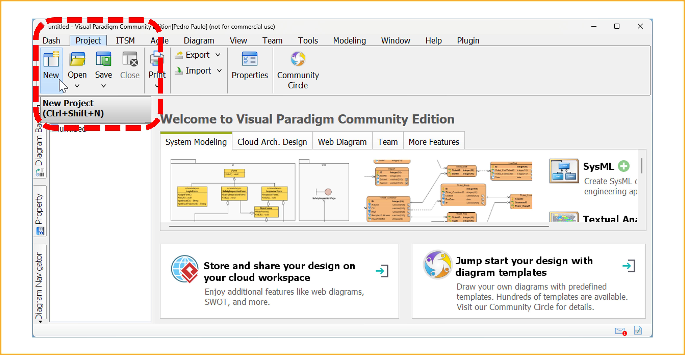
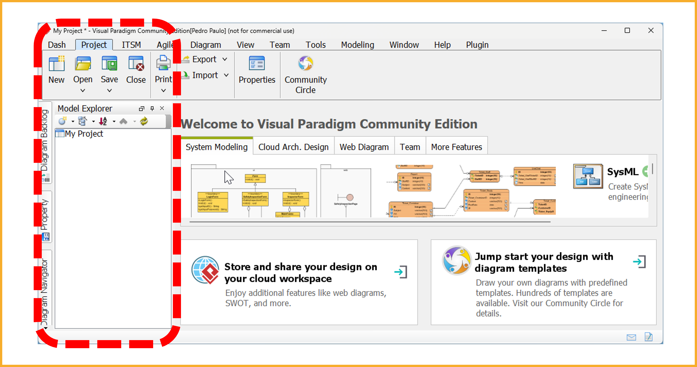
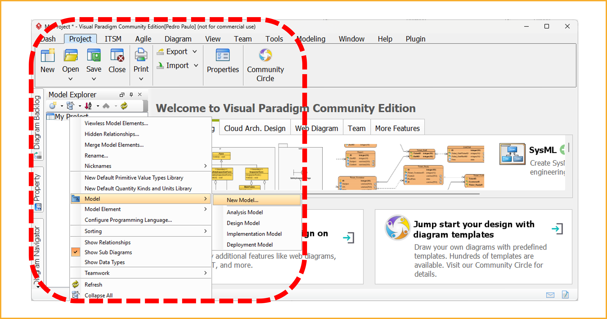
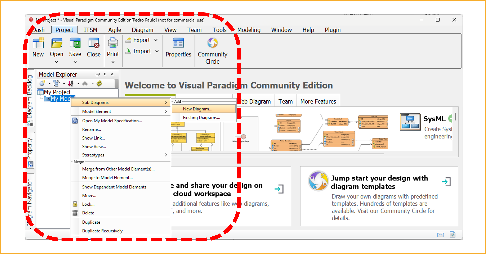
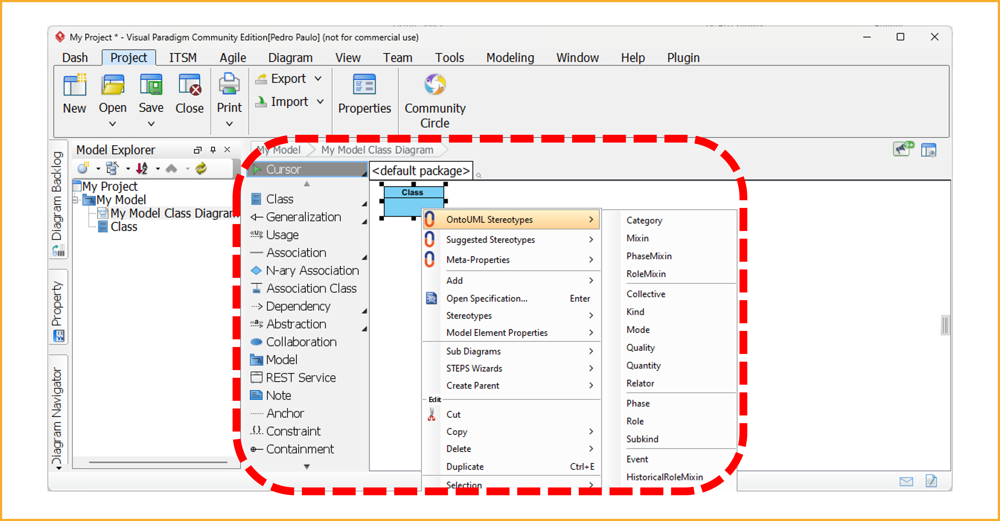

# Creating OntoUML Models

Creating an OntoUML model requires a modeling tool that supports UML class diagrams. Since an OntoUML model is a valid UML class diagram enriched with specific stereotypes, it can, in principle, be created using any standard UML modeling tool that allows users to define custom stereotypes.

The recommended approach is to use [**Visual Paradigm**](https://www.visual-paradigm.com), a widely adopted UML modeling environment that integrates well with the OntoUML ecosystem through the [**ontouml-vp-plugin**](https://w3id.org/ontouml/vp-plugin). This plugin provides native support for OntoUML stereotypes, model validation, and export to machine-readable formats.

Other UML tools can also be used to manually create OntoUML models. Since OntoUML models conform to UML class diagram syntax, you can use any modeling environment that allows the definition of custom stereotypes or tags. Examples include:

- [Astah UML](https://astah.net/products/uml/) – Lightweight UML modeling with custom profile support.
- [Enterprise Architect (EA)](https://sparxsystems.com/products/ea/) – Robust, professional-grade tool supporting UML profiles and custom stereotypes.
- [StarUML](https://staruml.io) – Cross-platform tool with extensibility through plugins.
- [Modelio](https://www.modelio.org) – Free and open-source UML/BPMN tool with profile extension support.
- [Papyrus](https://www.eclipse.org/papyrus/) – Open-source, Eclipse-based UML modeling framework with support for custom profiles.

!!! tip

    If possible, prefer tools with native OntoUML support—like Visual Paradigm with the ontouml-vp-plugin—to avoid manual errors when assigning stereotypes.

When using these tools, OntoUML stereotypes (e.g., `«kind»`, `«role»`, `«relator»`) must be applied manually, and modelers must follow the conceptual modeling guidelines provided by the Unified Foundational Ontology (UFO).

## Installation Guide for Visual Paradigm and the OntoUML Plugin

The following steps describe how to set up a modeling environment using Visual Paradigm and the `ontouml-vp-plugin`.

### Step 1: Install Visual Paradigm

Visual Paradigm is a commercial UML tool, but it offers a **Community Edition** that is free for non-commercial use.

- **Download Visual Paradigm**: [https://www.visual-paradigm.com/download/](https://www.visual-paradigm.com/download/)
- **Community Edition**: [https://www.visual-paradigm.com/download/community.jsp](https://www.visual-paradigm.com/download/community.jsp)

Follow the installation instructions for your operating system (Windows, macOS, or Linux).

### Step 2: Install the OntoUML Plugin

To enable native support for OntoUML, you'll need to install the open-source plugin:

#### 2.1 Download the Plugin

- GitHub repository: [https://w3id.org/ontouml/vp-plugin](https://w3id.org/ontouml/vp-plugin)
- Latest release (`.zip` file): [https://w3id.org/ontouml/vp-plugin/releases](https://w3id.org/ontouml/vp-plugin/releases)

Download the most recent `zip` file compatible with your Visual Paradigm version.

#### 2.2 Install the Plugin in Visual Paradigm

1. Open Visual Paradigm.
2. Navigate to **Help → Install Plugin**.
3. Select the `.zip` file you downloaded.
4. Restart Visual Paradigm when prompted.

### Step 3: Create an OntoUML Diagram

After installing the plugin, follow the steps below to create your first OntoUML diagram in Visual Paradigm:

#### 3.1 Create a New Project

Go to the **Project** tab and click **New** to create a new modeling project.
This will initialize your workspace.

In the pop-up window that appears, enter a name for your project and the author's name.
Then click on **Create Blank Project** to proceed.

#### 3.2 Create a New Model Inside the Project

In the **Model Explorer**, right-click on `My Project` and select
**Model → New Model…**.
Give your model a name such as "My Model".

#### 3.3 Add a New Diagram to the Model

Right-click on your newly created model (e.g., "My Model"), go to
**Sub Diagrams → Add → New Diagram…**.

In the dialog that opens, select **Class Diagram** as the diagram type.
Then give your diagram a name (e.g., "My Model Class Diagram") and click **OK**.

#### 3.4 Start Modeling with OntoUML Stereotypes

Once the diagram opens, use the class diagram tools to create elements.
Right-click on a class, go to **OntoUML Stereotypes**, and choose the appropriate stereotype from the list (e.g., `Kind`, `Role`, `Relator`, `Phase`, etc.).

These stereotypes correspond to the ontological distinctions defined by the Unified Foundational Ontology (UFO).

At this point, your OntoUML modeling environment is ready. You can continue building the model using semantically grounded elements and defining relationships among them.

#### 3.5 Add a New OntoUML Class to the Diagram

To begin modeling, select the **Class** tool from the left-side toolbar and click anywhere on the diagram canvas to place a class element.

Then, right-click the class and go to **OntoUML Stereotypes** to assign a semantic type such as `Kind`, `Category`, `Relator`, or others, depending on the nature of the concept you are representing.

## Additional Features of the Plugin

The `ontouml-vp-plugin` enhances Visual Paradigm with native support for OntoUML modeling. It adds dedicated functionalities and modeling options to assist in building well-founded models:

### Modeling Support

- **OntoUML Stereotypes**: Easily assign OntoUML stereotypes to classes and relations through a context menu.
- **Suggested Stereotypes**: Access intelligent recommendations based on modeling context.
- **Meta-Properties**: Enrich model elements with additional OntoUML-specific metadata.

These options are available by right-clicking a class or relation in the diagram and choosing the appropriate OntoUML feature.

### Model Operations and Validation

The plugin also includes a dedicated OntoUML menu with tools to manage and analyze your model:

- **Check Model**: Validates the model according to OntoUML constraints.
- **Check Diagram**: Validates specific diagrams for structural and ontological correctness.
- **Import from JSON**: Load OntoUML models from serialized JSON files.
- **Export to JSON**: Save your model in machine-readable OntoUML JSON format.
- **Export to gUFO**: Export your model to OWL/RDF using the gUFO ontology.

These tools assist in ensuring semantic consistency, enable data exchange across tools, and facilitate publishing and reuse of OntoUML models.

For more details, see the plugin documentation:
[https://w3id.org/ontouml/vp-plugin#readme](https://w3id.org/ontouml/vp-plugin#readme)
