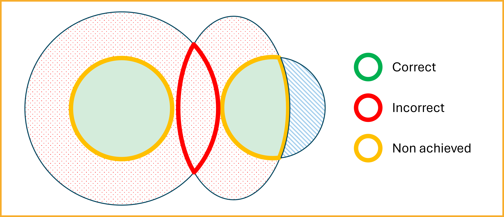

# Semantic Interoperability Overview

Semantic interoperability is a cornerstone of effective data exchange, ensuring that information shared between systems retains its intended meaning. This capability is vital across various sectors, including healthcare, public administration, and the Internet of Things (IoT), facilitating seamless communication and collaboration.

<!-- omit from toc -->
## Table of Contents

- [What is Semantic Interoperability?](#what-is-semantic-interoperability)
- [Why is Semantic Interoperability Important?](#why-is-semantic-interoperability-important)
- [Semantic Interoperability and the “I” of FAIR](#semantic-interoperability-and-the-i-of-fair)
- [How is Semantic Interoperability Achieved?](#how-is-semantic-interoperability-achieved)
- [Representing the Semantic Interoperability Problem](#representing-the-semantic-interoperability-problem)
  - [Interoperability Between Systems A and B](#interoperability-between-systems-a-and-b)
  - [Interoperability Between Systems B and C](#interoperability-between-systems-b-and-c)
- [References](#references)

## What is Semantic Interoperability?

Semantic interoperability refers to the ability of different computer systems to exchange data with unambiguous, shared meaning. Unlike syntactic interoperability, which focuses on the format of data exchange, semantic interoperability ensures that the meaning of the data is preserved and understood consistently across different systems. This is achieved by linking data elements to a common vocabulary or ontology, allowing machines to interpret and process information accurately without human intervention <a href="#ref1">[1]</a><a href="#ref2">[2]</a>.

A critical challenge that semantic interoperability aims to address is the "false agreement" problem, as defined by Nicola Guarino. This problem arises when different agents (e.g., systems or people) use the same term but mean different things, or when they use different terms but mean the same thing. Guarino explains that many current representation languages are ontologically neutral, allowing knowledge engineers to use identical formal structures to represent fundamentally distinct concepts. This neutrality often leads to false agreements—apparent consensus at the syntactic or logical level that masks genuine semantic divergence.

To prevent this, semantic interoperability frameworks must explicitly represent ontological commitments, ensuring that shared terms reflect shared understanding <a href="#ref3">[3]</a>. Building on this, Guizzardi adds that interoperability succeeds only when these commitments are not only stated, but also harmonized across systems <a href="#ref11">[11]</a>. Without this alignment, different agents may construct models that appear compatible but actually rely on divergent conceptualizations. As both Guarino and Guizzardi highlight, even when systems use the same vocabulary, they can still misunderstand each other if their ontologies reflect different views of the world. Semantic interoperability must therefore go beyond vocabulary alignment to include agreement on the underlying conceptual structure <a href="#ref4">[4]</a>.

As Guizzardi explains, every information system necessarily reflects a particular view of reality, whether explicitly or not. That is, it commits to a conceptualization—a theory about what exists and how things are related. Even when developers are unaware of it, their systems make assumptions about the nature of the entities they represent. These assumptions must be clarified and aligned if systems are to interoperate semantically <a href="#ref11">[11]</a>.

## Why is Semantic Interoperability Important?

The importance of semantic interoperability lies in its capacity to enable accurate and meaningful data exchange, which is crucial for decision-making, efficiency, and innovation. In healthcare, for instance, it allows for the seamless sharing of patient information across different electronic health record systems, improving patient outcomes and reducing costs. In public services, it supports transparency and collaboration between governmental bodies <a href="#ref5">[5]</a><a href="#ref6">[6]</a>. This need for meaningful data exchange is reflected in the FAIR principles, which highlight Interoperability as one of the four essential pillars of data stewardship <a href="#ref12">[12]</a>.

## Semantic Interoperability and the “I” of FAIR

The FAIR guiding principles identify **Interoperability** as a central pillar for maximizing the value of information artifacts <a href="#ref12">[12]</a>. According to Guizzardi, the “I” in FAIR must be understood not just as a technical property, but as a commitment to meaningful, semantically grounded data integration that supports **human interoperation mediated by machines** [11].

The FAIR principles I1–I3 specify that:
1. (meta)data should use a **formal, accessible, shared, and broadly applicable language** for knowledge representation;
2. (meta)data should rely on **vocabularies that themselves follow FAIR principles**;
3. (meta)data should include **qualified references** to other (meta)data.

These requirements cannot be fulfilled by mere terminological resources alone. To ensure that systems interpret shared data consistently, vocabularies must be underpinned by **ontologies**—explicit and formal representations of shared conceptualizations. Guizzardi emphasizes that vocabularies must be ontologically grounded in order to properly support semantic interoperability [11].

To achieve this, two levels of support are needed:
- **Ontologies** (in the plural) serve as “meaning contracts” that clarify the domain-specific conceptualizations shared between systems;
- **Ontology** (as a discipline) provides the **formal methods and theories** required to build these ontologies correctly and to clarify their commitments.

This ontological grounding is essential to ensure that relations between data elements reflect not only their syntactic alignment, but also their **real-world semantics**, including identity, dependence, and other ontological distinctions.

Guizzardi argues that **formal ontologies**—such as the Unified Foundational Ontology (UFO)—play a key role in satisfying the interoperability requirements of FAIR. Ontology-driven representation languages like **OntoUML** allow modelers to specify their conceptualizations in a way that is formally constrained, semantically rich, and verifiable. This ontological precision is crucial to prevent the **false agreement problem**, in which systems appear interoperable at the surface level but interpret the same data differently beneath it.

Ultimately, the “I” of FAIR demands more than connectivity and shared syntax. It requires a shared **worldview**—an agreement not only on the words used, but on the meanings they are intended to convey. As Guizzardi puts it: _“No ontology without Ontology”_ [11].

## How is Semantic Interoperability Achieved?

Achieving semantic interoperability involves several steps:

1. **Standardized Vocabularies and Ontologies**: Use of shared terminologies like SNOMED CT, LOINC, or domain-specific ontologies to ensure consistent understanding of data elements <a href="#ref7">[7]</a>.
2. **Metadata and Annotations**: Adding semantic layers to data using RDF, OWL, or JSON-LD to provide context and meaning <a href="#ref8">[8]</a>.
3. **Mappings and Alignments**: Creating links between different vocabularies or datasets to facilitate data integration and interoperability <a href="#ref9">[9]</a>.
4. **Tools and Platforms**: Employing interoperability frameworks, APIs, and knowledge graphs to support seamless data exchange and understanding <a href="#ref10">[10]</a>.
5. **Ontologically Grounded Languages**: Employ modeling languages that help explicitly express the ontological assumptions embedded in data and systems. As Guizzardi argues, it is not enough for representation languages to be formally expressive—they must support users in articulating and verifying the real-world semantics of their models through ontological commitments. OntoUML is one such language—explicitly grounded in the Unified Foundational Ontology (UFO)—that enables semantically rich, internally consistent, and verifiable conceptual modeling <a href="#ref11">[11]</a>.

To avoid misinterpretations, Guarino suggests that ontologies should not only define terms but also specify the intended models they aim to capture. In his formal treatment, a conceptualization is a set of intensional relations—abstractions over possible worlds—which logical models only approximate. A well-designed ontology serves as a logical theory that constrains these models to reflect shared meaning, bridging the gap between formal syntax and real-world semantics <a href="#ref4">[4]</a>.

## Representing the Semantic Interoperability Problem

Semantic interoperability goes beyond shared data formats or common terminologies—it requires that different systems interpret exchanged data in the same way. Achieving this depends on how well each system’s ontology captures the intended meaning of the concepts it uses. The following diagrams illustrate how systems can differ in their approximation of a shared conceptualization, and how these differences impact their ability to interoperate meaningfully.

  

This diagram illustrates how three different systems attempt to represent the same conceptualization—i.e., a shared understanding of the real world—but with varying levels of success. Each system uses a different ontology to constrain its internal model, which leads to differences in how faithfully they capture the intended meaning.

1. **System A (left)** represents an ideal case. Its ontology tightly aligns with the intended semantics (green area), neither including extra interpretations nor excluding valid ones. Guarino describes this as a close approximation of the intended models—a highly desirable, though often difficult to achieve, situation for semantic interoperability.

2. **System B (center)** uses a more permissive ontology. The red dotted region shows unintended models that are logically consistent with System B's formalism but diverge from the intended meaning. According to Guarino, such overgeneralization can lead to **false agreement**: systems that appear to be interoperable because they use the same vocabulary, but actually interpret the terms differently.

3. **System C (right)** errs in the opposite direction. Its ontology is too restrictive: the blue striped area represents valid meanings that it fails to account for. This can happen when a system’s constraints are overly narrow or incomplete, leading to the exclusion of necessary interpretations and a loss of information.

As Guarino emphasizes, effective semantic interoperability is not just about using the same terms—it's about ensuring that those terms reflect the same **ontological commitments**. An ontology must constrain meaning in a way that captures the full range of intended models and excludes unintended ones. When systems fail to do this, misunderstandings arise—even if they use the same syntax.

True semantic interoperability, then, demands more than syntactic or logical alignment. It requires a shared **worldview**—a convergence on what exists, how it can be described, and what interpretations are valid <a href="#ref3">[3]</a><a href="#ref4">[4]</a><a href="#ref11">[11]</a>.

### Interoperability Between Systems A and B

  

This diagram shows what happens when **System A** and **System B** attempt to interoperate. While both aim to represent the same conceptualization (the green area), their ontologies differ significantly in precision.

- **System A** is more accurate: it captures only the intended models and avoids unintended interpretations.
- **System B** is broader: it includes the intended models but also admits additional, unintended ones (shown by the red-dotted area).

There is an overlap between their model spaces, which might suggest that interoperability is possible. However, Guarino warns that such overlap can be deceptive. Because System B allows more than System A, their agreement is superficial—they **appear to be interoperable**, but actually lack a shared understanding.

- **Cause**: A mismatch in ontological commitment. System B’s broadness allows interpretations that System A explicitly excludes.
- **Consequence**: **Semantic mismatches**. Data from System B may be misunderstood or rejected by System A, which interprets those inputs differently—or sees them as invalid altogether.

This scenario exemplifies the **false agreement problem**: even when systems share data formats and logical structures, they may fail to understand each other if their ontologies do not align <a href="#ref4">[4]</a>.

### Interoperability Between Systems B and C

  

This case presents an even more problematic scenario: the attempted interoperability between **System B** and **System C**, whose ontologies differ in opposite directions.

- **System B** is overly broad. Its ontology admits many unintended models—those that go beyond what the conceptualization requires.
- **System C** is too narrow. It fails to include all valid interpretations of the conceptualization, omitting relevant data (as shown in the blue-striped region).

Their shared space—the red overlapping region—includes some models that both systems accept. However, this overlap is **misleading**. While the systems may agree on certain data structures or schemas, the **meanings they assign to them differ**.

- **Cause**: The ontologies diverge not only from each other, but also from the intended conceptualization—one being too lax, the other too strict.
- **Consequence**: Even when both systems appear to validate a data exchange, they **interpret the same data differently**, leading to errors, miscommunication, or data loss.

This is another manifestation of the false agreement problem: syntactic compatibility masks semantic divergence. Guarino argues that for semantic interoperability to succeed, systems must align not only in form but in their **intended models** and the **ontological commitments** that define them <a href="#ref3">[3]</a><a href="#ref4">[4]</a>.

#### Causes and Consequences

- **Cause**: The lack of a shared conceptualization and the absence of a common ontological grounding. System B allows too much; System C allows too little.
- **Consequence**: **Semantic interoperability fails**. The data exchanged may technically conform to both systems' schemas, but the systems **draw different conclusions** from the same input. This may result in errors, misclassification, data loss, or rejected inputs.

This scenario illustrates why Guarino argues that **semantic interoperability requires agreement not just on representation syntax or surface ontologies**, but on the deeper **conceptual structures** and **intended models**. Without this alignment, even systems that validate data successfully may still fail to understand each other. 

These examples underscore the importance of designing systems that share not only data but also the underlying conceptual frameworks that give that data meaning. Semantic interoperability is ultimately a matter of shared understanding, not just shared syntax.

## References

- **[1]** Semantic interoperability. *Wikipedia*. Retrieved from: https://en.wikipedia.org/wiki/Semantic_interoperability

- **[2]** What is semantic interoperability? *Wolters Kluwer*. Retrieved from: https://www.wolterskluwer.com/en/expert-insights/what-is-semantic-interoperability

- **[3]** Guarino, N. (2009). *The Ontological Level: Revisiting 30 Years of Knowledge Representation*. In: Borgida, A.T. et al. (Eds.), Mylopoulos Festschrift, LNCS 5600, pp. 52–67. Springer. https://doi.org/10.1007/978-3-642-01907-4_6

- **[4]** Guarino, N. (1998). *Formal Ontology and Information Systems*. In: N. Guarino (ed.), FOIS’98, IOS Press, pp. 3–15. https://www.researchgate.net/publication/272169039_Formal_Ontology_and_Information_Systems

- **[5]** Interoperability: unifying and maximising data reuse within digital education ecosystems. *OECD*. Retrieved from: https://www.oecd.org/en/publications/oecd-digital-education-outlook-2023_c74f03de-en/full-report/interoperability-unifying-and-maximising-data-reuse-within-digital-education-ecosystems_660f8da1.html

- **[6]** Importance of Semantic Interoperability in Public Health Surveillance. *SSG*. Retrieved from: https://www.ssg-llc.com/semantic-interoperability-importance-of-interoperability-in-public-health/

- **[7]** Aligning Semantic Interoperability Frameworks with the FOXS Stack. *PubMed*. Retrieved from: https://pubmed.ncbi.nlm.nih.gov/36473495/

- **[8]** Achieving Semantic Interoperability Using RDF and OWL. *W3C*. Retrieved from: https://www.w3.org/2001/sw/BestPractices/OEP/SemInt/

- **[9]** Suggestions for extending the FAIR Principles based on a linguistic perspective on semantic interoperability. *Nature Scientific Data*. Retrieved from: https://www.nature.com/articles/s41597-025-05011-x

- **[10]** FAIR Semantics, Interoperability, and Services. *FAIRsFAIR*. Retrieved from: https://www.fairsfair.eu/fair-semantics-interoperability-and-services-0

- **[11]** Guizzardi, G. (2020). *Ontology, Ontologies and the “I” of FAIR*. Data Intelligence, 2(1–2), 181–191. https://doi.org/10.1162/dint_a_00040

- **[12]** Wilkinson, M. D., Dumontier, M., Aalbersberg, I. J., Appleton, G., Axton, M., Baak, A., et al. (2016). *The FAIR Guiding Principles for scientific data management and stewardship*. Scientific Data, 3, 160018. https://doi.org/10.1038/sdata.2016.18