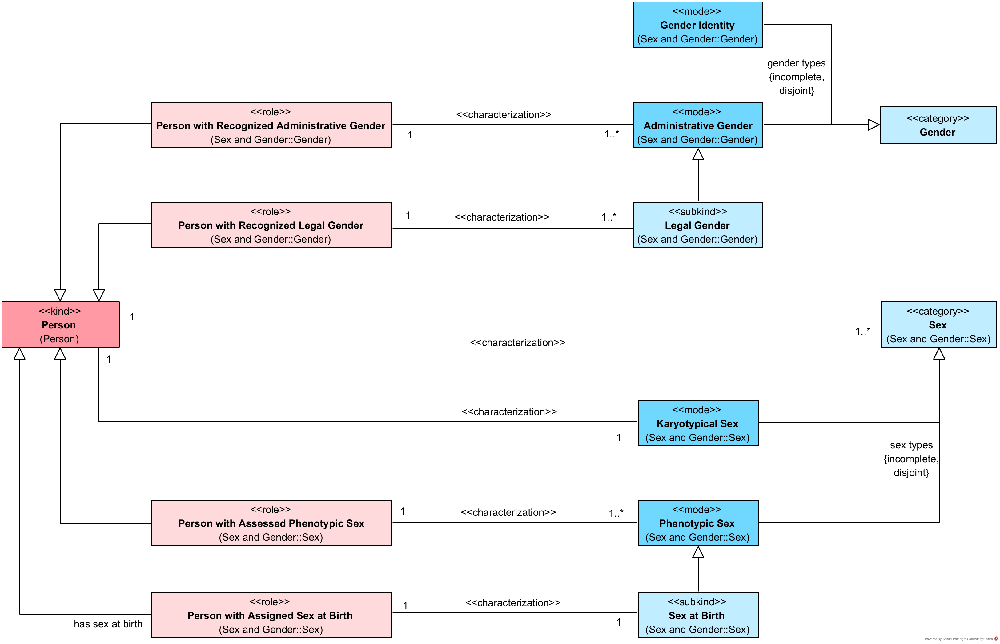
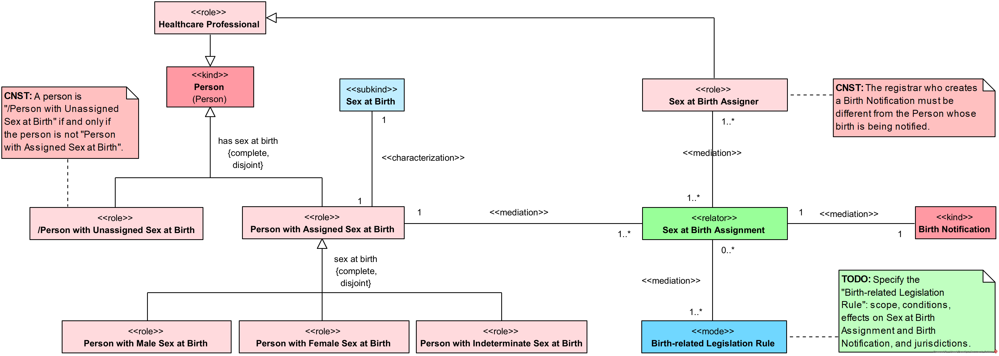
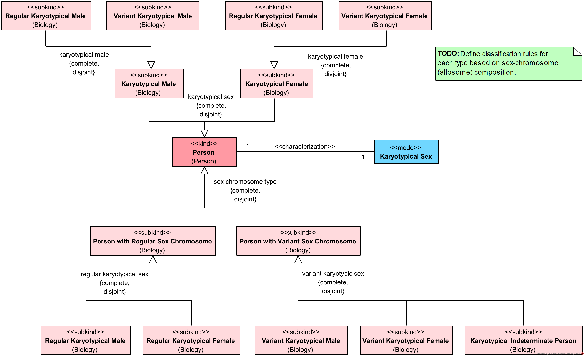
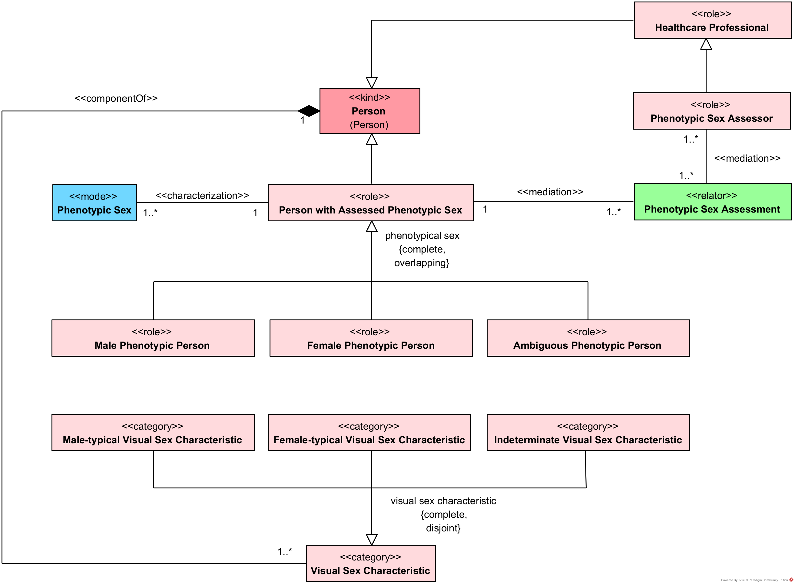
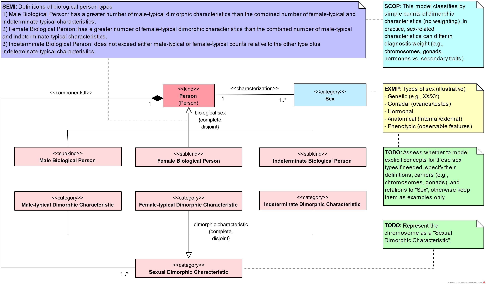
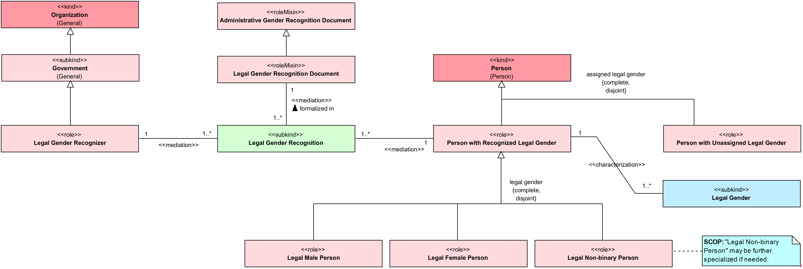
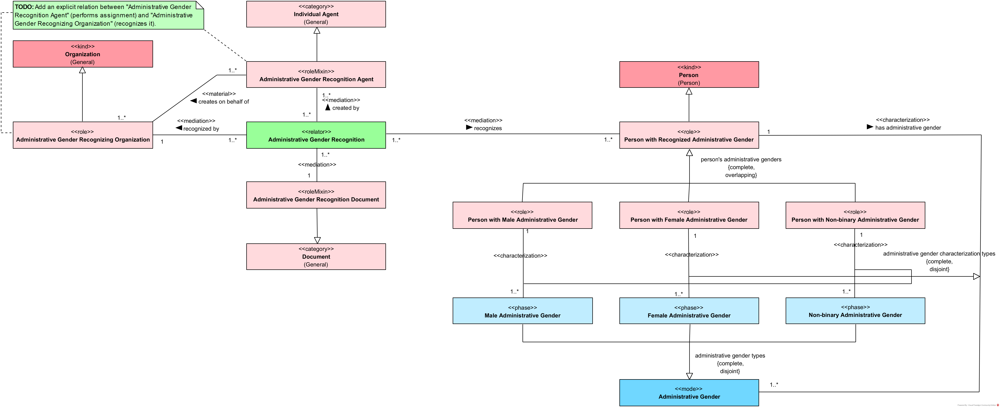
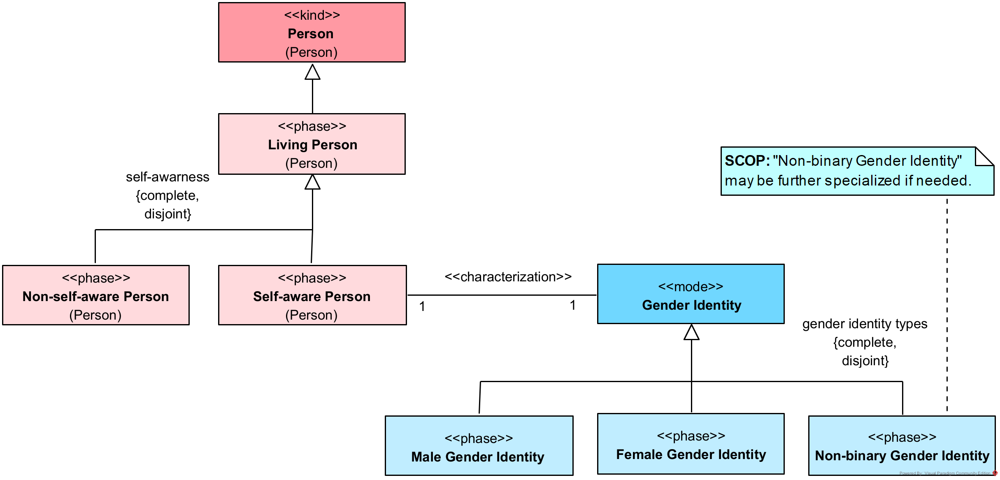

# Health-RI Ontology
*Version 0.9.1*

## Sex and Gender

This document describes the OntoUML conceptual model of Sex and Gender, detailing its structure, types, and relationships. The model follows the ontological notion of **<<mode>>**, representing intrinsic properties of a *Person*. However, while these modes always depend on the bearer (they are properties of them), their determination can be either intrinsic depending only on the person s own features or extrinsic requiring assessment or assignment by external agents.

This distinction is crucial to properly model the social, legal, and biological complexity of sex and gender in human contexts.

### Person's Sex and Gender

This integrated diagram brings together all the sex and gender modes that characterize a **Person**:

- **Intrinsic modes**: Karyotypical Sex, Gender Identity.
- **Extrinsic modes**: Phenotypic Sex, Sex at Birth, Administrative Gender, Legal Gender.

It also makes explicit the mediation roles for extrinsic modes highlighting how external agents participate in assigning or recognizing these properties.

This unified view underlines the model s goal: to provide a clear, precise, and inclusive conceptual framework that acknowledges both personal identity and social practices in defining sex and gender.

### Sex

#### Sex at Birth

Sex at birth is also modeled as an **extrinsic mode**, but it emphasizes its formal **assignment** during birth registration. While it typically relies on the newborn s phenotypical features, it is a legal and administrative act involving professionals who record this classification on official documents.

The ontology includes:

- The **Sex at Birth Assignment** relator, mediating between the professional and the person.
- The roles of **assigner** and **assignee**.
- Categories for **male**, **female**, and **indeterminate** assignments.

By modeling sex at birth explicitly as an assignment, the ontology makes clear that this label is not merely descriptive but socially consequential.

#### Karyotypical Sex

Karyotypical sex is an **intrinsic mode**: it depends solely on the person s genetic makeup and is present from birth. It is defined by the composition of **allosomes** (sex chromosomes) such as XX, XY, or variations like XXY or X0. This model distinguishes **regular** (XX or XY) and **variant** karyotypical patterns, capturing the biological diversity observed in human populations.

In practice, karyotypical sex is often viewed as the "genetic sex" of a person reflecting their chromosomal configuration independently of any interpretation or assessment.

#### Phenotypic Sex

Phenotypic sex is an **extrinsic mode**: while it refers to the person's own anatomical and morphological features, it depends on **external assessment** by healthcare professionals. It includes visible anatomical traits such as genitalia, secondary sexual characteristics, and body morphology.

The model explicitly includes **visual sex characteristics** as important cues for assessment classified as male-typical, female-typical, or indeterminate. It also models the mediation process, highlighting that phenotypic sex results from structured clinical or social evaluations.

This concept allows us to capture the important fact that biological sex is not just about genes, but also about embodied, observable features that can vary across individuals.

#### Sex

Sex is modeled here as **biological sex**, conceptualized as a **<<mode>>** an intrinsic property of a person that depends on their biology. Importantly, the ontology acknowledges that sex is not a single, unitary notion but an umbrella for several dimensions, such as chromosomal, anatomical, phenotypical, hormonal, and gonadal sex.

While not all these dimensions are explicitly modeled, the ontology focuses on three representative types:

- **Karyotypical Sex** (intrinsic mode)
- **Phenotypic Sex** (extrinsic mode)
- **Sex at Birth** (extrinsic mode)

This separation helps clarify that while biological sex is fundamentally about the person's body, some of its types require social practices of observation, assessment, and formal assignment.

### Gender

Gender is also modeled as a **<<mode>>**, reflecting its intrinsic nature as a property of a person. However, the ontology carefully distinguishes **intrinsic** from **extrinsic** modes of gender:

- **Gender Identity** (intrinsic): Defined and experienced by the person themselves.
- **Administrative Gender** (extrinsic): Assigned or recognized by organizations for institutional purposes.
- **Legal Gender** (extrinsic): A specialized form of administrative gender, recognized and enforced by government entities.

This structure acknowledges that while gender always resides in the person, its recognition and categorization often involve formal social processes.

#### Legal Gender

**Legal Gender** is an **extrinsic mode** and a **subkind of Administrative Gender**. It refers to the gender category officially recognized by a **government**. It typically appears in legal documents like birth certificates, IDs, or passports, and has formal consequences for rights and obligations.

The diagram shows:

- The role of **Legal Gender Recognizer** (government bodies).
- Mediation via **Legal Gender Recognition**.
- Recognized roles: **Legal Male**, **Legal Female**, **Legal Non-binary**, and **Unassigned**.

This modeling clarifies the distinction between personal identity and state recognition.

#### Administrative Gender

**Administrative Gender** generalizes the notion of formal assignment beyond governments to **any organization**. Hospitals, schools, and companies may record or assign gender categories for their own administrative purposes.

The model includes:

- Organizations as **Administrative Gender Recognizers**.
- Mediation via **Administrative Gender Recognition**.
- Recognized roles for people with an administrative gender.

By situating legal gender as a **subkind** of administrative gender, the model shows that state-recognized categories are just one (especially consequential) form of institutional recognition.

#### Gender Identity

**Gender Identity** represents the **intrinsic mode** of gender the personally defined and experienced sense of being male, female, non-binary, or other identities. This dimension is internal to the person and does not depend on external assignment or recognition.

The model includes:

- Male, Female, and Non-binary identities as **<<phase>>** subtypes, acknowledging that a person's gender identity can vary over time.

This approach supports inclusive modeling of diverse gender identities while recognizing their personal, self-defined nature.

## Biology

### Chromosomes

This diagram shows how allosomes (X and Y chromosomes) combine to form the karyotypical makeup of human cells. Different allosome combinations lead to distinct karyotypical categories.
