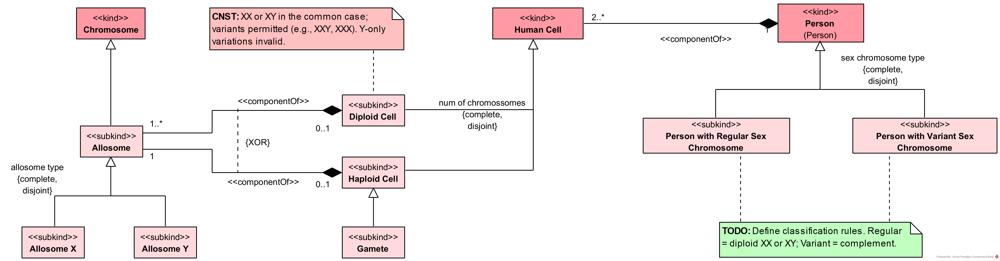

# Health-RI Ontology
*Version 1.3.0*

## Sex and Gender

This document describes the OntoUML conceptual model of Sex and Gender, detailing its structure, types, and relationships. The model follows the ontological notion of **<<mode>>**, representing intrinsic properties of a *Person*. However, while these modes always depend on the bearer (they are properties of them), their determination can be either intrinsic depending only on the person s own features or extrinsic requiring assessment or assignment by external agents.

This distinction is crucial to properly model the social, legal, and biological complexity of sex and gender in human contexts.

### Sex

The Sex package represents biological sex of persons along three axes: karyotypic sex, phenotypic sex, and sex at birth. It classifies persons by biological sex (male, female, indeterminate) using counts of sexual dimorphic characteristics and distinguishes karyotypic male and female, including regular and variant sex-chromosome composition. Phenotypic sex is treated as an observable condition of a person that can be classified as male, female, or ambiguous with reference to visual sex characteristics. Sex at birth is addressed as a registration category that distinguishes persons with assigned or unassigned sex at birth and specifies the categories male, female, or indeterminate.

The package separates characterization, assessment, and registration. Phenotypic sex may be established by one or more assessments involving a healthcare professional. Sex at birth is represented as an assignment recorded on a birth notification and may be governed by birth-related legislation rules. Karyotypic sex provides a chromosome-based characterization without prescribing decision rules. This structure keeps the dimensions of sex explicit, identifies the agents and artifacts involved in assessments and assignments, and supports consistent application of categories to persons.

#### Sex at Birth

The diagram models Sex at Birth as an extrinsic mode that is determined through a process of formal assignment at the time of birth registration. While such assignments often rely on the newborn s phenotypical features, they are not merely descriptive but the outcome of a social and administrative act recorded in official documents.

The process is represented by the relator Sex at Birth Assignment, which mediates between the Sex at Birth Assigner (a role typically played by a healthcare professional) and the Person with Assigned Sex at Birth. This mediation links the professional responsible for the classification to the person whose sex is being recorded. Persons may therefore appear either as Persons with Assigned Sex at Birth further specified as male, female, or indeterminate or as Persons with Unassigned Sex at Birth if no assignment has yet taken place.

The assignment is also tied to a Birth Notification, which documents the registration act. A constraint clarifies that a person cannot register their own birth notification, ensuring that the assignment is always performed by another agent. Furthermore, the model acknowledges the influence of Birth-related Legislation Rules, which establish the normative framework within which sex at birth assignments occur.

#### Karyotypical Sex

The diagram represents Karyotypical Sex as a mode that characterizes every Person according to their chromosomal configuration. This intrinsic determination is grounded in the composition of sex chromosomes and is present from birth, independently of later developmental or interpretive factors.

The model distinguishes between Karyotypical Male and Karyotypical Female, each further divided into Regular and Variant forms. Regular karyotypical males and females correspond to the common chromosomal patterns XY and XX, while variant karyotypes (e.g., XXY, X0, mosaic configurations) capture biological diversity beyond the typical patterns. Both male and female partitions are complete and disjoint, ensuring exhaustive and non-overlapping classification.

At the level of persons, the ontology separates Person with Regular Sex Chromosome from Person with Variant Sex Chromosome. Each of these types is further specified by the corresponding karyotypical category. Variant cases also include the possibility of a Karyotypical Indeterminate Person, acknowledging that some chromosomal configurations cannot be unambiguously aligned with either the male or female partition.

#### Phenotypic Sex

The diagram models Phenotypic Sex as a mode that characterizes a Person based on their observable anatomical and morphological traits. Unlike karyotypical sex, phenotypic sex is extrinsic, as it arises through assessment by others rather than being solely determined by genetic makeup. This assessment is represented through the relator Phenotypic Sex Assessment, which mediates the interaction between the Person with Assessed Phenotypic Sex and the Phenotypic Sex Assessor, a role typically played by a healthcare professional.

Persons with assessed phenotypic sex are further specialized into the roles Male Phenotypic Person, Female Phenotypic Person, and Ambiguous Phenotypic Person. These roles are complete and overlapping, reflecting the variability of observable traits and the fact that assessments may not always yield a binary outcome.

The ontology makes explicit use of Visual Sex Characteristics as the basis for assessment. These are categorized as Male-typical, Female-typical, or Indeterminate Visual Sex Characteristics, providing the cues through which assessments are made. This partition is complete and disjoint, ensuring that each characteristic is classified in exactly one category.

#### Biological Sex

The diagram models Sex as a biological property that characterizes every Person. In this context, sex is represented as a mode, understood as an intrinsic property grounded in the person s biological makeup. The ontology acknowledges, however, that biological sex is not a single or unitary concept but rather an umbrella encompassing multiple dimensions, such as chromosomal, gonadal, hormonal, anatomical, and phenotypical aspects.

The model structures biological sex through three subkinds of persons: Male Biological Person, Female Biological Person, and Indeterminate Biological Person. These roles are distinguished based on the relative number of Sexual Dimorphic Characteristics exhibited by the individual. Such characteristics are further classified as Male-typical, Female-typical, or Indeterminate Dimorphic Characteristics, and together they form the basis for sex classification in the model.

This classification is simplified, focusing on the count of dimorphic traits without weighting them, while recognizing that in biological and clinical practice, some traits such as chromosomal constitution, gonadal tissue, or hormonal profiles may be considered diagnostically more significant than secondary sexual features. Supplementary notes in the model highlight this limitation and indicate that future refinements may include explicit modeling of chromosomes as sexual dimorphic characteristics.

By organizing sex in this way, the ontology establishes biological sex as a multifaceted construct while situating it within a coherent framework that connects intrinsic features of persons with representative biological dimensions, such as karyotypical, phenotypic, and assigned sex at birth.

#### Views

##### Person's Sex Taxonomy

The diagram presents an updated consolidated view of the taxonomy of sex classifications modeled within the Sex subpackage. It does not introduce new constructs but integrates, in a single structure, the different categories and roles established in the package s detailed diagrams.

At the center, Person is specialized into distinct sex-related determinations. These include Karyotypical Male and Karyotypical Female, representing intrinsic chromosomal categories; Male Biological Person, Female Biological Person, and Indeterminate Biological Person, which reflect biological classifications based on dimorphic traits; Person with Assessed Phenotypic Sex, which is further specified as Male Phenotypic Person, Female Phenotypic Person, or Ambiguous Phenotypic Person; and finally, Person with Assigned Sex at Birth, specialized into male, female, and indeterminate roles, alongside Person with Unassigned Sex at Birth.

### Gender

Gender defines a person-related characteristic that can be established through distinct sources of identification and attribution. It distinguishes gender that is self-identified by the person from gender that is externally attributed to the person, and it supports external attribution that is recognized in administrative settings and, more specifically, in legal settings through governmental recognition. This separation enables representing gender characterizations that reflect different authorities and contexts of use without forcing a single privileged source.

Gender is organized around common gender options and supports consistent alignment between those options and context-specific gender types used in person characterizations. It also supports gender modality characterizations and explicit attribution by relating an attributing agent to the person to whom a gender is attributed, keeping the source of externally-attributed gender statements explicit.

#### Person by Genders Modality

Person is classified by gender modality into Cisgender Person and Transgender Person, with the classification defined as complete and overlapping. Two context-specific person types support modality assignment: Self-aware Person supports self-identified modality types, and Externally Gender-attributed Person supports externally-attributed modality types.

Self-identified Cisgender Person and Self-identified Transgender Person specialize Self-aware Person as a complete and disjoint classification, while Externally-attributed Cisgender Person and Externally-attributed Transgender Person specialize Externally Gender-attributed Person as a complete and overlapping classification. Cisgender and transgender types are also refined by context, relating self-identified and externally-attributed variants to the broader cisgender and transgender person classifications.

#### Person by Gender Context

Person is characterized by Gender through person types that reflect how gender is established. Self-aware Person is characterized by exactly one Self-identified Gender, linking self-identification to a person state where self-identification is applicable. Externally Gender-attributed Person is characterized by one or more Externally-attributed Gender instances, capturing cases where gender is assigned to a person by an external party.

Recognized Administrative Gender and Recognized Legal Gender refine external attribution into administrative and legal contexts. Person with Recognized Administrative Gender is characterized by Administrative Gender, and Person with Recognized Legal Gender is characterized by Legal Gender, with recognized legal gender treated as a specialization of recognized administrative gender. The specialization of Gender into contexts is not exhaustive, while keeping these contexts distinct.

#### Person by Gender Option

Person is classified into Male-gender Person, Female-gender Person, and Non-binary-gender Person, with the classification defined as complete and overlapping. Each Person is characterized by one or more Gender instances, and each such Gender instance characterizes exactly one Person.

Male-gender Person, Female-gender Person, and Non-binary-gender Person are each characterized by the corresponding gender option, namely Male Gender, Female Gender, and Non-binary Gender. The gender options are defined as complete and disjoint, so each Gender instance falls under exactly one option, while a person may be associated with multiple options by being characterized by multiple Gender instances.

#### Gender Types

Gender is specialized by context into Self-identified Gender and Externally-attributed Gender, with Externally-attributed Gender further specialized into Administrative Gender and Legal Gender. This supports distinguishing genders grounded in self-identification from genders attributed by third parties, while separating administrative attribution from legal attribution.

Gender is also specialized by option into Male Gender, Female Gender, and Non-binary Gender. Specific genders are defined at the intersection of context and option, including self-identified, externally-attributed, administrative, and legal variants for male, female, and non-binary. For each option, the context-specific variants are defined as complete and overlapping, supporting cases where a single gender instance participates in more than one attribution context within the same option.

#### Gender Context

Gender Context defines the contexts in which gender is established for a person and the agents and social entities involved in that establishment. It distinguishes self-identified gender from externally-attributed gender, specializes externally-attributed gender into administrative gender as gender recognized by organizations, and further specializes administrative gender into legal gender as gender recognized through governmental authority. It also supports representing persons whose administrative or legal gender is recognized, as well as persons whose legal gender is unassigned.

Gender Context captures recognition as a mediated process that can involve recognizers, recognition acts, and recognition documents, allowing administrative and legal recognition to be represented with their associated participants and artifacts. It also includes an explicit gender attribution relation connecting a gender attributor to an externally gender-attributed person, preserving a clear separation between the attributing party and the person who is attributed.

##### Legal Gender

Legal Gender is established through Legal Gender Recognition, which is carried out by a Legal Gender Recognizer situated within a Government. This recognition is formalized in a Legal Gender Recognition Document, and both the recognition and its document are treated as specializations of their administrative recognition counterparts. This frames legal gender as a state-based form of gender recognition.

Legal Gender Recognition recognizes a Person, yielding the classification Person with Recognized Legal Gender, and this person is associated with one or more Legal Gender instances. Persons are also classified under an "assigned legal gender" partition that distinguishes recognized legal gender from unassigned legal gender, supporting explicit representation of cases where no legal gender has been assigned.

##### Administrative Gender

Administrative Gender is assigned through an Administrative Gender Recognition, which specializes Gender Attribution. An Administrative Gender Recognizing Organization recognizes a Person through this recognition, supporting the classification Person with Recognized Administrative Gender. The recognized person is associated with one or more Administrative Gender instances, capturing administrative gender values as outcomes of organizational recognition.

An Administrative Gender Recognition is created by an Administrative Gender Recognition Agent and generates an Administrative Gender Recognition Document, which is a Document. The generated document supports traceability of the recognition act. A relation "creates on behalf of" links the recognition agent and the recognizing organization, with a rule that derives this relation when an Administrative Gender Recognition mediates both parties; a scope note states that no additional formal relation between agent and organization is asserted.

##### Self-identified Gender

Self-identified Gender characterizes a Self-aware Person, with Self-aware Person specializing Living Person. Each Self-aware Person is linked to exactly one Self-identified Gender, and each Self-identified Gender is linked to exactly one Self-aware Person.

This establishes a single, direct association between a self-aware person and the gender they self-identify, using a one-to-one characterization link.

##### Externally-attributed Gender

Externally-attributed Gender is grounded in Gender Attribution, which links a Gender Attributor to an Externally Gender-attributed Person via mediation relations. This supports an explicit attribution situation in which an individual agent attributes gender information to a person, and the attributed person is associated with one or more Externally-attributed Gender instances.

Each Gender Attribution has exactly one Gender Attributor and is attributed to exactly one Externally Gender-attributed Person, while allowing multiple attributions for the same attributor and for the same person. A stated constraint requires that, in each Gender Attribution, the Gender Attributor and the Externally Gender-attributed Person are not the same individual.

##### Externally-attributed Gender Hierarchy

Gender Attribution defines how gender can be attributed to a person by an external agent through an explicit attribution relationship. It captures the roles of the gender attributor and the externally gender-attributed person, and it links the externally gender-attributed person to an externally-attributed gender characterization. Each attribution involves an attributing agent that is distinct from the person to whom gender is attributed, keeping the source of externally-attributed gender statements explicit.

Gender Attribution is specialized into Administrative Gender Recognition and Legal Gender Recognition, representing institutional attributions performed by an administrative gender recognizing organization and, more specifically, by a legal gender recognizer. These specializations relate the recognizing party to a recognition instance that connects a person with recognized gender to the corresponding recognized gender type, distinguishing administrative and legal recognition while preserving a shared attribution structure.

#### Person by Gender Type

Person by Gender Type defines person classifications according to gender options, organizing persons as male-gender, female-gender, or non-binary-gender. It connects these person classifications to corresponding gender types through gender characterizations, ensuring that each person classification is grounded in an explicit gender characterization.

This package distinguishes person classifications by the source of the associated gender, separating self-identified from externally-attributed classifications and refining external attribution into administrative variants and, more specifically, legal variants. This supports describing a person by gender option while keeping the relevant source of recognition or attribution explicit.

##### Male-gender Person

Male-gender Person is refined into Self-identified Male-gender Person and Externally-attributed Male-gender Person in a complete and overlapping way, allowing a person to satisfy one or both refinements. Externally-attributed Male-gender Person is further refined into Administrative Male-gender Person and Legal Male-gender Person.

Male-gender Person is linked to Male Gender so that each Male-gender Person is characterized by one or more Male Gender instances, and each Male Gender instance characterizes exactly one Male-gender Person. The characterization links are organized as a complete and disjoint set, aligning Self-identified Male-gender Person with exactly one Self-identified Male Gender, and aligning each of Externally-attributed Male-gender Person, Administrative Male-gender Person, and Legal Male-gender Person with one or more corresponding male gender instances. Male Gender is refined into Self-identified Male Gender and Externally-attributed Male Gender in a complete and disjoint way, with externally-attributed male genders further refined into Administrative Male Gender and Legal Male Gender.

##### Female-gender Person

Female-gender Person is refined into Self-identified Female-gender Person and Externally-attributed Female-gender Person in a complete and overlapping way, allowing a person to satisfy one or both refinements. Externally-attributed Female-gender Person is further refined into Administrative Female-gender Person and Legal Female-gender Person.

Female-gender Person is linked to Female Gender so that each Female-gender Person is characterized by one or more Female Gender instances, and each Female Gender instance characterizes exactly one Female-gender Person. The characterization links are organized as a complete and disjoint set, aligning Self-identified Female-gender Person with exactly one Self-identified Female Gender, and aligning each of Externally-attributed Female-gender Person, Administrative Female-gender Person, and Legal Female-gender Person with one or more corresponding female gender instances. Female Gender is refined into Self-identified Female Gender and Externally-attributed Female Gender in a complete and disjoint way, with externally-attributed female genders further refined into Administrative Female Gender and Legal Female Gender.

##### Non-binary-gender Person

Non-binary-gender Person is refined into Self-identified Non-binary-gender Person and Externally-attributed Non-binary-gender Person in a complete and overlapping way, allowing a person to satisfy one or both refinements. Externally-attributed Non-binary-gender Person is further refined into Administrative Non-binary-gender Person and Legal Non-binary-gender Person.

Non-binary-gender Person is linked to Non-binary Gender so that each Non-binary-gender Person is characterized by one or more Non-binary Gender instances, and each Non-binary Gender instance characterizes exactly one Non-binary-gender Person. The characterization links are organized as a complete and disjoint set, aligning Self-identified Non-binary-gender Person with exactly one Self-identified Non-binary Gender, and aligning each of Externally-attributed Non-binary-gender Person, Administrative Non-binary-gender Person, and Legal Non-binary-gender Person with one or more corresponding non-binary gender instances. Non-binary Gender is refined into Self-identified Non-binary Gender and Externally-attributed Non-binary Gender in a complete and disjoint way, with externally-attributed non-binary genders further refined into Administrative Non-binary Gender and Legal Non-binary Gender.

#### Gender Modality

Gender Modality defines how a person can be characterized as cisgender or transgender and how such characterizations may arise from different sources. It supports modality assignments for persons and refines them into self-identified and externally-attributed modality types, allowing both perspectives to be represented when applicable.

Gender Modality also refines cisgender and transgender person types through their connections to sex at birth and to person classifications by gender type, supporting more specific modality assignments that are grounded in these linked characterizations. This supports consistent representation of modality statements while keeping the source of the modality explicit.

##### Self-identified Cisgender Person

Defines self-identified cisgender classification by combining a self-identified gender-type classification with a sex-at-birth classification.

Self-identified cisgender persons are partitioned into female and male cases. Each case is defined by the conjunction of two conditions: the person is self-identified as female-gender or male-gender, and the person is also classified as having female sex at birth or male sex at birth, respectively. This provides a clear criterion for self-identification-based cisgender classification that depends on both self-identification and a sex-at-birth type.

##### Externally-attributed Cisgender Person

Defines externally-attributed cisgender classification by combining an externally attributed gender-type classification with a sex-at-birth classification.

Externally-attributed cisgender persons are partitioned into female and male cases. Each case is defined by the conjunction of two conditions: the person is externally attributed as female-gender or male-gender, and the person is also classified as having female sex at birth or male sex at birth, respectively. This provides a clear criterion for externally attributed cisgender classification that depends on both an externally attributed gender type and a sex-at-birth type.

## Biology

### Chromosomes

The diagram models chromosomes and their role in human cells and persons. At its core, Chromosome is specialized into the subkind Allosome, which is further partitioned into Allosome X and Allosome Y. A note clarifies that an allosome set can never consist of only Y, preventing biologically inconsistent representations. The model enforces that allosome type is complete and disjoint.

Human cells are classified according to their number of chromosomes as either Diploid Cell or Haploid Cell, in a complete and disjoint partition. Diploid cells incorporate one or more allosomes, whereas haploid cells (including Gametes) contain only one set of chromosomes. The relations use {xor} constraints to ensure mutual exclusivity in chromosome composition. This distinction provides explicit support for modeling gametes as haploid carriers of genetic material.

On the organismal level, Person is represented as composed of two or more human cells, with specialization according to sex chromosome type. The diagram distinguishes between Person with Regular Sex Chromosome (diploid XX or XY) and Person with Variant Sex Chromosome, allowing the ontology to accommodate individuals with chromosomal variations.

### Cellular Entities

The diagram represents the high-level modeling of cellular entities and their relation to broader biological categories. At the core is the category Cellular Entity, which generalizes living beings composed of cells, including both individual organisms and more specific cellular components. This category is specialized according to the complete and disjoint states Living Cellular Entity and Dead Cellular Entity, capturing the essential life-state distinction relevant to medical and biological contexts.

The diagram makes explicit that cellular entities encompass not only whole organisms but also entities such as fetuses, embryos, and isolated cells. This ensures coverage of cases important for biomedical data integration where early developmental stages and cellular-level entities must be consistently represented.

From a taxonomic perspective, Cellular Entity subsumes Animal, which is further divided into the disjoint categories Person and Non-Human Animal. This partition provides a clear distinction between human and non-human subjects in biomedical datasets while preserving their common grounding as cellular entities.

### Health Condition

#### Health Condition Overview

The diagram Health Condition Overview provides a high-level structure for representing health conditions and their main distinctions. It introduces Health Condition as a specialization of Condition, associated with Animal entities, and instantiated through Health Condition Types. This establishes the general framework in which health conditions are characterized and classified within the ontology.

The diagram differentiates health conditions along two principal axes. The first axis concerns pathological status, dividing conditions into pathological and non-pathological types. Pathological Health Condition is further connected to categories such as Disease and Non-traumatic Health Condition, clarifying its scope within the ontology. The second axis addresses the nature of health conditions, separating risk-based conditions from established ones. Risk-based conditions represent probabilities or predispositions, while established conditions represent actual states, ensuring that both preventive and diagnostic perspectives are accounted for.

Together, these partitions provide a coherent schema for distinguishing between current disorders, risks of future conditions, and the pathological status of health states.

#### Established Health Condition Types

The diagram Established Health Condition Types organizes the classification of health conditions based on structural, functional, psychological, and etiological aspects. It provides a structured view of how different categories of conditions are related, ensuring that all relevant perspectives on health conditions are consistently represented. The model distinguishes between structural and non-structural conditions, including functional and psychological conditions, and connects them to broader classifications of established health conditions. It also incorporates etiological distinctions, such as idiopathic and known-origin conditions, with the latter further divided into congenital and acquired types.

The diagram additionally addresses dependence types, separating inherent conditions from externally-caused ones. Externally-caused conditions are modeled alongside injuries and exposure-based conditions, reflecting the impact of external influences on health states. Injuries are further divided into traumatic and non-traumatic categories, capturing the role of trauma in their occurrence. This structure ensures that conditions are classified according to both their internal characteristics and their external determinants.

Overall, the diagram provides a comprehensive schema for differentiating established health conditions, using complete and disjoint partitions where appropriate and allowing overlaps where necessary.

## General

### Agents

The diagram organizes the ontology of Agents, rooted in the UFO-based category Agent. Agents are understood as entities capable of acting or exercising agency in a system. The diagram distinguishes between collective and individual forms of agency.

Organization is modeled as a kind of agent that represents collective structures, while Individual Agent is a separate category, further divided into disjoint and complete types. These include Artificial Agent, covering computational or technological systems with agency-like behavior, and Animal, representing biological entities capable of action. Within the biological domain, Person is modeled as a kind of animal, thereby situating human agents within the broader taxonomy of living individual agents.

The diagram specifies that types of agents as a whole are incomplete and disjoint, clarifying that while the current taxonomy covers key distinctions, the classification is not exhaustive. By contrast, types of individual agents are modeled as complete and disjoint, ensuring that every individual agent must be classified as either artificial or animal, with no overlap.

### Datatypes

A coherent set of datatypes for calendar and civil time. It includes an enumeration Month with twelve named values, a Date datatype that combines year, month, and day in the proleptic Gregorian calendar, and an OffsetDateTime that reuses Date and adds hour, minute, second, optional nanosecond, and a UTC offset in whole minutes. The separation between Date and OffsetDateTime supports reuse of calendar dates where no time-of-day or offset is needed and enables precise timestamping where an explicit offset is required.

### Documents

The diagram introduces the general category Document, encompassing entities that serve as carriers of information. This category is specialized into two complete and disjoint subcategories: Physical Document and Digital Document.

Physical Document represents tangible information carriers such as paper records, printed reports, or handwritten notes. Digital Document covers information encoded in electronic formats, including files, databases, and digitally stored reports. The complete and disjoint constraint ensures that every document must be classified as either physical or digital, with no overlap between the two.

This distinction supports consistent representation of information artifacts across heterogeneous healthcare and research contexts, enabling explicit modeling of whether information exists in material form or as a digital object.

## Diagnosis

### Diagnostic Assessments

The diagram represents the structure and results of diagnostic processes. At the top, a Diagnostic Relation connects diagnosing agents and diagnosed entities. Once a diagnostic process has been completed, this relation becomes a Concluded Diagnostic Relation, which manifests in one or more Diagnostic Assessments. These assessments classify the determination of diagnostic results into complete and disjoint categories.

A Diagnostic Assessment may be Conclusive or Inconclusive. Inconclusive assessments represent cases where the diagnostic process fails to establish a definitive result. Conclusive assessments are subdivided into Negative Diagnosis Assessment and Positive Diagnosis Assessment, each yielding a specific outcome. Negative assessments yield a No-Diagnosis Outcome, while positive assessments yield a Diagnosis. Both outcomes are treated as subkinds of Diagnostic Assessment Outcome, which serves as the general mode representing the result of a diagnostic process.

The model also includes a connection from Diagnostic Assessment Outcome to the general category Belief, clarifying that diagnostic outcomes are modeled as entities that may ground or manifest beliefs within clinical or biomedical contexts.

### Diagnostic Relations

The diagram presents the structural components and mediations that constitute a Diagnostic Relation. This relator connects a Diagnosing Agent and a Diagnosed Entity, ensuring that diagnostic activities are explicitly grounded in the participation of both an agent and a target entity.

A diagnostic process may begin with a Diagnosis Suspicion, modeled as a mode and characterized as a specific kind of Belief. Suspicion is always linked to at least one diagnosing agent, capturing the cognitive or inferential basis that motivates the establishment of a diagnostic relation.

Diagnostic relations also involve Diagnostic Methods, which are characterized modes instantiated by a Diagnostic Method Type. This distinction ensures that diagnostic practices are not only recorded at the instance level but also categorized by methodological type, providing traceability of procedures.

On the side of the diagnosed entity, the diagram shows that each diagnosed entity, modeled as a substantial, can be characterized by one or more Conditions. These conditions, in turn, may be further qualified by Condition Indicators, which capture observable or inferable elements such as symptoms, signs, risk factors, or contextual historical data. A note clarifies that condition indicators can be decomposed into subjective, objective, and contextual categories, offering finer-grained representation of diagnostic evidence.

### Diagnosing Agents

The diagram specifies the agents responsible for performing diagnostic activities and issuing diagnostic outcomes. At its root, the general category Agent is specialized through the role mixin Diagnosing Agent, representing any entity capable of carrying out a diagnostic process. This general type is further specialized into two disjoint roles: Diagnosing Artificial Agent and Diagnosing Person.

Artificial agents include automated systems, algorithms, or devices classified under the broader category Artificial Agent, highlighting the relevance of computational and technological systems in diagnostic contexts. Diagnosing persons, grounded in the kind Person, are subdivided according to professional status. The roles Layperson Diagnosing Agent and Professional Diagnosing Agent are modeled as complete and overlapping, allowing for flexible representation of cases where diagnostic activities may be carried out by professionals (e.g., clinicians) or non-professionals (e.g., self-diagnosis).

In addition, diagnosing agents are linked to the role mixin Diagnostic Outcome Issuer, ensuring that diagnostic activities are tied to the issuance of outcomes. A characterization relation specifies that each Diagnostic Assessment Outcome is issued by at least one diagnostic outcome issuer, anchoring diagnostic outcomes to the agents responsible for their production.

### Diagnosis Types

The diagram structures the taxonomy of Diagnosis, identifying different types according to their object, focus, source, and use. A general subkind Diagnosis is specialized into Cellular Entity Diagnosis and Healthcare Diagnosis, ensuring coverage of both cellular-level and broader healthcare-oriented diagnostic contexts.

Cellular Entity Diagnosis is partitioned into the disjoint types Antemortem Diagnosis and Postmortem Diagnosis, distinguishing whether the diagnostic assessment occurs before or after death. Healthcare Diagnosis is further refined through three complementary classification axes. By focus, diagnoses are divided into Human Healthcare Diagnosis and Veterinary Diagnosis. By source, they are classified into disjoint subtypes such as Clinical Diagnosis, Epidemiological Diagnosis, Laboratory Diagnosis, Administrative Coding Diagnosis, and Radiological Diagnosis. By use, diagnoses are modeled as roles that may overlap: Care-oriented Diagnosis, Surveillance Diagnosis, and Research Diagnosis.

The model also incorporates the distinction between Self-diagnosis and External Diagnosis. A note clarifies that self-diagnosis applies exclusively when a single individual simultaneously plays both diagnosing agent and diagnosed entity roles. Another annotation highlights that diagnosis types are defined by the method from which they originate, such that diagnoses derived from laboratory methods are classified as laboratory diagnoses.

### Diagnosed Entities

The diagram defines the abstract notion of a Diagnosed Entity, capturing the range of entities that may be the subject of a diagnostic process. This is partitioned into four disjoint and complete types, ensuring that all diagnosed entities fall into one of these categories.

The specialization includes Diagnosed Cellular Entity, which is explicitly linked to the broader biological category of Cellular Entity. This supports the modeling of diagnostic contexts where individual cells, such as tumor cells or infected cells, are the diagnostic target. Diagnosed Biological Part covers organs, tissues, or other anatomical structures subject to diagnosis, while Diagnosed Specimen represents biological samples collected for diagnostic analysis. Finally, Diagnosed Group accounts for diagnoses applied at the collective level, such as patient cohorts or study populations.

## UFO

### Endurant

The diagram presents the high-level taxonomy of Endurants as conceptualized in UFO. At the top, Particular is introduced as a general mixin that subsumes all individual entities. From this root, the category Endurant captures entities that persist through time while possibly undergoing changes in their properties.

Substantial is modeled as a specialization of endurants, representing entities that have identity and exist independently. The category is further partitioned into two complete and disjoint subtypes: Object and Agent. Objects denote substantial entities that are not capable of agency, while Agents represent substantials that can act or exercise agency. This division provides the ontological basis for distinguishing between passive and active entities in the domain.

## Person

### Person's Living Status

The diagram models the temporal and biological aspects of a person s existence, capturing both life stages and living status. At its center is the kind Person, which includes an attribute date of birth that records the individual's birth date. A constraint ensures consistency by requiring that the date of birth matches the date portion of the end attribute of the associated Person s Birth event.

The diagram distinguishes between two mutually exclusive living states, represented as phases: Living Person and Dead Person. This partition is complete and disjoint, ensuring that every person is classified in one and only one of these states at a time. A living person may transition across the life stages Child, Adolescent, and Adult, also modeled as complete and disjoint phases. Additional constraints clarify that no person can become an adolescent without first being a child, and no person can become an adult without first being an adolescent.

The Person's Birth event creates the role Offspring, mediated by the Parent-Child Relation. A birth event includes start and end timestamps, the latter aligning with the person's registered date of birth. Conversely, the Person's Death event terminates the individual's life status and is associated with at least one Person's Death Cause. This mode is instantiated by a Person's Death Cause Type, ensuring that every recorded death is explained by an identified cause type.

By connecting life stages, birth and death events, and cause of death, the diagram provides a coherent framework for modeling the lifecycle of a person within biomedical and demographic contexts.

### Person's Birth

The diagram models biological parenthood through the Parent-Child Relation, a relator that mediates the link between persons in parental and offspring roles. At its core, every Person may take on the Child phase, which represents the life stage during which the individual participates as Offspring in a parent child relation. This mediation ensures that the role of offspring is explicitly tied to a person s life cycle.

On the parental side, the relator includes the roles Biological Mother and Biological Father, which are grounded in sexed subkinds of Biological Person. A Biological Mother is mediated by a Male Biological Person, while a Biological Father is mediated by a Female Biological Person. The model specifies that parenthood is always tied to the Parent-Child Relation, ensuring traceability of biological lineage.

Multiplicity constraints ensure that each offspring is connected to one or more parents, while parents may have one or more children. Material relations  is biological mother of  and  is biological father of  capture the concrete grounding of these roles in parent child structures.

The diagram also incorporates explicit constraints. (1) A biological mother or father can only be the parent of persons with whom they have a valid parent child relation. (2) A biological mother or father cannot be their own parent. (3) A biological mother and a biological father cannot be parents of each other. These clarifications prevent logically inconsistent cases, such as self-parenthood or reciprocal parental ties between parents, strengthening the semantic rigor of the model.
