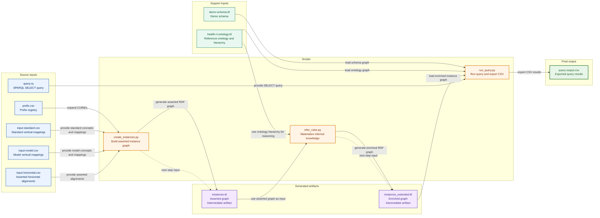

# README.md

## Overview

These three scripts form a simple pipeline for the semantic interoperability demo:

1. **`create_instances.py`**
    Creates the initial asserted RDF instance graph from CSV files.

2. **`infer_rules.py`**
    Reads that graph and materializes inferred mappings, alignments, and consistency flags.

3. **`run_query.py`**
    Runs a SPARQL `SELECT` query over the demo graphs and exports the result to CSV.

Typical workflow from `demonstration\scripts`:

```bash
python create_instances.py
python infer_rules.py
python run_query.py --input ..\queries\q1.rq
```

## Folder structure

The demo is organized as follows:

```text
demonstration/
├─ README.md
├─ definitions/
├─ inputs/
├─ outputs/
├─ queries/
│  ├─ q1.rq
│  └─ base queries/
└─ scripts/
   ├─ create_instances.py
   ├─ infer_rules.py
   └─ run_query.py
```

Recommended interpretation:

- `inputs/` contains source input files and intermediate Turtle files used by later pipeline steps
- `outputs/` contains exported query result CSV files
- `queries/` contains SPARQL query files
- `scripts/` contains the pipeline scripts

## Input files

The `inputs/` folder contains both source input files and intermediate Turtle files used by later steps in the pipeline.

### Source input files

- `prefix.csv` — Prefix registry used to expand CURIEs into full IRIs consistently across the demo inputs.
- `input-standard.csv` — Vertical input file containing standard representation concepts and their semantic mappings.
- `input-model.csv` — Vertical input file containing model representation concepts and their semantic mappings.
- `input-horizontal.csv` — Horizontal input file containing asserted alignments between standard and model representation concepts.
- `demo-schema.ttl` — Demo schema defining the core classes and relations used in the demonstration.
- `health-ri-ontology.ttl` — Reference ontology providing ontology concepts and hierarchy for reasoning and querying.

### Generated intermediate files

- `instances.ttl` — Asserted instance graph generated by `create_instances.py`.
- `instances_extended.ttl` — Enriched instance graph generated by `infer_rules.py` and used as the default graph for querying.

## Recommended order

### 1. Create the base instance graph

Run `create_instances.py` to generate `instances.ttl` from the CSV inputs.

### 2. Infer additional knowledge

Run `infer_rules.py` to generate an extended graph, usually `instances_extended.ttl`.

### 3. Query the extended graph

Run `run_query.py` with a SPARQL query file to export query results to CSV.

## 1) `create_instances.py`

### What it does

Builds the initial RDF/Turtle instance graph for the demo from CSV files.

### Default input files

By default, the script resolves its inputs relative to the script location, that is, from `..\inputs\`:

- `..\inputs\prefix.csv`
- `..\inputs\input-standard.csv`
- `..\inputs\input-model.csv`
- `..\inputs\input-horizontal.csv`

### Default output

- `..\inputs\instances.ttl`

### What it creates

- Standard and model representation concepts
- Ontology concepts
- Reified `demo:Mapping` instances for exact meanings
- Asserted `demo:Alignment` instances
- Direct symmetric `demo:aligns` triples for asserted horizontal alignments

### Important behavior

- Only rows with `hriv:hasExactMeaning` are materialized as mappings.
- Other vertical predicates are ignored for transformation, but their subjects are still registered as known concepts.
- Exact meanings are represented only through reified `demo:Mapping` nodes, **not** as direct `hriv:hasExactMeaning` triples.
- Horizontal rows only assert `aligns`; inferred horizontal relations are handled by `infer_rules.py`.
- The script fails on invalid CSV structure, conflicting labels, duplicate semantic rows, missing referenced concepts, and invalid horizontal pairs.
- The parent folder of the output path is created automatically before writing the Turtle file.

### Arguments

| Argument             | Default                                                  | Meaning                                       |
| -------------------- | -------------------------------------------------------- | --------------------------------------------- |
| `--standard-input`   | `..\inputs\input-standard.csv` relative to this script   | Path to the standard vertical input file      |
| `--model-input`      | `..\inputs\input-model.csv` relative to this script      | Path to the model vertical input file         |
| `--horizontal-input` | `..\inputs\input-horizontal.csv` relative to this script | Path to the horizontal alignment input file   |
| `--prefix`           | `..\inputs\prefix.csv` relative to this script           | Path to the prefix mapping file               |
| `--output`           | `..\inputs\instances.ttl` relative to this script        | Output Turtle file                            |
| `--delimiter`        | `;`                                                      | CSV delimiter used by all input files         |
| `--import-schema`    | off                                                      | Adds `owl:imports` to the schema ontology IRI |

### Required CSV structures

#### `prefix.csv`

Must contain exactly these columns, in this order:

- `prefix`
- `url`

#### `input-standard.csv` and `input-model.csv`

Must contain exactly these columns, in this order:

- `subject_id`
- `subject_label`
- `predicate_id`
- `predicate_modifier`
- `object_id`
- `object_label`

Allowed `predicate_modifier` values for `hriv:hasExactMeaning`:

- empty value
- `Not`

Other predicates may appear, but only `hriv:hasExactMeaning` is transformed into mapping assertions.

#### `input-horizontal.csv`

Must contain exactly these columns, in this order:

- `subject_type`
- `subject_id`
- `subject_label`
- `object_type`
- `object_id`
- `object_label`

Allowed values:

- `subject_type`: `standard` or `model`
- `object_type`: `standard` or `model`

Rules:

- Subject and object cannot be the same concept with the same type.
- Duplicate horizontal pairs are rejected.
- Both referenced concepts must already exist in the corresponding vertical input file.

### Example

Basic usage from `demonstration\scripts`:

```bash
python create_instances.py
```

With custom paths:

```bash
python create_instances.py ^
  --prefix ..\inputs\prefix.csv ^
  --standard-input ..\inputs\input-standard.csv ^
  --model-input ..\inputs\input-model.csv ^
  --horizontal-input ..\inputs\input-horizontal.csv ^
  --output ..\inputs\instances.ttl
```

## 2) `infer_rules.py`

### What it does

Reads the asserted instance graph and derives additional knowledge, including:

- inferred `aligns`
- inferred `cannotAlign`
- inferred `mayAlign`
- inferred `partiallyAligns`
- propagated exact-meaning mappings
- normalized `isConsistent` values

### Default input

By default, the script resolves its main input relative to the script location, from `..\inputs\`:

- `..\inputs\instances.ttl`

### Default output

The default output is based on the input file stem:

- `<input-stem>_extended.ttl`

So with the default input, the output is:

- `..\inputs\instances_extended.ttl`

### Ontology support

You may provide one or more ontology files with `--ontology-input`.

If `--ontology-input` is not provided, the script tries to auto-load:

- `..\inputs\health-ri-ontology.ttl`

These ontology files are used only for reasoning support, especially for `rdfs:subClassOf` checks, and are **not** copied into the output graph.

### Important behavior

- Exact meanings are read from reified `demo:Mapping` instances.
- Asserted alignments are read mainly from reified `demo:Alignment` instances.
- Bare direct `demo:aligns` triples are used as seed input only if `--trust-bare-aligns` is enabled.
- Existing direct `cannotAlign`, `mayAlign`, and `partiallyAligns` triples are used as seed input only if `--trust-horizontal-input` is enabled.
- Direct horizontal relation triples are rewritten on each run so stale materialization is removed.
- Inferred `Mapping` and `Alignment` nodes are regenerated.
- `isConsistent` is normalized for all discovered representation concepts.
- Conflicts between final horizontal classifications are detected and reported.
- The parent folder of the output path is created automatically before writing the Turtle file.

### Rules implemented

The script implements rule groups labeled:

- `R1`
- `R1a`
- `R2`
- `R3`
- `R4a`
- `R4b`
- `R5a`
- `R5b`
- `R6`
- `R7`
- `R8`

### Arguments

| Argument                         | Default                                            | Meaning                                                                                               |
| -------------------------------- | -------------------------------------------------- | ----------------------------------------------------------------------------------------------------- |
| `--input`                        | `..\inputs\instances.ttl` relative to this script  | Input Turtle file                                                                                     |
| `--ontology-input`               | none                                               | Additional ontology file for reasoning support; may be repeated                                       |
| `--output`                       | `<input-stem>_extended.ttl` next to the input file | Output Turtle file                                                                                    |
| `--fail-on-horizontal-conflicts` | off                                                | Abort without writing output if more than one final horizontal classification holds for the same pair |
| `--trust-horizontal-input`       | off                                                | Treat existing direct `cannotAlign` / `mayAlign` / `partiallyAligns` triples as seed facts            |
| `--trust-bare-aligns`            | off                                                | Treat direct `aligns` triples without an `Alignment` node as asserted seed facts                      |
| `--print-inconsistencies`        | off                                                | Print detailed inconsistency information                                                              |

### Example

Basic usage from `demonstration\scripts`:

```bash
python infer_rules.py
```

With ontology support and strict conflict handling:

```bash
python infer_rules.py ^
  --input ..\inputs\instances.ttl ^
  --ontology-input ..\inputs\health-ri-ontology.ttl ^
  --fail-on-horizontal-conflicts ^
  --print-inconsistencies
```

With multiple ontology support files:

```bash
python infer_rules.py ^
  --ontology-input ontologies\a.ttl ^
  --ontology-input ontologies\b.ttl
```

## 3) `run_query.py`

### What it does

Runs a SPARQL `SELECT` query over the demo graphs and exports the result to CSV.

### Required input

- A query file passed with `--input`

### Default graph files

If not overridden, the script loads these files from `..\inputs\` relative to the script location:

- `..\inputs\demo-schema.ttl`
- `..\inputs\health-ri-ontology.ttl`
- `..\inputs\instances_extended.ttl`

### Default output

If not overridden, the script writes the CSV to `..\outputs\` relative to the script location, using the query file stem:

- `..\outputs\<query-file-stem>-output.csv`

Example:

- query file: `..\queries\q1.rq`
- default output: `..\outputs\q1-output.csv`

### Important behavior

- Only SPARQL `SELECT` queries are supported.
- The query file must exist and must not be empty.
- The result must contain variables.
- Missing input files cause the script to fail.
- If the `outputs` folder does not exist yet, create it first unless you have already added automatic folder creation to `run_query.py`.

### Arguments

| Argument      | Default                                                      | Meaning                       |
| ------------- | ------------------------------------------------------------ | ----------------------------- |
| `--input`     | required                                                     | Path to the SPARQL query file |
| `--output`    | `..\outputs\<input-stem>-output.csv` relative to this script | Output CSV file               |
| `--schema`    | `..\inputs\demo-schema.ttl` relative to this script          | Schema Turtle file            |
| `--ontology`  | `..\inputs\health-ri-ontology.ttl` relative to this script   | Ontology Turtle file          |
| `--instances` | `..\inputs\instances_extended.ttl` relative to this script   | Instance Turtle file          |

### Example

Basic usage from `demonstration\scripts`:

```bash
python run_query.py --input ..\queries\q1.rq
```

With explicit files:

```bash
python run_query.py ^
  --input "..\queries\base queries\scenario1.rq" ^
  --schema ..\inputs\demo-schema.ttl ^
  --ontology ..\inputs\health-ri-ontology.ttl ^
  --instances ..\inputs\instances_extended.ttl ^
  --output ..\outputs\scenario1-output.csv
```

## Minimal end-to-end example

From `demonstration\scripts`:

```bash
python create_instances.py
python infer_rules.py
python run_query.py --input ..\queries\q1.rq
```

Typical outputs:

- `..\inputs\instances.ttl`
- `..\inputs\instances_extended.ttl`
- `..\outputs\q1-output.csv`

## Dependency chain



## Short summary

- Use **`create_instances.py`** to generate the initial asserted RDF graph from CSV.
- Use **`infer_rules.py`** to materialize inferred relations and consistency information.
- Use **`run_query.py`** to query the final graph and export results to CSV.
